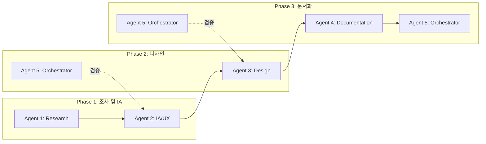

# Tokenization Demo - 5-Agent 역할 정의 및 성공 기준

> 이 문서는 Tokenization 데모 프로토타입 제작 시 5명의 에이전트가 수행할 역할, 역할 배분, 협업 흐름, 성공 기준을 정의합니다.

---

## 1. 에이전트 개요

| 에이전트 | 역할명 | 담당 MCP | 핵심 산출물 |
|----------|--------|----------|-------------|
| Agent 1 | Research Agent | Notion, Slack, Web | 조사 리포트, 요구사항 정리 |
| Agent 2 | IA/UX Agent | - | IA 문서, User Flow 다이어그램 |
| Agent 3 | Design Agent | Figma, Talk to Figma | Figma 화면 디자인 |
| Agent 4 | Documentation Agent | - | Google Spreadsheet, 산출물 문서 |
| Agent 5 | Orchestrator Agent | - | 일정 조율, 품질 검증, 의존성 관리 |

---

## 2. 에이전트별 상세 역할

### Agent 1: Research Agent (조사 에이전트)

**목적**: 시장·제품·내부 자료를 수집하여 IA 및 디자인 결정에 필요한 컨텍스트를 제공한다.

**담당 업무**
- Notion 검색: tokenization 관련 페이지, [2ff7fc3011a98028ba47deaec94f887f](https://www.notion.so/dsrv/2ff7fc3011a98028ba47deaec94f887f) 및 하위 페이지 수집
- Slack 검색: tokenization, Fireblocks, WaaS, 지갑 관련 메시지 수집
- Fireblocks 문서: [Tokenization](https://developers.fireblocks.com/docs/tokenization), [Issue New Tokens](https://developers.fireblocks.com/docs/issue-new-tokens) 등 정리
- 시장 제품 조사: Securitize, Polymath, Pedex, Coinbase Asset Hub 등 기능·플로우 비교

**산출물**
- `docs/research/` 폴더 내 조사 리포트
- `docs/research/requirements-summary.md` (핵심 요구사항 요약)

**성공 기준**
- [ ] Notion tokenization 관련 페이지 3개 이상 수집·요약
- [ ] Slack 관련 메시지 10건 이상 수집·분류
- [ ] Fireblocks 핵심 기능·플로우 문서화 완료
- [ ] 시장 제품 3개 이상 비교표 작성

---

### Agent 2: IA/UX Agent (정보구조·UX 에이전트)

**목적**: Research Agent 산출물을 바탕으로 IA와 User Flow를 설계한다.

**담당 업무**
- IA 설계: 페이지 구조, 네비게이션, 섹션 정의
- User Flow 설계: 토큰 발행, Mint/Burn/Transfer, 스마트 컨트랙트 관리 플로우
- Mermaid 다이어그램 작성
- Fireblocks 스타일 IA 반영 및 데모 MVP 범위 정의

**산출물**
- `docs/IA.md` (Information Architecture)
- `docs/UserFlow.md` (User Flow 다이어그램 포함)

**성공 기준**
- [ ] IA 문서에 Dashboard, Tokens, Smart Contracts, Wallets, Governance, Settings 포함
- [ ] User Flow 3개 이상 (발행, 생명주기 관리, 전체 여정) 정의
- [ ] Mermaid 다이어그램이 렌더링 가능한 형태로 작성
- [ ] MVP 범위(우선 구현 화면) 명시

---

### Agent 3: Design Agent (디자인 에이전트)

**목적**: IA 및 User Flow를 기반으로 Figma에 실제 화면을 디자인한다.

**담당 업무**
- Figma 파일 생성: Tokenization Demo 프로토타입
- Talk to Cursor/Figma 활용: 자연어로 UI 생성·수정
- 핵심 화면 디자인: Dashboard, Token List, Token Detail, Add/Link Token, Mint/Burn/Transfer 모달, Manage Contract
- Fireblocks 콘솔 스타일 참고 (다크 테마, 테이블 레이아웃 등)

**산출물**
- Figma 파일: Tokenization Demo
- 화면 목록: `docs/design/screen-inventory.md`

**성공 기준**
- [ ] Dashboard, Token List, Token Detail 최소 3개 화면 완성
- [ ] Add Token / Link Token 플로우 화면 1개 이상
- [ ] Mint, Burn, Transfer 액션 UI (버튼 또는 모달) 포함
- [ ] 일관된 디자인 시스템(색상, 타이포, 간격) 적용

---

### Agent 4: Documentation Agent (문서화 에이전트)

**목적**: IA, User Flow, 디자인 산출물을 Google Spreadsheet 등으로 정리·공유한다.

**담당 업무**
- Google Spreadsheet IA 시트: 페이지, 섹션, 기능, 우선순위 매핑
- User Flow 시트: 플로우명, 단계, 화면 매핑
- 산출물 인덱스: `docs/INDEX.md` (전체 문서 링크 및 요약)
- Notion 동기화용 요약 문서 작성

**산출물**
- Google Spreadsheet: IA 시트, User Flow 시트
- `docs/INDEX.md`
- `docs/spreadsheet-export-spec.md` (시트 구조 명세)

**성공 기준**
- [ ] IA 시트: 페이지 10개 이상, 섹션·기능·우선순위 컬럼 포함
- [ ] User Flow 시트: 플로우 3개 이상, 단계별 화면 매핑
- [ ] INDEX.md에 모든 산출물 링크 및 1줄 요약
- [ ] spreadsheet-export-spec.md로 시트 구조 재현 가능

---

### Agent 5: Orchestrator Agent (조율·검증 에이전트)

**목적**: 에이전트 간 의존성·일정을 관리하고, 산출물 품질을 검증한다.

**담당 업무**
- 의존성 관리: Research → IA → Design → Documentation 순서 준수
- 일정·체크포인트: Phase 1(조사·IA) → Phase 2(디자인) → Phase 3(문서화) 진행 확인
- 품질 검증: IA와 Figma 화면 매핑 일치 여부, User Flow와 디자인 일치 여부 점검
- 이슈·갭 정리: 누락된 화면, 불일치 사항 리스트 작성

**산출물**
- `docs/orchestrator/checklist.md` (진행 체크리스트)
- `docs/orchestrator/quality-report.md` (품질 검증 결과)
- `docs/orchestrator/gaps.md` (갭·이슈 목록)

**성공 기준**
- [ ] Phase 1 완료 후 Phase 2 시작 (의존성 준수)
- [ ] IA ↔ Figma 화면 매핑 검증 완료
- [ ] User Flow ↔ 디자인 일치 검증 완료
- [ ] 갭·이슈 목록 작성 및 우선순위 부여

---

## 3. 역할 배분 및 협업 흐름

### 실행 순서

| 순서 | 에이전트 | 선행 조건 | 산출물 |
|------|----------|-----------|--------|
| 1 | Agent 1 (Research) | - | 조사 리포트, requirements-summary.md |
| 2 | Agent 2 (IA/UX) | Agent 1 산출물 | IA.md, UserFlow.md |
| 3 | Agent 5 (Orchestrator) | Agent 2 산출물 | Phase 1 검증 |
| 4 | Agent 3 (Design) | Agent 2 산출물 | Figma 화면 |
| 5 | Agent 5 (Orchestrator) | Agent 3 산출물 | Phase 2 검증 |
| 6 | Agent 4 (Documentation) | Agent 2, 3 산출물 | Spreadsheet, INDEX.md |
| 7 | Agent 5 (Orchestrator) | Agent 4 산출물 | 최종 품질 리포트 |

### 병렬 가능 구간

- **Agent 1 + Agent 5 (초기)**: Agent 5가 체크리스트·일정 초안 작성
- **Agent 3 + Agent 4 (부분)**: Agent 4가 IA/UserFlow 기반 시트 초안 작성, Agent 3가 디자인 진행

---

## 4. 성공 기준 (전체 프로젝트)

### Phase 1 성공 기준
- [ ] Notion, Slack, Fireblocks, 시장 제품 조사 완료
- [ ] IA 문서 및 User Flow 문서 완성
- [ ] MVP 범위 확정 (Dashboard, Tokens, Smart Contracts 기본)

### Phase 2 성공 기준
- [ ] Figma에 Dashboard, Token List, Token Detail 화면 구현
- [ ] Add Token / Link Token, Mint/Burn/Transfer UI 구현
- [ ] IA와 화면 매핑 일치

### Phase 3 성공 기준
- [ ] Google Spreadsheet IA·User Flow 시트 완성
- [ ] docs/INDEX.md에 전체 산출물 정리
- [ ] 품질 검증 리포트 작성, 갭 목록 정리

### 최종 성공 기준
- [ ] 데모 프로토타입으로 Tokenization 플로우 시연 가능
- [ ] IA 및 User Flow가 Google Spreadsheet로 공유 가능
- [ ] Fireblocks 스타일과 시장 제품을 반영한 설계 완료

---

## 5. MCP 연결 매핑

| 에이전트 | 사용 MCP | 비고 |
|----------|----------|------|
| Agent 1 | plugin-notion-workspace-notion, plugin-slack-slack | Notion 검색/페치, Slack 검색 |
| Agent 2 | - | 마크다운·Mermaid 작성 |
| Agent 3 | user-figma, cursor-talk-to-figma (설치 시) | Figma 읽기/수정 |
| Agent 4 | - | Spreadsheet API 또는 수동 입력 가이드 |
| Agent 5 | cursor-ide-browser (선택) | 화면 검증용 |

---

## 6. 참고 문서

- [Cloud Agent 오케스트레이터 프롬프트](CLOUD_AGENT_PROMPT.md) - 한 번에 전체 Phase 실행용
- [Tokenization Demo IA and Design Plan](.cursor/plans/tokenization_demo_ia_and_design_ba5497f3.plan.md)
- [Fireblocks Tokenization Docs](https://developers.fireblocks.com/docs/tokenization)
- [Notion Tokenization Page](https://www.notion.so/dsrv/2ff7fc3011a98028ba47deaec94f887f)
