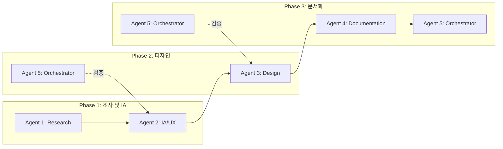

# Tokenization Demo - 5-Agent 역할 정의 및 성공 기준

> 이 문서는 Tokenization 데모 프로토타입 제작 시 5명의 에이전트가 수행할 역할, 역할 배분, 협업 흐름, 성공 기준을 정의합니다.

---

## 1. 에이전트 개요

| 에이전트 | 역할명 | 담당 MCP | 핵심 산출물 |
|----------|--------|----------|-------------|
| Agent 1 | Research Agent | Notion, Slack, Web | 조사 리포트, 요구사항 정리 |
| Agent 2 | IA/UX Agent | - | IA 문서, User Flow 다이어그램 |
| Agent 3 | Design Agent | Figma, Talk to Figma | Figma 화면 디자인 |
| Agent 4 | Documentation Agent | - | Google Spreadsheet, 산출물 문서 |
| Agent 5 | Orchestrator Agent | - | 일정 조율, 품질 검증, 의존성 관리 |

---

## 2. 에이전트별 상세 역할

### Agent 1: Research Agent (조사 에이전트)

**목적**: 시장·제품·내부 자료를 수집하여 IA 및 디자인 결정에 필요한 컨텍스트를 제공한다.

**담당 업무**
- Notion 검색: tokenization 관련 페이지, [2ff7fc3011a98028ba47deaec94f887f](https://www.notion.so/dsrv/2ff7fc3011a98028ba47deaec94f887f) 및 하위 페이지 수집
- Slack 검색: tokenization, Fireblocks, WaaS, 지갑 관련 메시지 수집
- Fireblocks 문서: [Tokenization](https://developers.fireblocks.com/docs/tokenization), [Issue New Tokens](https://developers.fireblocks.com/docs/issue-new-tokens) 등 정리
- 시장 제품 조사: Securitize, Polymath, Pedex, Coinbase Asset Hub 등 기능·플로우 비교

**산출물**
- `docs/research/` 폴더 내 조사 리포트
- `docs/research/requirements-summary.md` (핵심 요구사항 요약)

**성공 기준**
- [ ] Notion tokenization 관련 페이지 3개 이상 수집·요약
- [ ] Slack 관련 메시지 10건 이상 수집·분류
- [ ] Fireblocks 핵심 기능·플로우 문서화 완료
- [ ] 시장 제품 3개 이상 비교표 작성

---

### Agent 2: IA/UX Agent (정보구조·UX 에이전트)

**목적**: Research Agent 산출물을 바탕으로 IA와 User Flow를 설계한다.

**담당 업무**
- IA 설계: **본 문서 §3 IA 상세 명세**를 기준으로 페이지 구조, 섹션별 포함 요소, 데이터 필드 정의
- User Flow 설계: **본 문서 §4 User Flow 상세 명세**를 기준으로 단계별 화면·액션·시스템 응답·예외 정의
- Mermaid 다이어그램 작성 (플로우별)
- Fireblocks 스타일 IA 반영 및 데모 MVP 범위 정의

**산출물**
- `docs/IA.md` (Information Architecture) — §3 테이블 구조 반영
- `docs/UserFlow.md` (User Flow 다이어그램 포함) — §4 단계별 플로우 반영

**성공 기준**
- [ ] IA 문서에 §3의 모든 섹션(Dashboard, Tokens, Smart Contracts, Wallets, Governance, Settings) 및 포함 요소 반영
- [ ] User Flow 문서에 §4의 7개 플로우(발행, 연결, Mint, Burn, Transfer, Manage Contract, Add Wallet) 단계별 정의
- [ ] 각 플로우별 화면·액션·시스템 응답·예외 컬럼 포함
- [ ] Mermaid 다이어그램이 렌더링 가능한 형태로 작성
- [ ] MVP 범위(우선 구현 화면) 명시

---

### Agent 3: Design Agent (디자인 에이전트)

**목적**: IA 및 User Flow를 기반으로 Figma에 실제 화면을 디자인한다.

**담당 업무**
- Figma 파일 생성: Tokenization Demo 프로토타입
- Talk to Cursor/Figma 활용: 자연어로 UI 생성·수정
- **§3 IA 상세 명세**의 각 섹션별 포함 요소를 화면에 반영 (예: Token List 컬럼, Dashboard 카드 등)
- **§4 User Flow 상세 명세**의 단계별 화면 구현 (모달, 폼 필드, 버튼 등)
- Fireblocks 콘솔 스타일 참고 (다크 테마, 테이블 레이아웃 등)

**산출물**
- Figma 파일: Tokenization Demo
- 화면 목록: `docs/design/screen-inventory.md` (IA §3 섹션 ↔ Figma 화면 매핑)

**성공 기준**
- [ ] Dashboard: Token Overview, Recent Activity, Quick Actions (§3.1) 반영
- [ ] Token List: Name, Symbol, Blockchain, Contract Address, Total Supply, Holding, Holders, Actions (§3.2) 반영
- [ ] Token Detail: Info, Holders, Actions (§3.2) 반영
- [ ] Add Token / Link Token 플로우 화면 (§4.1, §4.2) 반영
- [ ] Mint, Burn, Transfer 모달 (§4.3~4.5) 반영
- [ ] 일관된 디자인 시스템(색상, 타이포, 간격) 적용

---

### Agent 4: Documentation Agent (문서화 에이전트)

**목적**: IA, User Flow, 디자인 산출물을 Google Spreadsheet 등으로 정리·공유한다.

**담당 업무**
- Google Spreadsheet IA 시트: **§3 IA 상세 명세** 구조 반영 — 페이지, 섹션, 포함 요소, 데이터/필드, 비고, 우선순위
- User Flow 시트: **§4 User Flow 상세 명세** 구조 반영 — 플로우명, 단계, 화면, 사용자 액션, 시스템 응답, 예외/분기
- 산출물 인덱스: `docs/INDEX.md` (전체 문서 링크 및 요약)
- Notion 동기화용 요약 문서 작성

**산출물**
- Google Spreadsheet: IA 시트 (§3 테이블 구조), User Flow 시트 (§4 테이블 구조)
- `docs/INDEX.md`
- `docs/spreadsheet-export-spec.md` (시트 컬럼 명세 — §3, §4 구조 기반)

**성공 기준**
- [ ] IA 시트: §3의 6개 영역(Dashboard, Tokens, Smart Contracts, Wallets, Governance, Settings) 및 섹션별 포함 요소·데이터 필드 반영
- [ ] User Flow 시트: §4의 7개 플로우 및 단계별 5컬럼(화면, 액션, 응답, 예외) 반영
- [ ] INDEX.md에 모든 산출물 링크 및 1줄 요약
- [ ] spreadsheet-export-spec.md로 시트 구조 재현 가능

---

### Agent 5: Orchestrator Agent (조율·검증 에이전트)

**목적**: 에이전트 간 의존성·일정을 관리하고, 산출물 품질을 검증한다.

**담당 업무**
- 의존성 관리: Research → IA → Design → Documentation 순서 준수
- 일정·체크포인트: Phase 1(조사·IA) → Phase 2(디자인) → Phase 3(문서화) 진행 확인
- 품질 검증: IA와 Figma 화면 매핑 일치 여부, User Flow와 디자인 일치 여부 점검
- 이슈·갭 정리: 누락된 화면, 불일치 사항 리스트 작성

**산출물**
- `docs/orchestrator/checklist.md` (진행 체크리스트)
- `docs/orchestrator/quality-report.md` (품질 검증 결과)
- `docs/orchestrator/gaps.md` (갭·이슈 목록)

**성공 기준**
- [ ] Phase 1 완료 후 Phase 2 시작 (의존성 준수)
- [ ] IA ↔ Figma 화면 매핑 검증 완료
- [ ] User Flow ↔ 디자인 일치 검증 완료
- [ ] 갭·이슈 목록 작성 및 우선순위 부여

---

## 3. IA 상세 명세 (Agent 2 필수 참고)

Agent 2는 `docs/IA.md` 작성 시 아래 구조를 반드시 포함해야 한다.

### 3.1 Dashboard (홈)

| 섹션 | 포함 요소 | 데이터/필드 | 비고 |
|------|-----------|-------------|------|
| **Token Overview** | 카드 또는 요약 테이블 | 총 토큰 수, 총 공급량(USD 또는 원화), 블록체인별 분포 | Fireblocks 스타일 요약 |
| **Recent Activity** | 타임라인 또는 테이블 | 타임스탬프, 액션(Mint/Burn/Transfer), 토큰명, 수량, 상태(Pending/Completed/Failed) | 최근 10~20건 |
| **Quick Actions** | 버튼 그룹 | Add Token, Link Token, Mint, Burn, Transfer | 주요 액션 바로가기 |
| **Alerts/Notifications** | 배너 또는 리스트 | 승인 대기 건수, 실패 트랜잭션, 정책 위반 | (선택) |

### 3.2 Tokens (토큰 관리)

| 화면/섹션 | 포함 요소 | 데이터/필드 | 비고 |
|-----------|-----------|-------------|------|
| **Token List** | 테이블 + 필터/검색 | Name, Symbol, Blockchain(로고), Contract Address, Total Supply, Holding, Holders 수, Actions(드롭다운) | 정렬, 페이지네이션 |
| **Token Detail - Info** | 상세 카드 | Name, Symbol, Decimals, Contract Address, Issuer Vault(Stellar/Ripple), Total Supply, Created At | EVM/Stellar/Ripple 차이 반영 |
| **Token Detail - Holders** | 테이블 | Vault ID, Balance, % of Supply, Last Activity | See Deposit Addresses 링크 |
| **Token Detail - Actions** | 버튼 그룹 | Mint, Burn, Withdraw(Transfer), Manage Contract, Add Wallet, More(Unlink 등) | |
| **Add Token** | 단계별 폼 | Step1: Blockchain 선택(EVM/Stellar/Ripple), Step2: Name, Symbol, Decimals, (EVM: Contract 배포 옵션), Step3: 확인 및 Deploy/Issue | 에러 메시지, 로딩 상태 |
| **Link Token** | 폼 | Blockchain, Contract Address(또는 Asset Code), 검증 버튼 | 기존 토큰 연결 |

### 3.3 Smart Contracts (EVM 전용)

| 화면/섹션 | 포함 요소 | 데이터/필드 | 비고 |
|-----------|-----------|-------------|------|
| **Contract List** | 테이블 | Contract Name, Address, Token 연결 여부, Last Used | Token Detail에서 진입 가능 |
| **Contract Detail** | 탭 또는 섹션 | Read Functions, Write Functions | |
| **Read Function** | 입력 폼 + 결과 | 파라미터 입력, Call 버튼, 결과 표시(JSON/테이블) | 읽기 전용 |
| **Write Function** | 입력 폼 + 트랜잭션 | 파라미터 입력, Execute 버튼, Gas 추정, 승인 플로우 | Mint, Burn 등 |

### 3.4 Wallets (지갑)

| 화면/섹션 | 포함 요소 | 데이터/필드 | 비고 |
|-----------|-----------|-------------|------|
| **Vault Accounts** | 테이블 | Vault ID, Name, Asset Wallets, Balance 요약 | |
| **Add Wallet** | 폼 | Token 선택, Vault 선택, (Stellar/Ripple: Trustline 설정) | Token Detail에서 진입 |

### 3.5 Governance (정책/승인)

| 화면/섹션 | 포함 요소 | 데이터/필드 | 비고 |
|-----------|-----------|-------------|------|
| **Policies** | 리스트 + 편집 | Policy Name, 적용 대상(Mint/Burn/Transfer), Approval 수, 상태 | Policy Engine 참고 |
| **Approval Workflows** | 단계 다이어그램 | 단계별 승인자, 조건, 타임아웃 | (데모는 단순화 가능) |

### 3.6 Settings

| 화면/섹션 | 포함 요소 | 데이터/필드 | 비고 |
|-----------|-----------|-------------|------|
| **API Keys** | 테이블 + 생성 | Key Name, Created At, Permissions, Revoke | |
| **User Management** | 테이블 | User, Role, Last Login | |

---

## 4. User Flow 상세 명세 (Agent 2 필수 참고)

Agent 2는 `docs/UserFlow.md` 작성 시 아래 플로우를 단계별로 상세 정의해야 한다.

### 4.1 토큰 발행 플로우 (Issue New Token) - 상세

| 단계 | 화면 | 사용자 액션 | 시스템 응답 | 예외/분기 |
|------|------|-------------|------------|-----------|
| 1 | Token List | "Add Token" 클릭 | Add Token 모달/페이지 진입 | |
| 2 | Add Token - Step 1 | Blockchain 선택 (EVM / Stellar / Ripple) | 선택에 따라 Step 2 필드 변경 | |
| 3 | Add Token - Step 2 | Name, Symbol, Decimals 입력 (EVM: Custom Contract 또는 Pre-built 선택) | 유효성 검사 (필수값, Symbol 형식) | 에러 시 해당 필드 하이라이트 |
| 4 | Add Token - Step 2 (EVM) | Contract 배포 파라미터 또는 기존 Contract Address | Contract 검증 | Invalid Address 시 에러 |
| 5 | Add Token - Step 3 | 요약 확인, "Deploy" 또는 "Issue" 클릭 | 트랜잭션 제출, 로딩 표시 | 실패 시 에러 메시지 + Retry |
| 6 | - | 트랜잭션 완료 대기 | 성공 토스트, Token List로 리다이렉트 | |
| 7 | Token List | 새 토큰 표시 확인 | | |

### 4.2 토큰 연결 플로우 (Link Existing Token) - 상세

| 단계 | 화면 | 사용자 액션 | 시스템 응답 | 예외/분기 |
|------|------|-------------|------------|-----------|
| 1 | Token List | "Link Token" 클릭 | Link Token 모달/페이지 진입 | |
| 2 | Link Token | Blockchain 선택, Contract Address(또는 Asset Code) 입력 | "Verify" 클릭 | |
| 3 | - | - | 토큰 정보 조회 (Name, Symbol, Decimals) | Not Found 시 에러 |
| 4 | Link Token | 확인 후 "Link" 클릭 | Tokenization List에 추가 | 이미 연결된 토큰 시 에러 |
| 5 | Token List | 링크된 토큰 표시 | | |

### 4.3 Mint 플로우 - 상세

| 단계 | 화면 | 사용자 액션 | 시스템 응답 | 예외/분기 |
|------|------|-------------|------------|-----------|
| 1 | Token Detail | "Mint" 버튼 클릭 | Mint 모달 오픈 | |
| 2 | Mint Modal | Amount 입력, Destination(지갑/Vault) 선택 | 유효성 검사 (잔액, 한도) | 초과 시 에러 |
| 3 | Mint Modal | "Confirm" 클릭 | 승인 플로우 또는 트랜잭션 제출 | Policy에 따라 승인 대기 |
| 4 | - | (승인 필요 시) 승인자 승인 | 트랜잭션 실행 | 거부 시 취소 알림 |
| 5 | - | 완료 | 성공 토스트, Holders 테이블 갱신 | 실패 시 에러 + Retry |

### 4.4 Burn 플로우 - 상세

| 단계 | 화면 | 사용자 액션 | 시스템 응답 | 예외/분기 |
|------|------|-------------|------------|-----------|
| 1 | Token Detail | "Burn" 버튼 클릭 | Burn 모달 오픈 | |
| 2 | Burn Modal | Amount 입력, Source(지갑) 선택 | 유효성 검사 (보유량 ≥ Amount) | 부족 시 에러 |
| 3 | Burn Modal | "Confirm" 클릭 | 승인 플로우 또는 트랜잭션 제출 | |
| 4 | - | 완료 | 성공 토스트, Total Supply 감소 반영 | |

### 4.5 Transfer(Withdraw) 플로우 - 상세

| 단계 | 화면 | 사용자 액션 | 시스템 응답 | 예외/분기 |
|------|------|-------------|------------|-----------|
| 1 | Token Detail | "Withdraw" 버튼 클릭 | Transfer 모달 오픈 | |
| 2 | Transfer Modal | Source, Destination(Workspace 내 Vault 또는 External), Amount 입력 | Destination 화이트리스트 검증 | 미화이트리스트 시 경고/차단 |
| 3 | Transfer Modal | "Confirm" 클릭 | 승인 플로우 또는 트랜잭션 제출 | |
| 4 | - | 완료 | 성공 토스트, Holders 갱신 | |

### 4.6 Manage Contract (EVM) 플로우 - 상세

| 단계 | 화면 | 사용자 액션 | 시스템 응답 | 예외/분기 |
|------|------|-------------|------------|-----------|
| 1 | Token Detail | "Manage Contract" 클릭 | Contract Detail 페이지 진입 | |
| 2 | Contract Detail | Read/Write 탭 선택 | 함수 목록 표시 | |
| 3 | Read Function | 함수 선택, 파라미터 입력, "Call" 클릭 | 결과 표시 (동기) | 에러 시 메시지 |
| 4 | Write Function | 함수 선택, 파라미터 입력, "Execute" 클릭 | Gas 추정, 승인 플로우 | |
| 5 | - | 승인 후 실행 | 트랜잭션 해시, 성공/실패 | |

### 4.7 Add Wallet 플로우 - 상세

| 단계 | 화면 | 사용자 액션 | 시스템 응답 | 예외/분기 |
|------|------|-------------|------------|-----------|
| 1 | Token Detail | "Add Wallet" 클릭 | Add Wallet 모달 오픈 | |
| 2 | Add Wallet Modal | Token 선택(현재 토큰), Vault 선택 | (Stellar/Ripple) Trustline 자동 설정 옵션 | |
| 3 | Add Wallet Modal | "Add" 클릭 | 지갑 생성/연결 | 이미 존재 시 에러 |
| 4 | - | 완료 | 성공 토스트, Holders 테이블에 추가 | |

### 4.8 User Flow 문서 필수 포함 항목

`docs/UserFlow.md`에는 다음이 반드시 포함되어야 한다:

- **플로우 목록**: 발행, 연결, Mint, Burn, Transfer, Manage Contract, (선택) Add Wallet
- **각 플로우별**: 단계 번호, 화면명, 사용자 액션, 시스템 응답, 예외/분기
- **Mermaid 다이어그램**: 플로우별 시퀀스 또는 플로우차트
- **화면 매핑**: 각 단계 → IA의 해당 화면/섹션 참조
- **에러 시나리오**: 주요 에러(잔액 부족, 화이트리스트 미등록, 승인 거부 등) 및 처리

---

## 5. 역할 배분 및 협업 흐름

### 5.1 실행 순서

| 순서 | 에이전트 | 선행 조건 | 산출물 |
|------|----------|-----------|--------|
| 1 | Agent 1 (Research) | - | 조사 리포트, requirements-summary.md |
| 2 | Agent 2 (IA/UX) | Agent 1 산출물 | IA.md, UserFlow.md |
| 3 | Agent 5 (Orchestrator) | Agent 2 산출물 | Phase 1 검증 |
| 4 | Agent 3 (Design) | Agent 2 산출물 | Figma 화면 |
| 5 | Agent 5 (Orchestrator) | Agent 3 산출물 | Phase 2 검증 |
| 6 | Agent 4 (Documentation) | Agent 2, 3 산출물 | Spreadsheet, INDEX.md |
| 7 | Agent 5 (Orchestrator) | Agent 4 산출물 | 최종 품질 리포트 |

### 5.2 병렬 가능 구간

- **Agent 1 + Agent 5 (초기)**: Agent 5가 체크리스트·일정 초안 작성
- **Agent 3 + Agent 4 (부분)**: Agent 4가 IA/UserFlow 기반 시트 초안 작성, Agent 3가 디자인 진행

---

## 6. 성공 기준 (전체 프로젝트)

### Phase 1 성공 기준
- [ ] Notion, Slack, Fireblocks, 시장 제품 조사 완료
- [ ] IA 문서 및 User Flow 문서 완성
- [ ] MVP 범위 확정 (Dashboard, Tokens, Smart Contracts 기본)

### Phase 2 성공 기준
- [ ] Figma에 Dashboard, Token List, Token Detail 화면 구현
- [ ] Add Token / Link Token, Mint/Burn/Transfer UI 구현
- [ ] IA와 화면 매핑 일치

### Phase 3 성공 기준
- [ ] Google Spreadsheet IA·User Flow 시트 완성
- [ ] docs/INDEX.md에 전체 산출물 정리
- [ ] 품질 검증 리포트 작성, 갭 목록 정리

### 최종 성공 기준
- [ ] 데모 프로토타입으로 Tokenization 플로우 시연 가능
- [ ] IA 및 User Flow가 Google Spreadsheet로 공유 가능
- [ ] Fireblocks 스타일과 시장 제품을 반영한 설계 완료

---

## 7. MCP 연결 매핑

| 에이전트 | 사용 MCP | 비고 |
|----------|----------|------|
| Agent 1 | plugin-notion-workspace-notion, plugin-slack-slack | Notion 검색/페치, Slack 검색 |
| Agent 2 | - | 마크다운·Mermaid 작성 |
| Agent 3 | user-figma, cursor-talk-to-figma (설치 시) | Figma 읽기/수정 |
| Agent 4 | - | Spreadsheet API 또는 수동 입력 가이드 |
| Agent 5 | cursor-ide-browser (선택) | 화면 검증용 |

---

## 8. 참고 문서

- [Cloud Agent 오케스트레이터 프롬프트](CLOUD_AGENT_PROMPT.md) - 한 번에 전체 Phase 실행용
- [Tokenization Demo IA and Design Plan](.cursor/plans/tokenization_demo_ia_and_design_ba5497f3.plan.md)
- [Fireblocks Tokenization Docs](https://developers.fireblocks.com/docs/tokenization)
- [Notion Tokenization Page](https://www.notion.so/dsrv/2ff7fc3011a98028ba47deaec94f887f)
