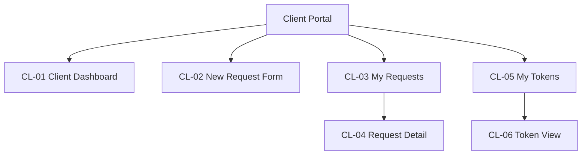

# 토큰화 플랫폼 정보 구조 (IA)

> 이 문서는 `IA.md`의 한국어 번역본입니다. 원본과 차이가 있을 경우 원본을 우선합니다.

> 이 문서는 Layer 1 (Tokenization API Console)과 Layer 2 (Point Token Admin)의 IA를 모두 정의합니다.

---

# Part A — Layer 1: 토큰화 API 콘솔

DSRV 내부 인프라 관리용 콘솔. Layer 1 API(Custody, Tokenization, Blockchain Orchestration)를 직접 제어하는 개발자/운영자 도구.

## 1) IA 원칙

- 빠른 데모 실행을 위한 운영 중심 네비게이션
- Fireblocks 스타일 콘솔 밀도 (다크 테마, 테이블 중심, 액션 가능)
- 토큰 생애주기 액션과 거버넌스 컨텍스트 간 명확한 분리

## 2) 전역 네비게이션

1. Dashboard
2. Tokens
3. Smart Contracts
4. Wallets
5. Governance
6. Settings

## 3) 사이트맵 (MVP)

```mermaid
flowchart TD
    Root[Tokenization Demo] --> Dashboard
    Root --> Tokens
    Root --> SmartContracts[Smart Contracts]
    Root --> Wallets
    Root --> Governance
    Root --> Settings

    Tokens --> TokenList[Token List]
    Tokens --> TokenDetail[Token Detail]
    Tokens --> AddToken[Add Token]
    Tokens --> LinkToken[Link Token]
    Tokens --> AddTokenV2[Add Token v2]

    TokenDetail --> Mint[Mint Action]
    TokenDetail --> Burn[Burn Action]
    TokenDetail --> Transfer[Transfer Action]
    TokenDetail --> Pause[Pause/Unpause Action]
    TokenDetail --> Lock[Lock/Unlock Action]
    TokenDetail --> Emergency[Emergency Action]
    TokenDetail --> Activity[Activity Log]
    TokenDetail --> LifecycleRail[Lifecycle Rail]
    TokenDetail --> UtilityTab[Utility Contracts]
    TokenDetail --> SupplyOverview[Supply Overview]
    TokenDetail --> TokenHolders[Token Holders]
    TokenDetail --> LockupManager[Lockup Schedules]
    LockupManager --> LockupDetail[Lockup Detail]
    LockupManager --> CreateLockup[Create Lockup]

    Tokens --> DeployResult[Deploy Result]

    SmartContracts --> ContractList[Contract List]
    SmartContracts --> ContractDetail[Contract Detail]
    SmartContracts --> ManageContract[Manage Contract]

    Wallets --> WalletList[Wallet List]
    Wallets --> WalletDetail[Wallet Detail]

    Governance --> PolicySummary[Policy Summary]
    Governance --> PolicyEditor[Policy Editor]
    Governance --> ApprovalQueue[Approval Queue]
    Governance --> ApprovalQueueV2[Approval Queue v2]
    Governance --> AuditLog[Audit Log]

    Settings --> APIKeys[API Key Management]
```

## 4) 페이지 인벤토리

| 페이지 | 핵심 섹션 | 주요 액션 | 우선순위 |
|---|---|---|---|
| Dashboard | KPI 카드, 최근 활동, 승인 대기 | 토큰 액션으로 이동 | P1 |
| Token List | 검색/필터, 토큰 테이블, 상태 칩 | 상세 열기, 토큰 추가, 토큰 연결 | P0 |
| Token Detail | 헤더 요약, 공급량 패널, 활동 테이블, Utility Contracts 탭 | Mint, Burn, Transfer, Pause/Unpause, Lock/Unlock, Emergency Action | P0 |
| Add Token | 네트워크/토큰 표준 폼, 메타데이터 | 토큰 생성 | P0 |
| Add Token v2 | 네트워크 선택기, 인라인 함수 미리보기 아코디언이 있는 토큰 타입 카드, Backing Asset 선택기, 초기 공급량, 발행 역할 설정 | 고급 발행 파라미터로 토큰 생성 | P0 |
| Link Token | 기존 컨트랙트 입력/검증, **ERC-20 검증 결과 패널** (mint/burn/pause 가능 여부 + "관리 가능/불가" 판정) | 컨트랙트 연결 | P0 |
| Deploy Result | Token Address, Deploy Tx Hash, Program ID, 배포 성공/실패 상태 | Token Detail로 이동, 주소 복사 | P0 |
| Smart Contracts List | 컨트랙트 테이블, 상태/헬스 | 컨트랙트 상세 열기 | P1 |
| Manage Contract | 파라미터, 권한, 상태 | 컨트랙트 업데이트/관리 | P1 |
| Wallets | 지갑 테이블, 태깅, 잔액 | 출처/대상 선택 | P1 |
| Governance | 정책 개요, 승인 큐 | 상태 검토 | P1 |
| Approval Queue v2 | 큐 운영 테이블, 담당자, SLA, 에스컬레이션, 일괄 액션 | 일괄 승인/거절/재할당/에스컬레이션 | P0 |
| Pause Modal | Pause/Unpause 액션 확인 대화상자 | Pause 확인, 취소 | P0 |
| Lock/Unlock Modal | 주소 또는 수량 기반 Lock/Unlock | Lock 확인, 대상 지정 | P1 |
| Emergency Action Modal | 긴급 동결/종료를 위한 2단계 확인 | 긴급 액션 확인 (위험) | P1 |
| Audit Log | 필터/검색/내보내기가 있는 전용 감사 추적 | 필터, 검색, CSV 내보내기 | P1 |
| Policy Editor | 트리거/승인자/임계값이 있는 정책 규칙 생성/편집 | 정책 생성/편집 | P2 |
| Settings | 환경/네트워크/팀 설정, **API Key 관리** | 설정 저장, API 키 관리 | P2 |
| Supply Overview | Total/Circulating/Locked/Burned 공급량, 분포 분석, 타임라인 차트, 핵심 지표 | 시간에 따른 공급량 변화 조회 | P0 |
| Token Holders | 순위, 주소, 잔액, 공급량 %, 태그(Team/Investor/Treasury/Public)가 있는 Holder 목록, CSV 내보내기 | 태그별 필터, 주소 검색, 내보내기 | P0 |
| Lockup Manager | Lockup 일정 목록, Total Locked/Active/Next Unlock/Released KPI, 새 Lockup 생성 | Lockup 생성, 일정 조회 | P0 |
| Lockup Detail | Vesting 진행률 바, 배포 이벤트 타임라인, 일정 정보, 액션(Release/Pause/Revoke) | 즉시 Release, Pause, Revoke | P0 |
| Create Lockup Modal | 폼: 이름, 수혜자, 수량, 타입(Linear/Cliff/Step), 날짜, cliff, 기간, 간격 | Lockup 일정 생성 | P0 |

## 5) 데이터 객체 매핑

| 객체 | 핵심 필드 |
|---|---|
| Token | symbol, name, network, standard, total_supply, status |
| Contract | address, network, owner, template, status |
| Wallet | wallet_id, label, network, address, role |
| Operation | type, amount, actor, timestamp, status, tx_hash, approval_id |
| UtilityContract | address, type (lock/restriction), linked_token, attached_at, status |
| APIKey | key_id, name, permissions, created_at, last_used, status |
| Policy | policy_name, trigger, approver_group, decision_state |
| LifecycleState | stage, entered_at, actor, transition_reason, tx_hash |
| SupplySnapshot | total_supply, circulating, locked, burned, timestamp, distribution_breakdown |
| TokenHolder | address, balance, percent_of_supply, tag (Team/Investor/Advisor/Treasury/Public), last_activity |
| LockupSchedule | schedule_id, name, beneficiary, token_id, type (Linear/Cliff/Step), total_amount, released, remaining, start_date, end_date, cliff_period, release_interval, status (Active/Locked/Paused/Completed/Revoked), next_unlock_date |
| LockupEvent | event_id, schedule_id, event_type (cliff_release/monthly_release/manual_release/revoke), amount, tx_hash, timestamp, status |

## 6) MVP 범위 결정

### 필수 화면

- Dashboard
- Token List
- Token Detail
- Add Token / Add Token v2 / Link Token
- Mint/Burn/Transfer 액션 모달
- Smart Contract 개요
- Approval Queue v2

## 7) P0 강화 정렬 (Fireblocks 갭 동기화)

### Add Token v2 (P0)

- Step 1a: 네트워크 선택 (Ethereum / Polygon / Solana)
- Step 1b: 선택 카드로 토큰 타입 선택 (ERC-20F / ERC-721F / ERC-1155F)
  - 각 카드 표시: 타입명, 설명, 함수 수
  - 선택 시 → **인라인 아코디언 확장**으로 컨트랙트 함수 미리보기:
    - Read Functions (예: name, symbol, balanceOf, totalSupply, allowance)
    - Write Functions (예: transfer, approve, mint, burn, pause)
    - Available Roles (예: ADMIN, MINTER, PAUSER)
    - 참고: "Deploy 시 자동 설정됨 · Step 4에서 Role 주소 지정 가능"
  - UX 근거: 별도 페이지 이동 없이 위저드 흐름 유지하면서 함수 스펙 확인 가능
- Step 2: Backing Asset 선택 — **카테고리별 Pill Chip 그리드** (단일 선택)
  - Fiat Currency: USD, EUR, KRW, JPY, GBP, CHF, SGD
  - Commodity: Gold (XAU), Silver (XAG), Platinum, Crude Oil
  - Bond / Fixed Income: US Treasury, Corporate, Municipal, Sovereign
  - Alternative / Other: Real Estate, Carbon Credit, Art, IP Rights
  - UX: 카테고리 헤더 + 가로 칩 나열, 선택 칩 파란색 하이라이트, 전체 자산 중 1개만 선택 가능
- Step 3: Name / Symbol / Decimals / Initial Supply
- Step 4: Issuance role setup preview (Admin/Minter/Pauser)
- Step 1 옵션: Upgradeable Proxy 토글 (on/off) — 보안·감사 관점에서 proxy 패턴 사용 여부 선택
- Step 5: 검토 및 제출 → **Deploy Result 화면**으로 리다이렉트 (Token Address + Tx Hash + Program ID)

### Token Detail lifecycle rail (P0)

- 인라인 생애주기 상태 표시:
  - Defined
  - Deployed/Linked
  - Issued/Minted
  - Distributed/Transferred
  - Burned/Redeemed
- 각 상태는 타임스탬프, 운영자, 참조 트랜잭션을 유지합니다.

### Approval Queue v2 (P0)

- 필수 컬럼:
  - Request ID
  - Type
  - Token
  - Amount
  - Assignee
  - SLA
  - Escalation flag
  - Status
- 필수 액션:
  - 일괄 승인
  - 일괄 거절
  - 재할당
  - 에스컬레이션

### 권장 화면

- Wallet detail
- Governance queue summary

### Utility Contract 통합 (P1)

- Token Detail 내 "Utility" 탭: 연결된 Utility Contract 목록 + Attach/Detach
- Lock/Unlock: 주소 또는 물량 단위, Transfer Restriction Hook 설정
- Utility Deploy: Token ↔ Utility 권한 연결, 연결 이력 기록
- External Utility Import: Utility Contract Address 등록 + Token 연결 관계 검증

### 보류

- Full policy editor (심층 규칙 엔진) — P2 Policy Editor로 대체

## 8-A) 승인 기반 발행 모델 (B2B 규제 환경)

규제 요건(콜드월렛 발행 의무)에 따라 고객이 토큰 발행을 **신청**하고, DSRV 어드민이 **심사·승인·실행**하는 워크플로우.

### Client Portal (고객 포탈)

| Screen ID | 화면명 | 유형 | 설명 | Priority |
|---|---|---|---|---|
| CL-01 | Client Dashboard | Landing | 신청 현황 요약, KPI, 알림 | P0 |
| CL-02 | New Request Form | Wizard (3-Step) | 토큰 발행 신청서 | P0 |
| CL-03 | My Requests | List | 신청 목록 + 상태 필터 | P0 |
| CL-04 | Request Detail | Detail | 진행상태 타임라인 + 메시지 | P0 |
| CL-05 | My Tokens | List | 발행 완료 토큰 조회 (읽기 전용) | P1 |
| CL-06 | Token View | Detail | 토큰 상세 조회 (잔액/이력) | P1 |

### Admin Portal (DSRV 어드민)

```mermaid
flowchart TD
    APRoot[Admin Portal] --> ADDash[AD-01 Admin Dashboard]
    APRoot --> ADQueue[AD-02 Request Queue]
    APRoot --> ADExec[AD-04 Execution Panel]
    APRoot --> ADHist[AD-05 Execution History]

    ADQueue --> ADReview[AD-03 Request Review]
    ADReview -->|Approve| ADExec
    ADExec -->|Complete| ADHist
```

| Screen ID | 화면명 | 유형 | 설명 | Priority |
|---|---|---|---|---|
| AD-01 | Admin Dashboard | Landing | 대기 건수, SLA, 처리량 KPI | P0 |
| AD-02 | Request Queue | List | 전체 신청 큐, 배치 처리 | P0 |
| AD-03 | Request Review | Detail+Action | 심사 (승인/거절/보류/반려) | P0 |
| AD-04 | Execution Panel | Action | 콜드월렛 Tx 실행 + 상태 추적 | P0 |
| AD-05 | Execution History | List | 완료 이력 + Tx 결과 | P1 |

### 데이터 객체 (추가)

| 객체 | 핵심 필드 |
|---|---|
| IssuanceRequest | request_id, applicant, token_spec, status, submitted_at, reviewed_by, decision_reason |
| ColdWalletExecution | execution_id, request_id, tx_hash, signing_status, broadcast_status, block_number |

## 8) IA 구현 정렬 결정

제품 완성도 결정 (시니어 기획 관점):

- `Add Token v2`를 5단계 위저드로 유지 (운영 안전을 위해 Step 5 Review/Submit 필수).
- `Contract Detail`과 `Manage Contract`를 별도 화면으로 유지:
  - Detail = 읽기 중심 컨텍스트 (파라미터/권한 개요)
  - Manage = 액션 중심 실행 화면
- `Governance`를 다음과 같이 분리 유지:
  - Approval Queue v2 (실행 가능한 운영)
  - Policy Summary (읽기 전용 정책 스냅샷)

현재 구현 정렬:

- 구현 완료: Dashboard Overview + Pending Approvals 위젯, Token List, Token Detail (Lifecycle Rail), Add Token v2, Link Token, Contract List, Contract Detail, Manage Contract, Wallet List, Wallet Detail, Approval Queue v2, Policy Summary, Settings Configuration.
- 추가됨 (Gap Audit 2026-02-23): Pause/Unpause 모달, Lock/Unlock 모달, Emergency Action 모달, Deploy Result 화면, Link Token 검증 패널, Upgradeable 토글, Utility 탭, Audit Log 화면, Policy Editor, API Key 관리.
- 남은 심화 갭: Wallet policy manager, risk controls, monitoring/alerts, NFT metadata helper.

---

# Part B — Layer 2: Point Token Admin (Culture Token)

BKC&C 납품용 포인트/컬쳐 토큰 관리 어드민. Layer 1 API를 래핑하며, Financial Management, Blockchain Common, Private Explorer 등 비즈니스 레이어를 추가한 목적 특화 어플리케이션.

## 9) Layer 2 IA 원칙

- 비즈니스 운영자 중심: 재단/포인트 사업자가 토큰 생애주기를 한 곳에서 관리
- 재무 가시성: 환매, 환불, 매입 등 재무 관련 흐름을 1급 시민으로 취급
- 컴플라이언스 준비: 주소 화이트리스트, 정책 엔진, 감사 로그를 내비게이션 레벨에서 노출
- Explorer 통합: 프라이빗 체인 전용 탐색기를 내장하여 외부 도구 의존 제거

## 10) Layer 2 전역 네비게이션

1. Dashboard
2. Token Management
3. Wallet Management
4. Financial Management
5. Blockchain
6. Explorer
7. Settings & Commons

## 11) Layer 2 사이트맵

```mermaid
flowchart TD
    Root[Point Token Admin] --> L2Dash[Dashboard]
    Root --> TokenMgmt[Token Management]
    Root --> WalletMgmt[Wallet Management]
    Root --> FinMgmt[Financial Management]
    Root --> Blockchain[Blockchain]
    Root --> Explorer[Explorer]
    Root --> SettingsCommons[Settings & Commons]

    L2Dash --> OpDashboard[Operation Dashboard]

    TokenMgmt --> L2TokenList[Token List]
    TokenMgmt --> L2TokenDetail[Token Detail]
    TokenMgmt --> L2CreateToken[Create Token]
    TokenMgmt --> L2DeployResult[Deploy Result]
    L2TokenDetail --> L2Mint[Mint Modal]
    L2TokenDetail --> L2Burn[Burn Modal]
    L2TokenDetail --> L2Transfer[Transfer Modal]
    L2TokenDetail --> L2Supply[Supply Overview]
    L2TokenDetail --> L2Holders[Token Holders]
    L2TokenDetail --> L2Lockup[Lockup Manager]
    L2Lockup --> L2LockupDetail[Lockup Detail]
    L2Lockup --> L2CreateLockup[Create Lockup]

    WalletMgmt --> L2WalletList[Wallet List]
    WalletMgmt --> L2WalletDetail[Wallet Balance Detail]

    FinMgmt --> Retirement[Retirement]
    FinMgmt --> RecordEditor[Record Editor]
    FinMgmt --> RefundBuy[Refund / Buy]

    Blockchain --> TXHistory[TX History]
    Blockchain --> AddrWhitelist[Address Whitelist]
    Blockchain --> GasWallet[Gas Wallet]
    Blockchain --> TxSafe[Tx Safe]

    Explorer --> TXDetail[TX Detail]
    Explorer --> AccountHistory[Account History]

    SettingsCommons --> SystemAdmin[System Admin]
    SettingsCommons --> PolicyEngine[Policy Engine]
    SettingsCommons --> L2AuditLog[Audit Log]
    SettingsCommons --> Alerts[Alert / Notifications]
    SettingsCommons --> APISettings[API & Integration Settings]
    SettingsCommons --> TxStats[Transaction Stats]
```

## 12) Layer 2 페이지 인벤토리

| ID | 페이지 | 핵심 섹션 | 주요 액션 | 우선순위 |
|---|---|---|---|---|
| L2-01 | Dashboard | 운영 KPI (발행량, 트랜잭션 수, 보유자 수), 최근 활동, 알림 | 토큰/재무 액션으로 이동 | P0 |
| L2-02 | Token List | 토큰 테이블, 상태 필터, 네트워크 필터 | 상세 열기, 토큰 생성 | P0 |
| L2-03 | Token Detail | 토큰 요약, 공급량 패널, Lifecycle Rail, 활동 이력 | Mint, Burn, Transfer | P0 |
| L2-04 | Create Token | 네트워크/타입 선택, 메타데이터 입력, 역할 설정 | 토큰 생성 | P0 |
| L2-05 | Mint Modal | 수량, 대상 지갑, 메모 | Mint 확인 | P0 |
| L2-06 | Burn Modal | 수량, 원본 지갑, 사유 | Burn 확인 | P0 |
| L2-07 | Transfer Modal | 수량, 출발/도착 지갑 | Transfer 확인 | P0 |
| L2-08 | Deploy Result | Token Address, Tx Hash, 상태 | 상세로 이동, 주소 복사 | P0 |
| L2-09 | Supply Overview | Total/Circulating/Locked/Burned, 타임라인 차트, Key Metrics | 공급량 변화 조회 | P0 |
| L2-10 | Token Holders | Holder 목록, 잔액, 비율, 태그, CSV 내보내기 | 필터, 검색, 내보내기 | P0 |
| L2-11 | Lockup Manager | Lockup 일정 목록, KPI (Total Locked/Active/Next Unlock) | Lockup 생성, 일정 조회 | P0 |
| L2-12 | Wallet List | 지갑 목록, 잔액, 태그, 유형(Operation/Cold/CA) | 지갑 선택, 상세 조회 | P0 |
| L2-13 | Wallet Balance Detail | 지갑별 토큰 잔액 내역, 트랜잭션 이력 | 트랜잭션 조회 | P1 |
| L2-14 | **Retirement** | 환매/소각 요청 목록, 처리 상태, 필터 | 환매 처리, 승인/거절 | P0 |
| L2-15 | **Record Editor** | 포인트 이력 수정 테이블, 수정 사유, 승인 플로우 | 이력 수정, 승인 요청 | P0 |
| L2-16 | **Refund / Buy** | 환불/매입 요청 목록, 금액, 대상, 처리 상태 | 환불 처리, 매입 실행 | P0 |
| L2-17 | **TX History** | 전체 트랜잭션 이력 테이블, 블록/해시/상태, 필터/검색 | 필터, 검색, 내보내기 | P0 |
| L2-18 | **Address Whitelist** | 주소 화이트리스트 테이블, 추가/삭제, 상태 | 주소 추가, 삭제, 일괄 가져오기 | P1 |
| L2-19 | **Gas Wallet** | 가스 지갑 잔액, 충전 이력, 임계값 알림 설정 | 충전, 임계값 설정 | P1 |
| L2-20 | **Tx Safe** | 트랜잭션 한도 설정, 차단 규칙, 이상 트랜잭션 목록 | 한도 설정, 규칙 관리 | P1 |
| L2-21 | **TX Detail** | 트랜잭션 상세 (블록, 해시, 가스, from/to, 이벤트 로그) | 해시 복사, Explorer에서 조회 | P0 |
| L2-22 | **Account History** | 계정별 활동 이력, 잔액 변동, 관련 트랜잭션 | 기간별 필터, 내보내기 | P1 |
| L2-23 | **System Admin** | 사용자 관리, 권한/역할, 시스템 설정 | 사용자 추가, 역할 할당 | P1 |
| L2-24 | Policy Engine | 정책 규칙 목록, 트리거/승인자/임계값 | 정책 생성/편집 | P1 |
| L2-25 | Audit Log | 감사 이력, 필터/검색/내보내기 | 필터, 검색, CSV 내보내기 | P1 |
| L2-26 | **Alert / Notifications** | 알림 설정, 알림 이력, 채널(이메일/슬랙/웹훅) | 알림 설정, 이력 조회 | P2 |
| L2-27 | API & Integration Settings | API 키 관리, 웹훅 설정, 연동 상태 | 키 생성, 웹훅 설정 | P2 |
| L2-28 | **Transaction Stats** | 트랜잭션 통계 대시보드, 차트, 기간별 추이 | 기간별 필터, 리포트 내보내기 | P0 |

## 13) Layer 2 데이터 객체 매핑

| 객체 | 핵심 필드 |
|---|---|
| Token | symbol, name, network, standard, total_supply, status, issuer |
| Wallet | wallet_id, label, type (Operation/Cold/CA), network, address, balance |
| Transaction | tx_hash, block_number, from, to, value, gas_used, status, timestamp, token_id |
| RetirementRequest | request_id, token_id, amount, requester, status, reason, processed_at, processor |
| RecordEdit | edit_id, token_id, target_address, old_value, new_value, reason, editor, approved_by, status |
| RefundBuyOrder | order_id, type (refund/buy), token_id, amount, counterparty, status, tx_hash |
| WhitelistEntry | address, label, added_by, added_at, status (active/revoked) |
| GasWallet | wallet_id, chain, balance, threshold, last_recharge, auto_recharge |
| TxSafeRule | rule_id, type (daily_limit/per_tx_limit/blacklist/time_restriction), parameters, status |
| AlertConfig | alert_id, trigger_type, channel (email/slack/webhook), threshold, enabled |
| SystemUser | user_id, name, email, role (admin/operator/viewer), status, last_login |

## 14) Layer 2 MVP 범위

### P0 (핵심 — 납품 필수)

- Dashboard (L2-01)
- Token Management 전체 (L2-02~L2-11)
- Wallet List (L2-12)
- Financial Management 전체 (L2-14~L2-16)
- TX History (L2-17)
- TX Detail (L2-21)
- Transaction Stats (L2-28)

### P1 (운영 심화)

- Wallet Balance Detail (L2-13)
- Address Whitelist (L2-18)
- Gas Wallet (L2-19)
- Tx Safe (L2-20)
- Account History (L2-22)
- System Admin (L2-23)
- Policy Engine (L2-24)
- Audit Log (L2-25)

### P2 (확장)

- Alert / Notifications (L2-26)
- API & Integration Settings (L2-27)

## 15) Layer 1 vs Layer 2 화면 매핑

| Layer 2 화면 | Layer 1 원본 | 변경 사항 |
|---|---|---|
| L2-01 Dashboard | SCR-01 | KPI를 포인트 운영 지표로 교체, Financial 위젯 추가 |
| L2-02 Token List | SCR-02 | 네비게이션 변경, 브랜딩 변경 |
| L2-03 Token Detail | SCR-03 | 네비게이션 변경 |
| L2-04 Create Token | SCR-04 | Backing Asset 단계 간소화 (포인트 중심) |
| L2-05~07 Modals | SCR-06~08 | 동일 구조, 네비 없음 |
| L2-08 Deploy Result | SCR-24 | 동일 구조 |
| L2-09~11 Lifecycle | SCR-30~32 | 네비게이션 변경 |
| L2-12 Wallet List | SCR-11 | Operation/Cold/CA 타입 구분 추가 |
| L2-13 Wallet Detail | SCR-14 | 토큰별 잔액 강화 |
| L2-14~16 Financial | NEW | 신규 설계 |
| L2-17 TX History | NEW | 신규 설계 |
| L2-18~20 Blockchain | NEW | 신규 설계 |
| L2-21~22 Explorer | NEW | 신규 설계 |
| L2-23 System Admin | NEW | 신규 설계 |
| L2-24 Policy Engine | SCR-29 | 네비게이션 변경, 룰 목록 강화 |
| L2-25 Audit Log | SCR-28 | 네비게이션 변경 |
| L2-26~27 Settings | SCR-23 | 알림/웹훅 기능 분리 |
| L2-28 TX Stats | NEW | 신규 설계 |
