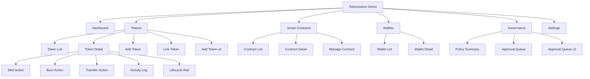

# Tokenization Demo Information Architecture

## 1) IA principles

- Operation-first navigation for fast demo execution
- Fireblocks-style console density (dark, table-centric, actionable)
- Clear separation between token lifecycle actions and governance context

## 2) Global navigation

1. Dashboard
2. Tokens
3. Smart Contracts
4. Wallets
5. Governance
6. Settings

## 3) Sitemap (MVP)

## 4) Page inventory

| Page | Core sections | Main actions | Priority |
|---|---|---|---|
| Dashboard | KPI cards, recent activity, pending approvals | Jump to token actions | P1 |
| Token List | Search/filter, token table, status chips | Open detail, add token, link token | P0 |
| Token Detail | Header summary, supply panel, activity table | Mint, burn, transfer | P0 |
| Add Token | Network/token standard form, metadata | Create token | P0 |
| Add Token v2 | Network selector, token type cards with inline function preview accordion, backing asset selector, initial supply, issuance role setup | Create token with advanced issuance parameters | P0 |
| Link Token | Existing contract input/validation | Link contract | P0 |
| Smart Contracts List | Contract table, health/status | Open contract detail | P1 |
| Manage Contract | Parameters, permissions, status | Update/manage contract | P1 |
| Wallets | Wallet table, tagging, balances | Select source/destination | P1 |
| Governance | Policy overview, approval queue | Review statuses | P1 |
| Approval Queue v2 | Queue operations table, assignee, SLA, escalation, batch actions | Approve/reject/reassign/escalate in bulk | P0 |
| Settings | Environment/network/team configuration | Save configuration | P2 |

## 5) Data object mapping

| Object | Key fields |
|---|---|
| Token | symbol, name, network, standard, total_supply, status |
| Contract | address, network, owner, template, status |
| Wallet | wallet_id, label, network, address, role |
| Operation | type, amount, actor, timestamp, status, tx_hash |
| Policy | policy_name, trigger, approver_group, decision_state |
| LifecycleState | stage, entered_at, actor, transition_reason, tx_hash |

## 6) MVP scope decision

### Must-have screens

- Dashboard
- Token List
- Token Detail
- Add Token / Add Token v2 / Link Token
- Mint/Burn/Transfer action modals
- Smart Contract overview
- Approval Queue v2

## 7) P0 enhancement alignment (Fireblocks gap sync)

### Add Token v2 (P0)

- Step 1a: Select Network (Ethereum / Polygon / Solana)
- Step 1b: Select Token Type via selection cards (ERC-20F / ERC-721F / ERC-1155F)
  - Each card shows: type name, description, function count
  - On select → **inline accordion expands** showing contract function preview:
    - Read Functions (e.g., name, symbol, balanceOf, totalSupply, allowance)
    - Write Functions (e.g., transfer, approve, mint, burn, pause)
    - Available Roles (e.g., ADMIN, MINTER, PAUSER)
    - Note: "Deploy 시 자동 설정됨 · Step 4에서 Role 주소 지정 가능"
  - UX rationale: 별도 페이지 이동 없이 위저드 흐름 유지하면서 함수 스펙 확인 가능
- Step 2: Select Backing Asset — **카테고리별 Pill Chip 그리드** (단일 선택)
  - Fiat Currency: USD, EUR, KRW, JPY, GBP, CHF, SGD
  - Commodity: Gold (XAU), Silver (XAG), Platinum, Crude Oil
  - Bond / Fixed Income: US Treasury, Corporate, Municipal, Sovereign
  - Alternative / Other: Real Estate, Carbon Credit, Art, IP Rights
  - UX: 카테고리 헤더 + 가로 칩 나열, 선택 칩 파란색 하이라이트, 전체 자산 중 1개만 선택 가능
- Step 3: Name / Symbol / Decimals / Initial Supply
- Step 4: Issuance role setup preview (Admin/Minter/Pauser)
- Step 5: Review and submit

### Token Detail lifecycle rail (P0)

- Display lifecycle states inline:
  - Defined
  - Deployed/Linked
  - Issued/Minted
  - Distributed/Transferred
  - Burned/Redeemed
- Each state keeps timestamp, operator, and reference transaction.

### Approval Queue v2 (P0)

- Required columns:
  - Request ID
  - Type
  - Token
  - Amount
  - Assignee
  - SLA
  - Escalation flag
  - Status
- Required actions:
  - Bulk approve
  - Bulk reject
  - Reassign
  - Escalate

### Should-have screens

- Wallet detail
- Governance queue summary

### Deferred

- Advanced settings and full policy editor

## 8) IA implementation alignment decision

Product-completeness decision (senior planning viewpoint):

- Keep `Add Token v2` as 5-step wizard (Step 5 Review/Submit is required for operational safety).
- Keep `Contract Detail` and `Manage Contract` as separate surfaces:
  - Detail = read-oriented context (parameters/permissions overview)
  - Manage = action-oriented execution surface
- Keep `Governance` split into:
  - Approval Queue v2 (actionable operations)
  - Policy Summary (read-only policy snapshot)

Current implementation alignment:

- Implemented: Dashboard Overview + Pending Approvals widget, Token List, Token Detail (Lifecycle Rail), Add Token v2, Link Token, Contract List, Contract Detail, Manage Contract, Wallet List, Wallet Detail, Approval Queue v2, Policy Summary, Settings Configuration.
- Remaining depth gaps (outside this IA baseline): Wallet policy manager, risk controls, monitoring/alerts, NFT metadata helper.
