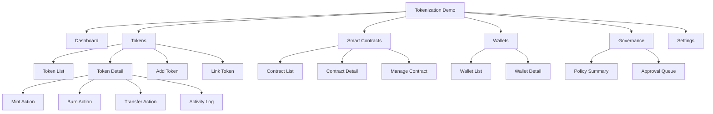

# Tokenization Demo Information Architecture

## 1) IA principles

- Operation-first navigation for fast demo execution
- Fireblocks-style console density (dark, table-centric, actionable)
- Clear separation between token lifecycle actions and governance context

## 2) Global navigation

1. Dashboard
2. Tokens
3. Smart Contracts
4. Wallets
5. Governance
6. Settings

## 3) Sitemap (MVP)

## 4) Page inventory

| Page | Core sections | Main actions | Priority |
|---|---|---|---|
| Dashboard | KPI cards, recent activity, pending approvals | Jump to token actions | P1 |
| Token List | Search/filter, token table, status chips | Open detail, add token, link token | P0 |
| Token Detail | Header summary, supply panel, activity table | Mint, burn, transfer | P0 |
| Add Token | Network/token standard form, metadata | Create token | P0 |
| Link Token | Existing contract input/validation | Link contract | P0 |
| Smart Contracts List | Contract table, health/status | Open contract detail | P1 |
| Manage Contract | Parameters, permissions, status | Update/manage contract | P1 |
| Wallets | Wallet table, tagging, balances | Select source/destination | P1 |
| Governance | Policy overview, approval queue | Review statuses | P1 |
| Settings | Environment/network/team configuration | Save configuration | P2 |

## 5) Data object mapping

| Object | Key fields |
|---|---|
| Token | symbol, name, network, standard, total_supply, status |
| Contract | address, network, owner, template, status |
| Wallet | wallet_id, label, network, address, role |
| Operation | type, amount, actor, timestamp, status, tx_hash |
| Policy | policy_name, trigger, approver_group, decision_state |

## 6) MVP scope decision

### Must-have screens

- Dashboard
- Token List
- Token Detail
- Add Token / Link Token
- Mint/Burn/Transfer action modals
- Smart Contract overview

### Should-have screens

- Wallet detail
- Governance queue summary

### Deferred

- Advanced settings and full policy editor
