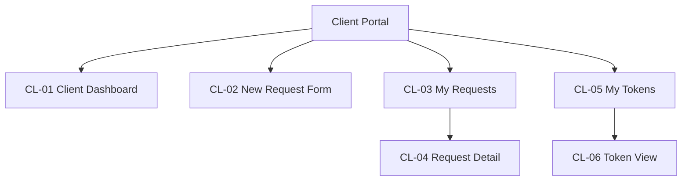
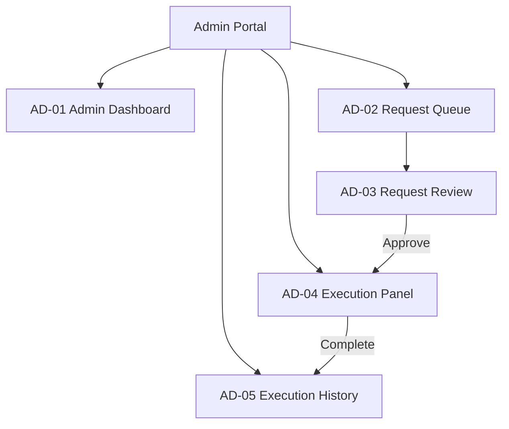

# Tokenization Demo Information Architecture

## 1) IA principles

- Operation-first navigation for fast demo execution
- Fireblocks-style console density (dark, table-centric, actionable)
- Clear separation between token lifecycle actions and governance context

## 2) Global navigation

1. Dashboard
2. Tokens
3. Smart Contracts
4. Wallets
5. Governance
6. Settings

## 3) Sitemap (MVP)

```mermaid
flowchart TD
    Root[Tokenization Demo] --> Dashboard
    Root --> Tokens
    Root --> SmartContracts[Smart Contracts]
    Root --> Wallets
    Root --> Governance
    Root --> Settings

    Tokens --> TokenList[Token List]
    Tokens --> TokenDetail[Token Detail]
    Tokens --> AddToken[Add Token]
    Tokens --> LinkToken[Link Token]
    Tokens --> AddTokenV2[Add Token v2]

    TokenDetail --> Mint[Mint Action]
    TokenDetail --> Burn[Burn Action]
    TokenDetail --> Transfer[Transfer Action]
    TokenDetail --> Pause[Pause/Unpause Action]
    TokenDetail --> Lock[Lock/Unlock Action]
    TokenDetail --> Emergency[Emergency Action]
    TokenDetail --> Activity[Activity Log]
    TokenDetail --> LifecycleRail[Lifecycle Rail]
    TokenDetail --> UtilityTab[Utility Contracts]
    TokenDetail --> SupplyOverview[Supply Overview]
    TokenDetail --> TokenHolders[Token Holders]
    TokenDetail --> LockupManager[Lockup Schedules]
    LockupManager --> LockupDetail[Lockup Detail]
    LockupManager --> CreateLockup[Create Lockup]

    Tokens --> DeployResult[Deploy Result]

    SmartContracts --> ContractList[Contract List]
    SmartContracts --> ContractDetail[Contract Detail]
    SmartContracts --> ManageContract[Manage Contract]

    Wallets --> WalletList[Wallet List]
    Wallets --> WalletDetail[Wallet Detail]

    Governance --> PolicySummary[Policy Summary]
    Governance --> PolicyEditor[Policy Editor]
    Governance --> ApprovalQueue[Approval Queue]
    Governance --> ApprovalQueueV2[Approval Queue v2]
    Governance --> AuditLog[Audit Log]

    Settings --> APIKeys[API Key Management]
```

## 4) Page inventory

| Page | Core sections | Main actions | Priority |
|---|---|---|---|
| Dashboard | KPI cards, recent activity, pending approvals | Jump to token actions | P1 |
| Token List | Search/filter, token table, status chips | Open detail, add token, link token | P0 |
| Token Detail | Header summary, supply panel, activity table, utility contracts tab | Mint, burn, transfer, pause/unpause, lock/unlock, emergency action | P0 |
| Add Token | Network/token standard form, metadata | Create token | P0 |
| Add Token v2 | Network selector, token type cards with inline function preview accordion, backing asset selector, initial supply, issuance role setup | Create token with advanced issuance parameters | P0 |
| Link Token | Existing contract input/validation, **ERC-20 검증 결과 패널** (mint/burn/pause 가능 여부 + "관리 가능/불가" 판정) | Link contract | P0 |
| Deploy Result | Token Address, Deploy Tx Hash, Program ID, 배포 성공/실패 상태 | Go to Token Detail, Copy Address | P0 |
| Smart Contracts List | Contract table, health/status | Open contract detail | P1 |
| Manage Contract | Parameters, permissions, status | Update/manage contract | P1 |
| Wallets | Wallet table, tagging, balances | Select source/destination | P1 |
| Governance | Policy overview, approval queue | Review statuses | P1 |
| Approval Queue v2 | Queue operations table, assignee, SLA, escalation, batch actions | Approve/reject/reassign/escalate in bulk | P0 |
| Pause Modal | Confirmation dialog for pause/unpause action | Confirm pause, cancel | P0 |
| Lock/Unlock Modal | Address or amount-based lock/unlock | Confirm lock, specify target | P1 |
| Emergency Action Modal | 2-step confirmation for emergency freeze/shutdown | Confirm emergency action (danger) | P1 |
| Audit Log | Dedicated audit trail with filtering/search/export | Filter, search, export CSV | P1 |
| Policy Editor | Policy rule creation/edit with trigger/approver/threshold | Create/edit policy | P2 |
| Settings | Environment/network/team configuration, **API Key management** | Save configuration, manage API keys | P2 |
| Supply Overview | Total/Circulating/Locked/Burned supply, distribution breakdown, timeline chart, key metrics | View supply changes over time | P0 |
| Token Holders | Holder list with rank, address, balance, % supply, tag (Team/Investor/Treasury/Public), export CSV | Filter by tag, search address, export | P0 |
| Lockup Manager | Lockup schedule list, Total Locked/Active/Next Unlock/Released KPIs, create new lockup | Create lockup, view schedule | P0 |
| Lockup Detail | Vesting progress bar, release events timeline, schedule info, actions (Release/Pause/Revoke) | Release now, pause, revoke | P0 |
| Create Lockup Modal | Form: name, beneficiary, amount, type (Linear/Cliff/Step), dates, cliff, duration, interval | Create lockup schedule | P0 |

## 5) Data object mapping

| Object | Key fields |
|---|---|
| Token | symbol, name, network, standard, total_supply, status |
| Contract | address, network, owner, template, status |
| Wallet | wallet_id, label, network, address, role |
| Operation | type, amount, actor, timestamp, status, tx_hash, approval_id |
| UtilityContract | address, type (lock/restriction), linked_token, attached_at, status |
| APIKey | key_id, name, permissions, created_at, last_used, status |
| Policy | policy_name, trigger, approver_group, decision_state |
| LifecycleState | stage, entered_at, actor, transition_reason, tx_hash |
| SupplySnapshot | total_supply, circulating, locked, burned, timestamp, distribution_breakdown |
| TokenHolder | address, balance, percent_of_supply, tag (Team/Investor/Advisor/Treasury/Public), last_activity |
| LockupSchedule | schedule_id, name, beneficiary, token_id, type (Linear/Cliff/Step), total_amount, released, remaining, start_date, end_date, cliff_period, release_interval, status (Active/Locked/Paused/Completed/Revoked), next_unlock_date |
| LockupEvent | event_id, schedule_id, event_type (cliff_release/monthly_release/manual_release/revoke), amount, tx_hash, timestamp, status |

## 6) MVP scope decision

### Must-have screens

- Dashboard
- Token List
- Token Detail
- Add Token / Add Token v2 / Link Token
- Mint/Burn/Transfer action modals
- Smart Contract overview
- Approval Queue v2

## 7) P0 enhancement alignment (Fireblocks gap sync)

### Add Token v2 (P0)

- Step 1a: Select Network (Ethereum / Polygon / Solana)
- Step 1b: Select Token Type via selection cards (ERC-20F / ERC-721F / ERC-1155F)
  - Each card shows: type name, description, function count
  - On select → **inline accordion expands** showing contract function preview:
    - Read Functions (e.g., name, symbol, balanceOf, totalSupply, allowance)
    - Write Functions (e.g., transfer, approve, mint, burn, pause)
    - Available Roles (e.g., ADMIN, MINTER, PAUSER)
    - Note: "Deploy 시 자동 설정됨 · Step 4에서 Role 주소 지정 가능"
  - UX rationale: 별도 페이지 이동 없이 위저드 흐름 유지하면서 함수 스펙 확인 가능
- Step 2: Select Backing Asset — **카테고리별 Pill Chip 그리드** (단일 선택)
  - Fiat Currency: USD, EUR, KRW, JPY, GBP, CHF, SGD
  - Commodity: Gold (XAU), Silver (XAG), Platinum, Crude Oil
  - Bond / Fixed Income: US Treasury, Corporate, Municipal, Sovereign
  - Alternative / Other: Real Estate, Carbon Credit, Art, IP Rights
  - UX: 카테고리 헤더 + 가로 칩 나열, 선택 칩 파란색 하이라이트, 전체 자산 중 1개만 선택 가능
- Step 3: Name / Symbol / Decimals / Initial Supply
- Step 4: Issuance role setup preview (Admin/Minter/Pauser)
- Step 1 옵션: Upgradeable Proxy 토글 (on/off) — 보안·감사 관점에서 proxy 패턴 사용 여부 선택
- Step 5: Review and submit → **Deploy Result 화면**으로 리다이렉트 (Token Address + Tx Hash + Program ID)

### Token Detail lifecycle rail (P0)

- Display lifecycle states inline:
  - Defined
  - Deployed/Linked
  - Issued/Minted
  - Distributed/Transferred
  - Burned/Redeemed
- Each state keeps timestamp, operator, and reference transaction.

### Approval Queue v2 (P0)

- Required columns:
  - Request ID
  - Type
  - Token
  - Amount
  - Assignee
  - SLA
  - Escalation flag
  - Status
- Required actions:
  - Bulk approve
  - Bulk reject
  - Reassign
  - Escalate

### Should-have screens

- Wallet detail
- Governance queue summary

### Utility Contract integration (P1)

- Token Detail 내 "Utility" 탭: 연결된 Utility Contract 목록 + Attach/Detach
- Lock/Unlock: 주소 또는 물량 단위, Transfer Restriction Hook 설정
- Utility Deploy: Token ↔ Utility 권한 연결, 연결 이력 기록
- External Utility Import: Utility Contract Address 등록 + Token 연결 관계 검증

### Deferred

- Full policy editor (deep rule engine) — P2 Policy Editor로 대체

## 8-A) Approval-Based Issuance Model (B2B 규제 환경)

규제 요건(콜드월렛 발행 의무)에 따라 고객이 토큰 발행을 **신청**하고, DSRV 어드민이 **심사·승인·실행**하는 워크플로우.

### Client Portal (고객 포탈)

| Screen ID | 화면명 | 유형 | 설명 | Priority |
|---|---|---|---|---|
| CL-01 | Client Dashboard | Landing | 신청 현황 요약, KPI, 알림 | P0 |
| CL-02 | New Request Form | Wizard (3-Step) | 토큰 발행 신청서 | P0 |
| CL-03 | My Requests | List | 신청 목록 + 상태 필터 | P0 |
| CL-04 | Request Detail | Detail | 진행상태 타임라인 + 메시지 | P0 |
| CL-05 | My Tokens | List | 발행 완료 토큰 조회 (읽기 전용) | P1 |
| CL-06 | Token View | Detail | 토큰 상세 조회 (잔액/이력) | P1 |

### Admin Portal (DSRV 어드민)

| Screen ID | 화면명 | 유형 | 설명 | Priority |
|---|---|---|---|---|
| AD-01 | Admin Dashboard | Landing | 대기 건수, SLA, 처리량 KPI | P0 |
| AD-02 | Request Queue | List | 전체 신청 큐, 배치 처리 | P0 |
| AD-03 | Request Review | Detail+Action | 심사 (승인/거절/보류/반려) | P0 |
| AD-04 | Execution Panel | Action | 콜드월렛 Tx 실행 + 상태 추적 | P0 |
| AD-05 | Execution History | List | 완료 이력 + Tx 결과 | P1 |

### Data objects (추가)

| Object | Key fields |
|---|---|
| IssuanceRequest | request_id, applicant, token_spec, status, submitted_at, reviewed_by, decision_reason |
| ColdWalletExecution | execution_id, request_id, tx_hash, signing_status, broadcast_status, block_number |

## 8) IA implementation alignment decision

Product-completeness decision (senior planning viewpoint):

- Keep `Add Token v2` as 5-step wizard (Step 5 Review/Submit is required for operational safety).
- Keep `Contract Detail` and `Manage Contract` as separate surfaces:
  - Detail = read-oriented context (parameters/permissions overview)
  - Manage = action-oriented execution surface
- Keep `Governance` split into:
  - Approval Queue v2 (actionable operations)
  - Policy Summary (read-only policy snapshot)

Current implementation alignment:

- Implemented: Dashboard Overview + Pending Approvals widget, Token List, Token Detail (Lifecycle Rail), Add Token v2, Link Token, Contract List, Contract Detail, Manage Contract, Wallet List, Wallet Detail, Approval Queue v2, Policy Summary, Settings Configuration.
- Added (Gap Audit 2026-02-23): Pause/Unpause modal, Lock/Unlock modal, Emergency Action modal, Deploy Result screen, Link Token verification panel, Upgradeable toggle, Utility tab, Audit Log screen, Policy Editor, API Key management.
- Remaining depth gaps: Wallet policy manager, risk controls, monitoring/alerts, NFT metadata helper.
