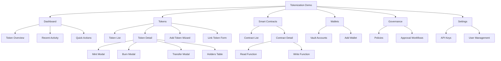

# Tokenization Demo Information Architecture (Aligned with Claude.md v2)

## 1) Purpose and alignment

This IA document is explicitly aligned to `Claude.md` section 3 (IA detail spec) and
is intended to be used as the source of truth for:

- Page hierarchy and navigation
- Section-level UI structure
- Data field definition
- Design mapping (screen/frame level)
- Spreadsheet export mapping

## 2) IA principles

1. Operation-first console UX for a 5-7 minute MVP demo.
2. Fireblocks-style dark layout with dense data tables.
3. Clear separation between action execution and governance decisions.
4. Deterministic terminology across IA, UserFlow, and Design inventory.
5. Every section in Claude section 3 must map to a concrete screen/frame.

## 3) Global navigation model

Primary navigation:

1. Dashboard
2. Tokens
3. Smart Contracts
4. Wallets
5. Governance
6. Settings

Secondary navigation:

- Contextual tabs in Token Detail
- Contract Read/Write tabs
- Modal-step navigation (Add Token Step 1/2/3)

## 4) IA detail mapping (1:1 with Claude section 3)

### 4.1 Dashboard

| Section | Included elements | Data fields | Notes | Screen ID |
|---|---|---|---|---|
| Token Overview | KPI cards and mini distribution chart | total_token_count, total_supply_usd, chain_distribution | Fireblocks-style summary row | SCR-01 |
| Recent Activity | Table with fixed columns and status chips | timestamp, action_type, token_name, amount, status | Keep 10-20 rows visible | SCR-01 |
| Quick Actions | Primary action button group | add_token, link_token, mint, burn, transfer | Must expose 5 actions | SCR-01 |
| Alerts/Notifications | Warning/notice stack | pending_approvals, failed_tx_count, policy_violation_count | Optional for MVP, but wireframe included | SCR-01 |

### 4.2 Tokens

| Screen/Section | Included elements | Data fields | Notes | Screen ID |
|---|---|---|---|---|
| Token List | Search, filters, table, row action menu | name, symbol, blockchain_logo, contract_address, total_supply, holding, holders_count, actions | Sorting and pagination required | SCR-02 |
| Token Detail - Info | Header info card with key metadata | name, symbol, decimals, contract_address, issuer_vault, total_supply, created_at | Network-specific field hints | SCR-03 |
| Token Detail - Holders | Holder table + helper link | vault_id, balance, supply_ratio, last_activity | Include "See Deposit Addresses" link | SCR-03 |
| Token Detail - Actions | Action button group | mint, burn, withdraw, manage_contract, add_wallet, more | Six actions are mandatory | SCR-03 |
| Add Token | Three-step form wizard | step1_blockchain, step2_name, step2_symbol, step2_decimals, step2_contract_option, step3_review_confirm | EVM/Stellar/Ripple branch behavior | SCR-04 |
| Link Token | Existing token linking form | blockchain, contract_address_or_asset_code, verify_result | Verify and Link are separate states | SCR-05 |

### 4.3 Smart Contracts (EVM only)

| Screen/Section | Included elements | Data fields | Notes | Screen ID |
|---|---|---|---|---|
| Contract List | Contract table and status indicator | contract_name, address, linked_token, last_used_at | Entry from Token Detail action | SCR-09 |
| Contract Detail | Read/Write tab shell | active_tab, contract_address, abi_name | Parent for function views | SCR-10 |
| Read Function | Parameter form + synchronous result panel | function_name, input_params, call_result | No state mutation | SCR-10 |
| Write Function | Parameter form + execution pipeline | function_name, input_params, gas_estimate, approval_state, tx_hash | Includes policy approval path | SCR-10 |

### 4.4 Wallets

| Screen/Section | Included elements | Data fields | Notes | Screen ID |
|---|---|---|---|---|
| Vault Accounts | Table with summary badges | vault_id, vault_name, asset_wallet_count, balance_summary | Workspace wallet overview | SCR-11 |
| Add Wallet | Form or modal from Token Detail | token, vault, trustline_option | Stellar/Ripple trustline hint | SCR-12 |

### 4.5 Governance

| Screen/Section | Included elements | Data fields | Notes | Screen ID |
|---|---|---|---|---|
| Policies | Policy list and quick edit controls | policy_name, scope_actions, required_approvals, status | Read-focused in MVP | SCR-13 |
| Approval Workflows | Stage graph and queue table | step_order, approver_group, condition, timeout, ticket_status | Simplified flow is allowed | SCR-13 |

### 4.6 Settings

| Screen/Section | Included elements | Data fields | Notes | Screen ID |
|---|---|---|---|---|
| API Keys | Table and key lifecycle controls | key_name, created_at, permissions, revoke_state | Mask sensitive values | SCR-14 |
| User Management | User roster and role controls | user_name, role, last_login | Read-only is acceptable for MVP | SCR-14 |

## 5) Field dictionary by domain object

### 5.1 Token

| Field | Type | Required | Description |
|---|---|---|---|
| token_id | string | Yes | Internal stable identifier |
| name | string | Yes | Display token name |
| symbol | string | Yes | Ticker symbol |
| blockchain | enum | Yes | EVM/Stellar/Ripple |
| contract_address | string | Conditional | EVM contract or mapped code |
| decimals | integer | Yes | Display precision |
| total_supply | decimal | Yes | Current total supply |
| holding | decimal | No | Workspace holding aggregate |
| holders_count | integer | No | Number of holders |
| status | enum | Yes | active/pending/archived |
| created_at | datetime | Yes | Creation timestamp |

### 5.2 Operation

| Field | Type | Required | Description |
|---|---|---|---|
| operation_id | string | Yes | Stable operation identifier |
| action_type | enum | Yes | mint/burn/withdraw/transfer |
| source_wallet | string | Conditional | Source wallet or vault |
| destination_wallet | string | Conditional | Destination wallet or vault |
| amount | decimal | Yes | Operation amount |
| approval_state | enum | Yes | auto-approved/pending/rejected |
| tx_hash | string | No | On-chain reference |
| status | enum | Yes | pending/completed/failed |
| actor | string | Yes | Triggering operator |
| timestamp | datetime | Yes | Action creation time |

### 5.3 Contract

| Field | Type | Required | Description |
|---|---|---|---|
| contract_id | string | Yes | Internal identifier |
| contract_name | string | Yes | Display contract name |
| address | string | Yes | Contract address |
| linked_token | string | No | Linked token symbol |
| abi_name | string | No | Function schema reference |
| last_used_at | datetime | No | Last invocation timestamp |

### 5.4 Governance policy

| Field | Type | Required | Description |
|---|---|---|---|
| policy_id | string | Yes | Policy identifier |
| policy_name | string | Yes | Display policy name |
| scope_actions | string | Yes | Applicable operations |
| required_approvals | integer | Yes | Number of approvals |
| approver_group | string | No | Responsible approver group |
| timeout_minutes | integer | No | Approval timeout |
| status | enum | Yes | active/inactive/draft |

## 6) Sitemap and route model

## 7) MVP priority and rationale

### 7.1 P0 (must-have)

| Screen ID | Screen name | Why P0 |
|---|---|---|
| SCR-01 | Dashboard | Entry point and KPI visibility for demo narrative |
| SCR-02 | Token List | Primary discovery and action launch surface |
| SCR-03 | Token Detail | Core action context and lifecycle verification |
| SCR-04 | Add Token | New token issuance entry required for demo |
| SCR-05 | Link Token | Existing token onboarding path |
| SCR-06 | Mint Modal | Core lifecycle action |
| SCR-07 | Burn Modal | Core lifecycle action |
| SCR-08 | Transfer Modal | Core lifecycle action |
| SCR-10 | Manage Contract | Contract operation proof point |

### 7.2 P1 (should-have)

| Screen ID | Screen name | Why P1 |
|---|---|---|
| SCR-09 | Contract List | Improves contract context but not required for minimal path |
| SCR-11 | Vault Accounts | Helpful for wallet visibility and source/destination clarity |
| SCR-12 | Add Wallet | Required for extended flow but can be simplified |
| SCR-13 | Governance | Important for policy framing; can be read-only in MVP |
| SCR-14 | Settings | Operationally useful, not critical to first demo |

## 8) IA acceptance checklist

- [x] Six mandatory IA domains are present.
- [x] Each domain is mapped using section/included-elements/data-fields.
- [x] Token List includes the exact 8 required columns.
- [x] Token Detail includes 7 info fields, holders table, and 6 action buttons.
- [x] Add Token is modeled as a 3-step branching flow.
- [x] Smart Contracts include Read/Write function modeling.
- [x] Wallet, Governance, and Settings sections are defined.
- [x] P0 versus P1 priorities and rationale are explicit.
