# 토큰화 플랫폼 사용자 플로우

> 이 문서는 `UserFlow.md`의 한국어 번역본입니다. 원본과 차이가 있을 경우 원본을 우선합니다.

> Part A: Layer 1 (Tokenization API Console) | Part B: Layer 2 (Point Token Admin)

## 1) 플로우 개요

이 문서는 필수 UX 플로우를 정의합니다:

1. 토큰 발행 플로우
2. 생애주기 관리 플로우 (Mint/Burn/Transfer)
3. 엔드투엔드 운영자 여정
4. P0 기능 강화 플로우 (Add Token v2, Lifecycle Rail, Approval Queue v2)

## 2) Flow A: 신규 토큰 발행

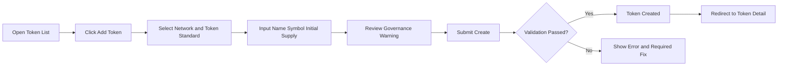

## 3) Flow B: 토큰 생애주기 액션 (Mint/Burn/Transfer)

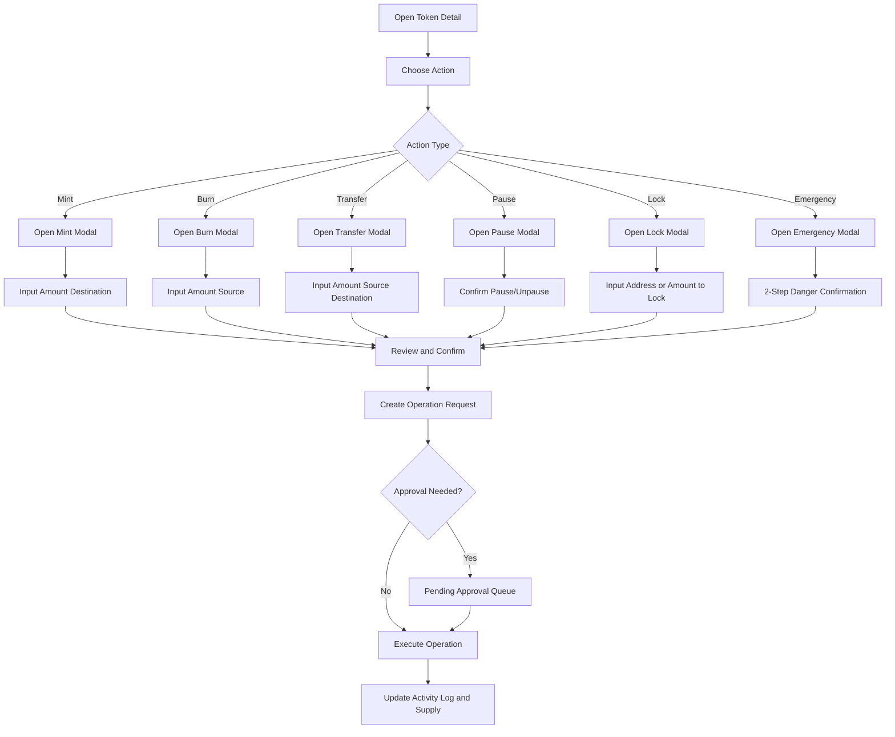

## 4) Flow C: 엔드투엔드 데모 여정

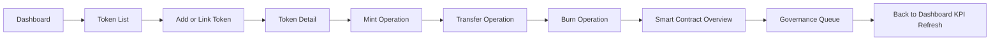

## 5) UX 규칙

- 모든 고영향 액션은 확인 모달을 사용해야 한다.
- 작업 결과 상태는 Token Detail 활동 로그에 표시되어야 한다.
- 에러 상태에서는 가능한 한 사용자 입력을 보존해야 한다.
- 최종 제출 전 Governance 상태를 표시해야 한다.
- 모든 블록체인 작업은 **Tx 상태 플로우** (§5-1 참고)를 따른다.
- 모든 목록/테이블 뷰는 안내 메시지가 포함된 **빈 상태(Empty State)**를 가져야 한다.
- 위험 액션(Pause, Emergency)은 명시적 확인 UI가 필요하다.

## 5-1) Tx 상태 플로우 (확인 후)

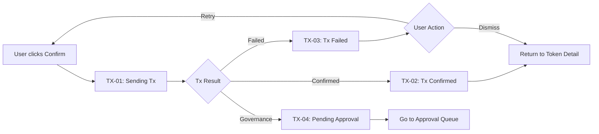

**TX-01 전송 중**: 진행률 바 (2/12 블록), tx hash (대기 중), 스피너
**TX-02 확인됨**: 초록색 배지, 블록 번호, 가스 사용량, Etherscan 링크
**TX-03 실패**: 빨간색 배지, 에러 메시지 (예: 가스 부족), 재시도 버튼
**TX-04 Governance**: 주황색 잠금, Request ID, 승인자 목록, SLA 카운트다운

## 6) 화면 매핑

| 플로우 단계 그룹 | 화면 |
|---|---|
| 탐색 및 모니터링 | Dashboard, Token List |
| 토큰 온보딩 | Add Token, Link Token |
| 토큰 운영 | Token Detail + Mint/Burn/Transfer 모달 |
| 컨트랙트 및 정책 확인 | Smart Contracts, Governance |
| 프로그램 및 담보 Mint | Program Selector, Mint Builder, Redemption Queue, Collateral Profiles |

## 7) 화면 간 전환 플로우 (전체 연결 흐름)

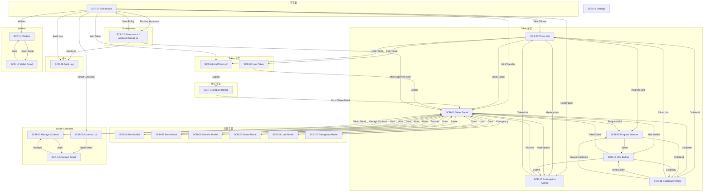

### 화면 간 전환 보충 설명

**추가된 연결 (v2 업데이트):**

| 추가된 연결 | 설명 |
|---|---|
| Dashboard → Contract List | 대시보드에서 Smart Contracts 직접 진입 |
| Dashboard → Wallets | 대시보드에서 Wallets 직접 진입 |
| Dashboard → Governance | Pending Approvals 위젯에서 Governance 진입 |
| Contract List → Contract Detail → Manage Contract | IA §8의 Detail(읽기)/Manage(실행) 분리 반영 |
| Wallets → Wallet Detail | 지갑 목록에서 상세 진입 |
| Governance → Token Detail | 승인/거절 후 해당 토큰 상세로 복귀 |
| Add Token → Token Detail | 생성 완료 후 Token Detail로 리다이렉트 |
| Link Token → Token Detail | 링크 완료 후 Token Detail로 리다이렉트 |
| Manage Contract ↔ Contract Detail | MC에서 Detail로 돌아가기 |

**화면 Depth 분류:**

| Depth | 역할 | 화면 |
|---|---|---|
| 0 | 진입점 | Dashboard |
| 1 | 섹션 랜딩 | Token List, Contract List, Wallets, Governance, Settings |
| 2a | 생성 플로우 | Add Token v2, Link Token |
| 2b | 상세/실행 | Token Detail, Contract Detail, Manage Contract, Wallet Detail |
| 3 | 액션 모달 | Mint Modal, Burn Modal, Transfer Modal |
| 3 | 서브플로우 | Program Selector → Mint Builder → Redemption Queue ↔ Collateral |
| 4 | MC 함수별 | Manage Contract 함수 실행 화면 (balanceOf, mint, burn 등) |

### Flow D: 프로그램 및 담보 Mint (FL-08)

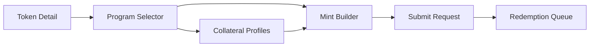

## 8) MVP 확인

- 발행 플로우: 포함
- 생애주기 플로우: 포함
- 엔드투엔드 여정: 포함
- 프로그램 및 담보 Mint 플로우: 포함 (SCR-15~18)

## 9) P0 기능 강화: Add Token v2 플로우 (타입/담보/공급량/역할)

```mermaid
flowchart LR
    A[Open Token List] --> B[Click Add Token v2]
    B --> C[Step 1a: Select Network]
    C --> D[Step 1b: Select Token Type Card]
    D --> D2[Inline Accordion: Function Preview]
    D2 --> E[Step 2: Select Backing Asset Class]
    E --> F[Step 3: Name Symbol Decimals Supply]
    F --> G[Step 4: Issuance Roles Preview]
    G --> H[Step 5: Review and Submit]
    H --> I{Validation Passed}
    I -->|Yes| J[Create Token]
    I -->|No| K[Show Error]
    J --> J2[Deploy Result Screen]
    J2 --> L[Redirect to Token Detail with Lifecycle Rail]
```

### P0 플로우 참고 사항

- Backing Asset 클래스는 v2 발행 경로에서 필수.
- 역할 설정은 토큰화 모듈 수준의 미리보기. 심층 정책 엔진은 범위 밖.
- Token Type 선택 시 **인라인 아코디언 패턴** 사용: ERC-20F/721F/1155F 카드를 선택하면 아래에 함수 미리보기 패널이 확장되어, 위저드를 벗어나지 않고 읽기/쓰기 함수와 역할을 확인 가능.
- 이것은 배포 후 동일한 함수가 실시간 읽기/쓰기 패널로 나타나는 Contract Detail (SCR-10)과 연결됨.

## 10) P0 기능 강화: Lifecycle Rail 업데이트

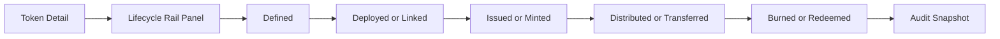

### Lifecycle Rail 필수 데이터

- 상태명
- entered_at 타임스탬프
- 수행자
- tx_hash 또는 request_id
- 전환 사유

## 11) P0 기능 강화: Approval Queue v2 운영

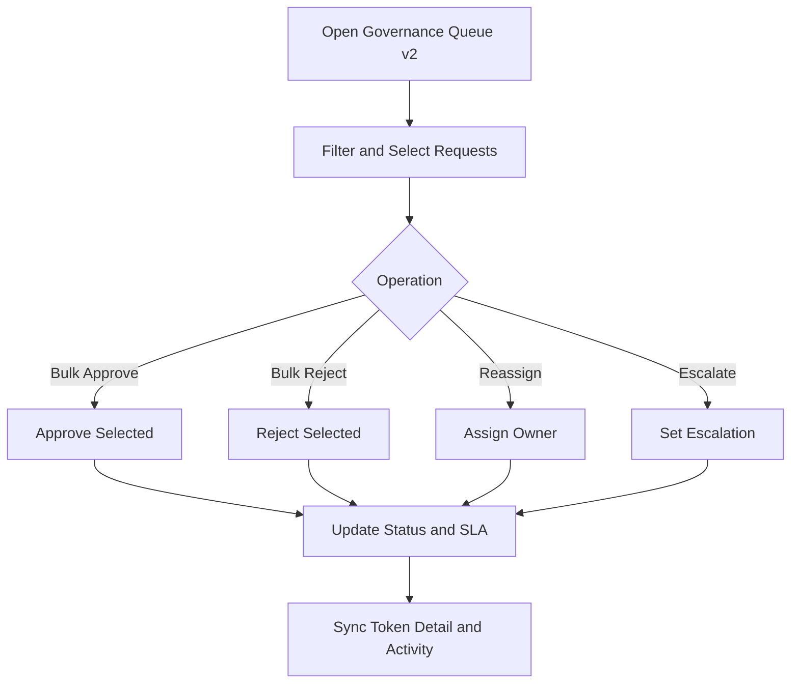

### Queue v2 UX 제약 조건

- 배치 액션은 1~N개 요청을 지원해야 함.
- SLA와 담당자는 큐 테이블의 1급 컬럼.
- 에스컬레이션 플래그는 목록과 상세에서 모두 표시되어야 함.

## 12) Manage Contract 함수별 화면 네비게이션

Manage Contract (SCR-10)에서 스마트 컨트랙트의 개별 함수를 실행하는 화면으로 전환하는 플로우.

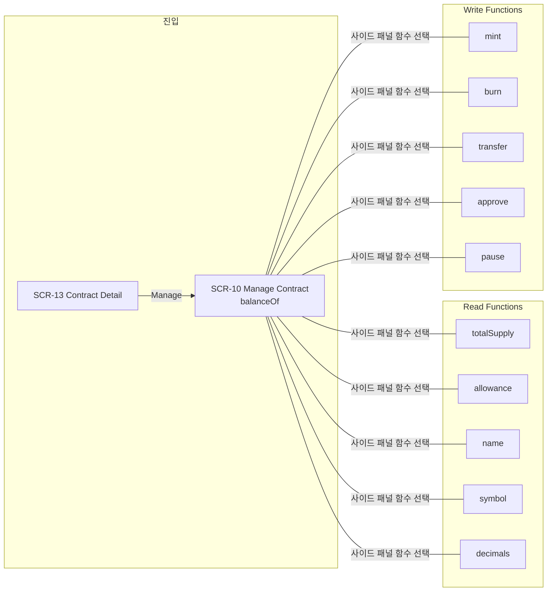

### MC 함수별 화면 전환 규칙

- **진입**: Contract Detail → Manage Contract (기본 화면: balanceOf)
- **함수 전환**: 사이드 패널의 함수 리스트에서 선택하면 같은 레이아웃의 다른 함수 화면으로 전환 (SPA 내 상태 변경, 페이지 이동 아님)
- **Read 함수**: 파라미터 입력 → Call → 결과 표시 (트랜잭션 없음)
- **Write 함수**: 파라미터 입력 → Gas 추정 → Execute → 승인 플로우 연결 가능
- **복귀**: Manage Contract → Contract Detail → Contract List

### MC 함수 목록 (ERC-20F 기준)

| 구분 | 함수 | 파라미터 | 반환/동작 |
|---|---|---|---|
| Read | totalSupply() | 없음 | uint256 |
| Read | balanceOf(address) | account | uint256 |
| Read | allowance(owner,spender) | owner, spender | uint256 |
| Read | name() | 없음 | string |
| Read | symbol() | 없음 | string |
| Read | decimals() | 없음 | uint8 |
| Write | mint(address,uint256) | to, amount | 트랜잭션 → 승인 |
| Write | burn(uint256) | amount | 트랜잭션 |
| Write | transfer(address,uint256) | to, amount | 트랜잭션 |
| Write | approve(address,uint256) | spender, amount | 트랜잭션 |
| Write | pause() | 없음 | 트랜잭션 → 승인 |

## 13-A) Flow E: 고객 토큰 발행 요청 (신청자 플로우)

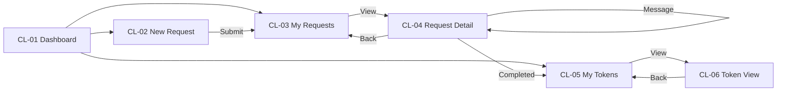

### 고객 플로우 설명

1. **신청**: CL-01 → CL-02에서 3-Step Wizard (네트워크/타입 → 토큰 정보/목적 → 검토/제출)
2. **추적**: CL-03에서 전체 신청 목록 확인, 상태 칩으로 진행 현황 파악
3. **상세**: CL-04에서 5단계 타임라인(Submitted → Under Review → Approved → Executing → Completed)과 어드민 메시지 확인
4. **완료 후**: CL-05/CL-06에서 발행 완료 토큰 조회 (읽기 전용, 발행 요청 불가)

## 13-B) Flow F: 어드민 심사 및 실행 플로우

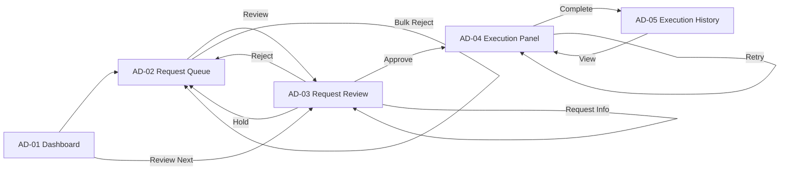

### 어드민 플로우 설명

1. **접수 확인**: AD-01에서 대기 건수, SLA 초과 건 파악
2. **심사**: AD-02에서 큐 확인 → AD-03에서 상세 심사 (KYC, 컴플라이언스 체크리스트)
3. **결정**: Approve → AD-04 실행 / Reject → 사유 입력 후 큐 복귀 / Hold → 보류 / Request Info → 고객에 추가 서류 요청
4. **실행**: AD-04에서 콜드월렛 서명 5단계 (Prepare → Sign → Broadcast → Confirm → Complete)
5. **이력**: AD-05에서 전체 실행 이력 + 성공률/처리시간 통계

### 콜드월렛 실행 상태 플로우

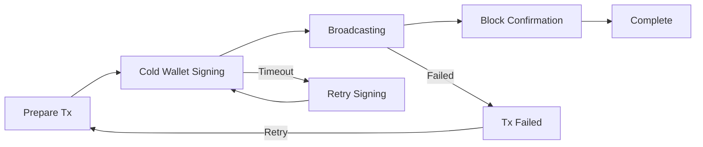

## 13) 전체 화면 전환 매트릭스 (v2)

| From ＼ To | Dashboard | Token List | Token Detail | Add Token | Link Token | Contract List | Contract Detail | Manage Contract | Wallets | Wallet Detail | Governance | Settings |
|---|---|---|---|---|---|---|---|---|---|---|---|---|
| **Dashboard** | — | ✓ | ✓ | ✓ | — | ✓ | — | — | ✓ | — | ✓ | ✓ |
| **Token List** | — | — | ✓ | ✓ | ✓ | — | — | — | — | — | — | — |
| **Token Detail** | — | — | — | — | — | — | — | ✓ | — | — | — | — |
| **Add Token** | — | — | ✓* | — | — | — | — | — | — | — | — | — |
| **Link Token** | — | — | ✓* | — | — | — | — | — | — | — | — | — |
| **Contract List** | — | — | — | — | — | — | ✓ | — | — | — | — | — |
| **Contract Detail** | — | — | — | — | — | ✓ | — | ✓ | — | — | — | — |
| **Manage Contract** | — | — | ✓ | — | — | — | ✓ | — | — | — | — | — |
| **Wallets** | — | — | — | — | — | — | — | — | — | ✓ | — | — |
| **Wallet Detail** | — | — | — | — | — | — | — | — | ✓ | — | — | — |
| **Governance** | ✓ | — | ✓ | — | — | — | — | — | — | — | — | — |

✓* = 생성/링크 완료 후 리다이렉트

> Token Detail에서 Mint/Burn/Transfer 모달, Program Selector, Mint Builder, Redemption Queue, Collateral Profiles로의 전환은 §3, §7 Flow D 참고.

---

# Part B — Layer 2: Point Token Admin 플로우

## 14) Layer 2 플로우 개요

Layer 2 Point Token Admin은 포인트/컬쳐 토큰 운영자를 위한 비즈니스 레이어.
Layer 1의 토큰 관리 플로우를 상속하면서, 재무 관리/블록체인 운영/탐색기 플로우를 추가.

주요 플로우:

1. Token Management (Layer 1 Flow A/B/C 상속)
2. 재무 관리 (Financial Management) — 신규
3. 블록체인 운영 (Blockchain Operations) — 신규
4. 탐색기 (Explorer) — 신규
5. 엔드투엔드 운영자 여정 — 신규

## 15) Flow G: 재무 관리

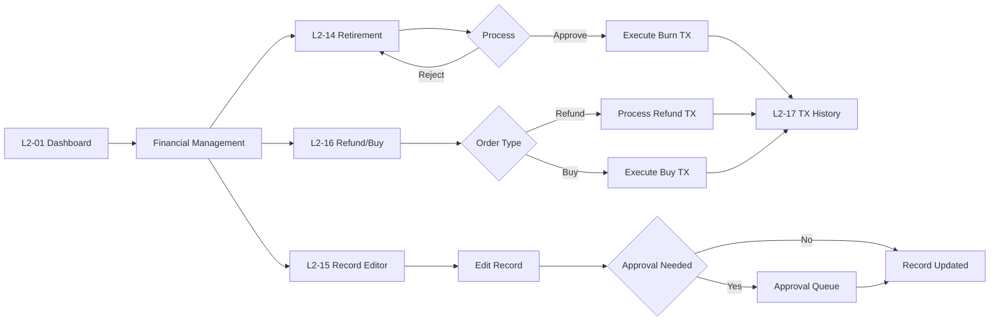

### Flow G UX 규칙

- Retirement (환매/소각): 요청 접수 → 검토 → 승인 시 Burn TX 자동 실행 → TX History에 기록
- Record Editor: 관리자 전용, 모든 수정은 사유 필수 + 감사 로그 자동 기록
- Refund/Buy: 환불은 역방향 Transfer + Burn, 매입은 Mint + Transfer
- 모든 재무 액션은 TX History(L2-17)에 기록 필수

## 16) Flow H: 블록체인 운영

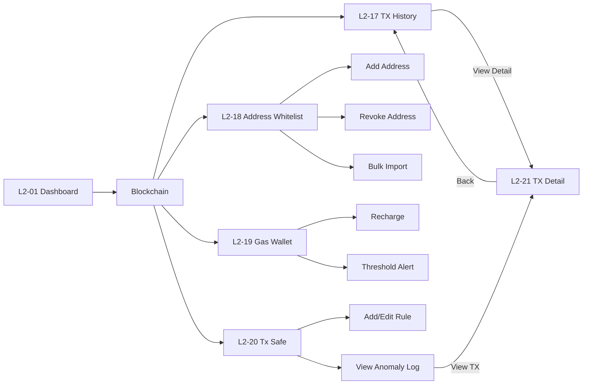

### Flow H UX 규칙

- TX History: 전체 트랜잭션의 단일 진실 소스. 모든 다른 화면에서 TX Hash 클릭 시 L2-21로 이동
- Address Whitelist: Transfer 대상 주소는 화이트리스트에 있어야 실행 가능 (정책 엔진과 연동)
- Gas Wallet: 잔액 부족 시 Dashboard에 경고 표시, 자동 충전 설정 가능
- Tx Safe: 한도 초과 트랜잭션은 자동 차단 → Anomaly Log에 기록 → 관리자 수동 승인 필요

## 17) Flow I: 탐색기

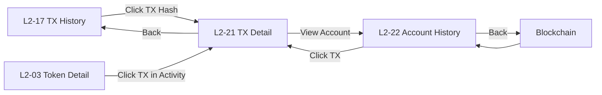

### Flow I UX 규칙

- TX Detail: 프라이빗 체인 전용 탐색기 역할. 외부 Etherscan 불필요
- Account History: 주소 입력 → 해당 주소의 모든 토큰 잔액, 활동 이력, 잔액 변동 차트 표시
- TX Hash 링크는 모든 화면에서 일관되게 L2-21로 이동

## 18) Layer 2 화면 간 전환 플로우

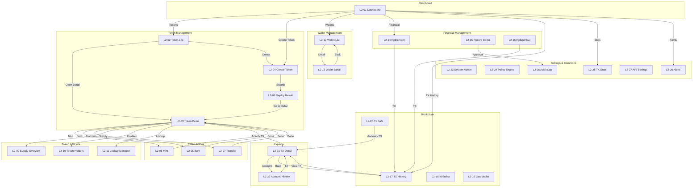

### Layer 2 화면 Depth 분류

| Depth | 역할 | 화면 |
|---|---|---|
| 0 | 진입점 | L2-01 Dashboard |
| 1 | 섹션 랜딩 | Token List, Wallet List, Retirement, TX History, TX Stats, System Admin |
| 2a | 생성 플로우 | Create Token, Deploy Result |
| 2b | 상세/실행 | Token Detail, Wallet Detail, Record Editor, Refund/Buy |
| 3 | 액션 모달 | Mint, Burn, Transfer |
| 3 | 탐색기 | TX Detail, Account History |
| 3 | 운영 도구 | Address Whitelist, Gas Wallet, Tx Safe, Policy Engine, Audit Log, Alerts, API Settings |

## 19) Layer 2 전체 화면 전환 매트릭스

| From ＼ To | Dashboard | Token List | Token Detail | Wallet List | Retirement | TX History | TX Detail | TX Stats | System Admin |
|---|---|---|---|---|---|---|---|---|---|
| **Dashboard** | — | ✓ | ✓ | ✓ | ✓ | ✓ | — | ✓ | ✓ |
| **Token List** | — | — | ✓ | — | — | — | — | — | — |
| **Token Detail** | — | ✓ | — | — | — | — | ✓ | — | — |
| **Wallet List** | — | — | — | — | — | — | — | — | — |
| **Retirement** | — | — | — | — | — | ✓ | — | — | — |
| **Record Editor** | — | — | — | — | — | — | — | — | — |
| **Refund/Buy** | — | — | — | — | — | ✓ | — | — | — |
| **TX History** | — | — | — | — | — | — | ✓ | — | — |
| **TX Detail** | — | — | — | — | — | ✓ | — | — | — |
| **Tx Safe** | — | — | — | — | — | — | ✓ | — | — |

> 모달(Mint/Burn/Transfer)은 Token Detail에서 열리고 Done 시 Token Detail로 복귀.
> TX Hash 링크는 모든 화면에서 L2-21 TX Detail로 이동.
