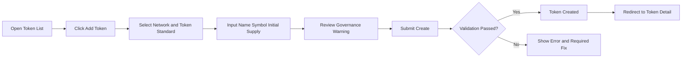
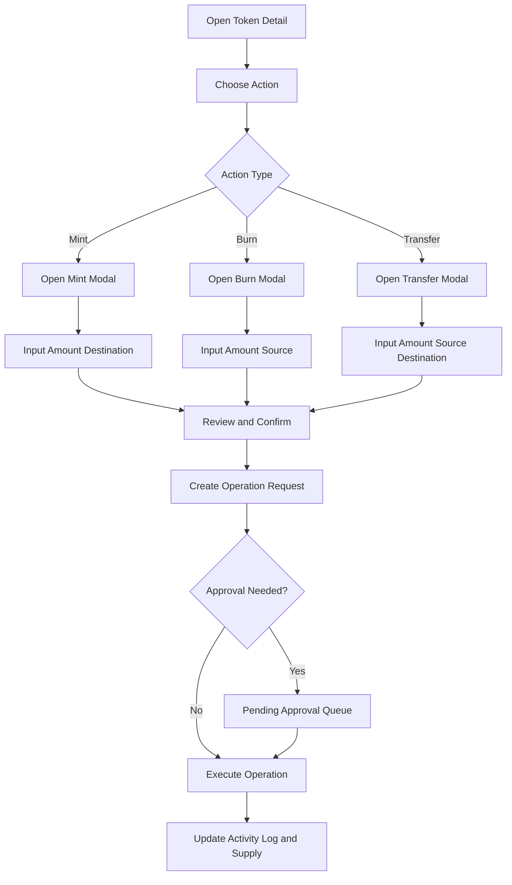
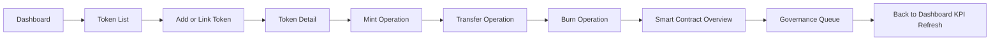

# Tokenization Demo User Flow

## 1) Flow overview

This document defines three required UX flows:

1. Token issuance flow
2. Lifecycle management flow (mint/burn/transfer)
3. End-to-end operator journey

## 2) Flow A: Issue New Token

## 3) Flow B: Token Lifecycle Action (Mint/Burn/Transfer)

## 4) Flow C: End-to-End Demo Journey

## 5) UX rules

- All high-impact actions must use confirmation modals.
- Operation result states must be visible in Token Detail activity log.
- Error states should preserve user input where possible.
- Governance state should be shown before final submit.

## 6) Screen mapping

| Flow step group | Screen(s) |
|---|---|
| Discovery and monitoring | Dashboard, Token List |
| Token onboarding | Add Token, Link Token |
| Token operations | Token Detail + Mint/Burn/Transfer modals |
| Contract and policy check | Smart Contracts, Governance |

## 7) MVP confirmation

- Issue flow: included
- Lifecycle flow: included
- End-to-end journey: included
