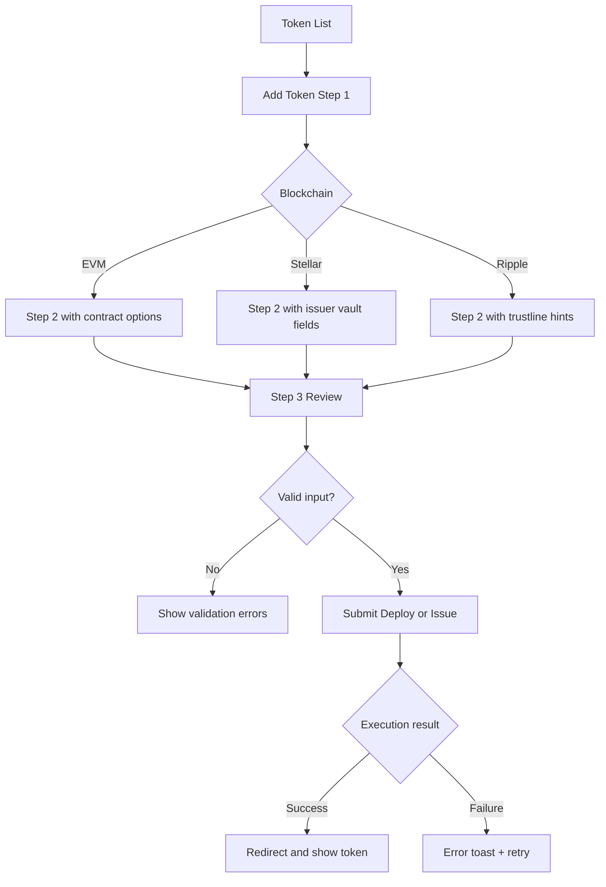
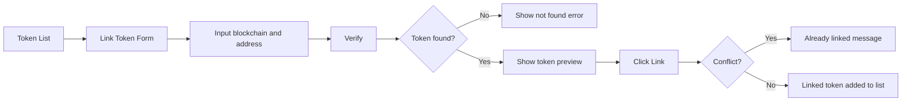
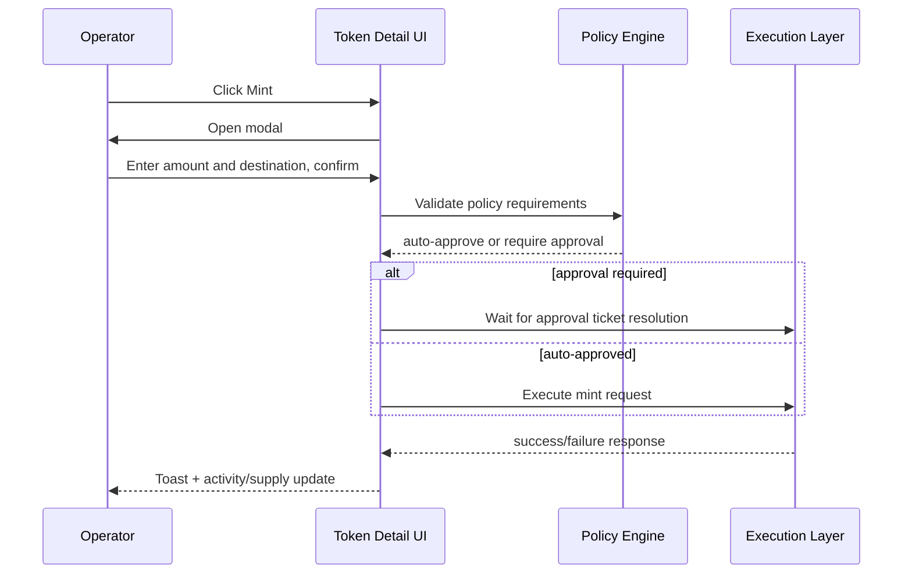
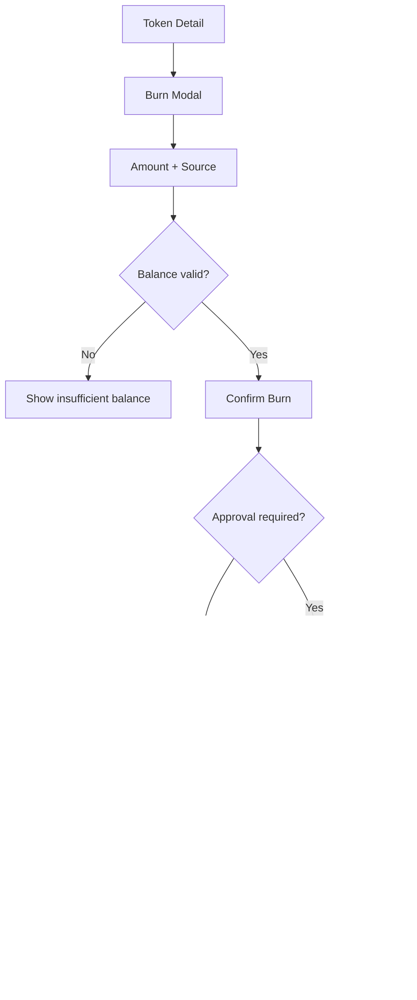
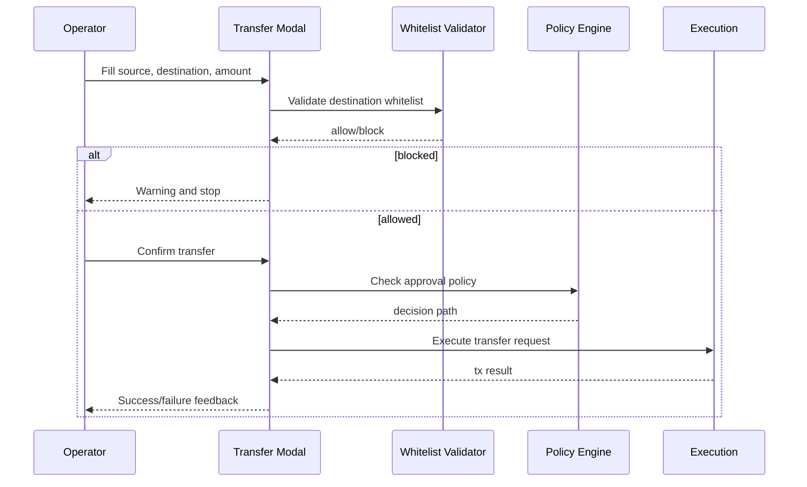
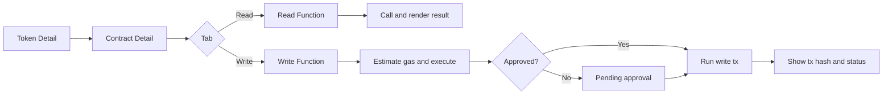
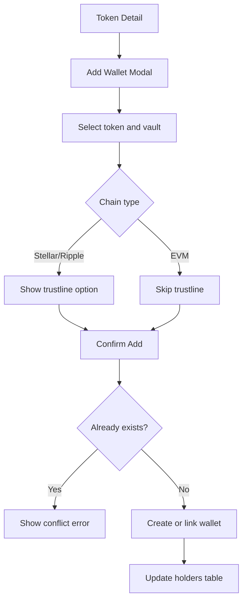

# Tokenization Demo User Flow (Aligned with Claude.md section 4)

## 1) Scope and objective

This document defines seven mandatory flows and one optional extension flow:

1. Issue New Token
2. Link Existing Token
3. Mint
4. Burn
5. Transfer (Withdraw)
6. Manage Contract (EVM)
7. Add Wallet

Each flow includes:

- Step table with 5 required columns
- Mermaid diagram
- Screen mapping to IA sections
- Error and branch handling

## 2) Flow 4.1 - Issue New Token (detailed)

### 2.1 Step table

| Step | Screen | User Action | System Response | Exception / Branch |
|---|---|---|---|---|
| 1 | Token List | Click `Add Token` | Open Add Token Step 1 | - |
| 2 | Add Token - Step 1 | Select blockchain (EVM/Stellar/Ripple) | Configure Step 2 fields by chain | Missing selection blocks next |
| 3 | Add Token - Step 2 | Enter name, symbol, decimals | Validate required and symbol format | Invalid symbol highlights field |
| 4 | Add Token - Step 2 (EVM) | Select contract option (prebuilt/custom/address) | Run contract option validation | Invalid address error |
| 5 | Add Token - Step 3 | Review summary and submit Deploy/Issue | Create operation request and show loading | API failure shows retry banner |
| 6 | System processing | Wait for completion | Show success toast and redirect to Token List/Detail | Timeout shows pending state |
| 7 | Token List | Confirm new token row appears | Persist created token state | If missing, prompt refresh and incident log |

### 2.2 Diagram

### 2.3 IA mapping

| Flow element | IA reference |
|---|---|
| Step 1 launch | Tokens > Token List |
| Step 1/2/3 form | Tokens > Add Token |
| Completion verification | Tokens > Token List, Token Detail - Info |

## 3) Flow 4.2 - Link Existing Token (detailed)

### 3.1 Step table

| Step | Screen | User Action | System Response | Exception / Branch |
|---|---|---|---|---|
| 1 | Token List | Click `Link Token` | Open Link Token form | - |
| 2 | Link Token | Select blockchain and enter address/asset code | Enable Verify action | Missing values disable Verify |
| 3 | Link Token | Click `Verify` | Query token metadata (name/symbol/decimals) | Not found error state |
| 4 | Link Token | Click `Link` after preview | Append token into list | Already linked conflict error |
| 5 | Token List | Confirm linked token row is visible | Persist and index linked token | Sync delay shows pending status |

### 3.2 Diagram

### 3.3 IA mapping

| Flow element | IA reference |
|---|---|
| Link entry | Tokens > Token List |
| Verify and link action | Tokens > Link Token |
| Final row presence | Tokens > Token List |

## 4) Flow 4.3 - Mint (detailed)

### 4.1 Step table

| Step | Screen | User Action | System Response | Exception / Branch |
|---|---|---|---|---|
| 1 | Token Detail | Click `Mint` | Open Mint modal | - |
| 2 | Mint Modal | Enter amount and destination wallet | Validate amount/rules | Limit exceeded warning |
| 3 | Mint Modal | Click `Confirm` | Create operation and evaluate policy | Approval required branch |
| 4 | Approval Queue | Approver accepts or rejects | Execute or cancel request | Rejected action logs cancellation |
| 5 | Token Detail | Review updated supply and holder row | Refresh info and activity feed | Failed tx adds failure row |

### 4.2 Diagram

### 4.3 IA mapping

| Flow element | IA reference |
|---|---|
| Mint launch | Tokens > Token Detail - Actions |
| Mint form fields | Tokens > Token Detail - Actions |
| Result verification | Tokens > Token Detail - Info, Token Detail - Holders |
| Approval branch | Governance > Approval Workflows |

## 5) Flow 4.4 - Burn (detailed)

### 5.1 Step table

| Step | Screen | User Action | System Response | Exception / Branch |
|---|---|---|---|---|
| 1 | Token Detail | Click `Burn` | Open Burn modal | - |
| 2 | Burn Modal | Enter amount and source wallet | Check source balance >= amount | Insufficient balance error |
| 3 | Burn Modal | Click `Confirm` | Route through policy or execute | Approval required branch |
| 4 | Token Detail | Observe total supply reduction | Refresh info and activity rows | Failure keeps previous supply |

### 5.2 Diagram

### 5.3 IA mapping

| Flow element | IA reference |
|---|---|
| Burn launch | Tokens > Token Detail - Actions |
| Burn validation | Tokens > Token Detail - Holders |
| Burn outcome | Tokens > Token Detail - Info |

## 6) Flow 4.5 - Transfer (Withdraw) (detailed)

### 6.1 Step table

| Step | Screen | User Action | System Response | Exception / Branch |
|---|---|---|---|---|
| 1 | Token Detail | Click `Withdraw` | Open Transfer modal | - |
| 2 | Transfer Modal | Enter source, destination, amount | Validate whitelist and format | Unlisted destination block |
| 3 | Transfer Modal | Click `Confirm` | Create transfer operation | Approval branch if policy demands |
| 4 | Token Detail | Verify holder distribution updates | Update activity and balances | Failure marks action failed |

### 6.2 Diagram

### 6.3 IA mapping

| Flow element | IA reference |
|---|---|
| Transfer launch | Tokens > Token Detail - Actions |
| Transfer validations | Governance > Policies, Tokens > Token Detail - Holders |
| Transfer confirmation | Dashboard > Recent Activity, Token Detail - Holders |

## 7) Flow 4.6 - Manage Contract (EVM) (detailed)

### 7.1 Step table

| Step | Screen | User Action | System Response | Exception / Branch |
|---|---|---|---|---|
| 1 | Token Detail | Click `Manage Contract` | Open Contract Detail | - |
| 2 | Contract Detail | Select Read or Write tab | Load function list for selected tab | Missing ABI warning |
| 3 | Read Function | Input params and click `Call` | Return synchronous result panel | Function revert error |
| 4 | Write Function | Input params and click `Execute` | Show gas estimate and approval state | Gas estimate failure |
| 5 | Execution Result | Confirm tx hash and result status | Persist write action record | Failed tx with retry guidance |

### 7.2 Diagram

### 7.3 IA mapping

| Flow element | IA reference |
|---|---|
| Manage contract launch | Tokens > Token Detail - Actions |
| Read flow | Smart Contracts > Read Function |
| Write flow | Smart Contracts > Write Function |
| Result visibility | Smart Contracts > Contract Detail |

## 8) Flow 4.7 - Add Wallet (detailed)

### 8.1 Step table

| Step | Screen | User Action | System Response | Exception / Branch |
|---|---|---|---|---|
| 1 | Token Detail | Click `Add Wallet` | Open Add Wallet modal | - |
| 2 | Add Wallet Modal | Select token and vault | Show trustline option for Stellar/Ripple | Missing vault blocks submit |
| 3 | Add Wallet Modal | Click `Add` | Create or link wallet | Existing wallet conflict error |
| 4 | Token Detail | Confirm holder row appears | Update holders table and activity | Eventual consistency pending state |

### 8.2 Diagram

### 8.3 IA mapping

| Flow element | IA reference |
|---|---|
| Add Wallet launch | Tokens > Token Detail - Actions |
| Wallet creation | Wallets > Add Wallet |
| Result update | Tokens > Token Detail - Holders, Wallets > Vault Accounts |

## 9) Cross-flow screen mapping matrix

| Flow ID | Flow name | Primary screens | Supporting screens |
|---|---|---|---|
| FL-01 | Issue New Token | Token List, Add Token | Token Detail - Info |
| FL-02 | Link Existing Token | Token List, Link Token | Token Detail - Info |
| FL-03 | Mint | Token Detail, Mint Modal | Governance Approval Workflows |
| FL-04 | Burn | Token Detail, Burn Modal | Governance Approval Workflows |
| FL-05 | Transfer | Token Detail, Transfer Modal | Governance Policies |
| FL-06 | Manage Contract | Token Detail, Contract Detail | Read Function, Write Function |
| FL-07 | Add Wallet | Token Detail, Add Wallet Modal | Wallets Vault Accounts |

## 10) Error scenario matrix

| Error code | Typical trigger | User-facing behavior | Recovery path |
|---|---|---|---|
| ERR-001 | Invalid contract address | Inline error under address field | Correct and re-verify |
| ERR-002 | Symbol format invalid | Highlight symbol input | Enforce uppercase + length rule |
| ERR-003 | Amount exceeds policy limit | Warning banner in modal | Reduce amount or request approval |
| ERR-004 | Source balance insufficient | Hard stop in Burn modal | Change source wallet or amount |
| ERR-005 | Destination not whitelisted | Transfer blocked warning | Add destination to whitelist |
| ERR-006 | Approval rejected | Toast + timeline entry | Re-submit with policy-compliant params |
| ERR-007 | Contract write reverted | Result panel error | Inspect params and retry |
| ERR-008 | Duplicate wallet link | Conflict message | Select a different vault |

## 11) Mermaid coverage checklist

- [x] Flow 4.1 Issue New Token diagram
- [x] Flow 4.2 Link Existing Token diagram
- [x] Flow 4.3 Mint diagram
- [x] Flow 4.4 Burn diagram
- [x] Flow 4.5 Transfer diagram
- [x] Flow 4.6 Manage Contract diagram
- [x] Flow 4.7 Add Wallet diagram

## 12) MVP scope confirmation (P0 vs P1)

### P0 flow coverage

- FL-01 Issue New Token
- FL-02 Link Existing Token
- FL-03 Mint
- FL-04 Burn
- FL-05 Transfer
- FL-06 Manage Contract

### P1 flow coverage

- FL-07 Add Wallet (recommended in extended demo)

### Priority rationale

P0 flows prove token onboarding and lifecycle controls.
P1 flow improves enterprise wallet management depth.
