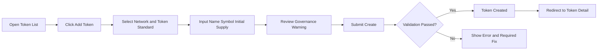
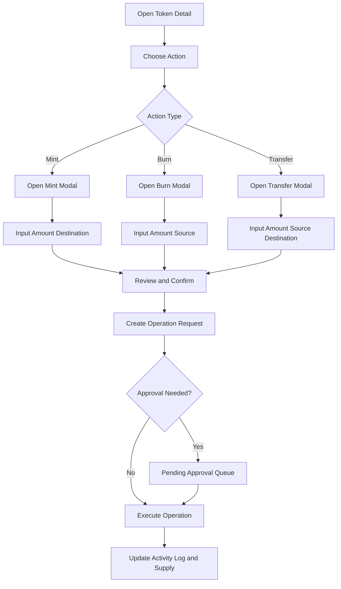
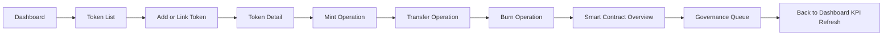
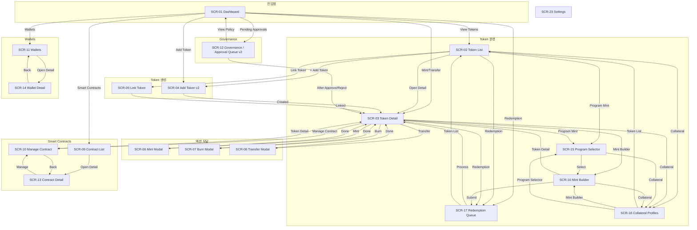
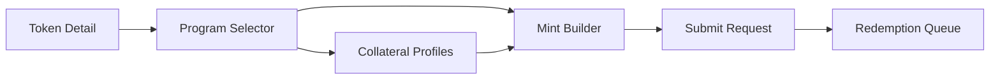
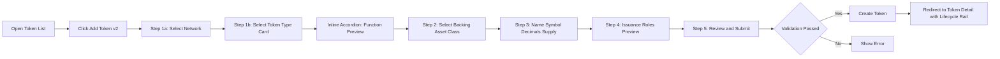
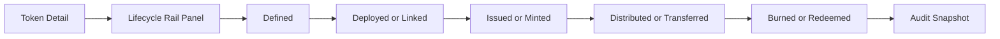
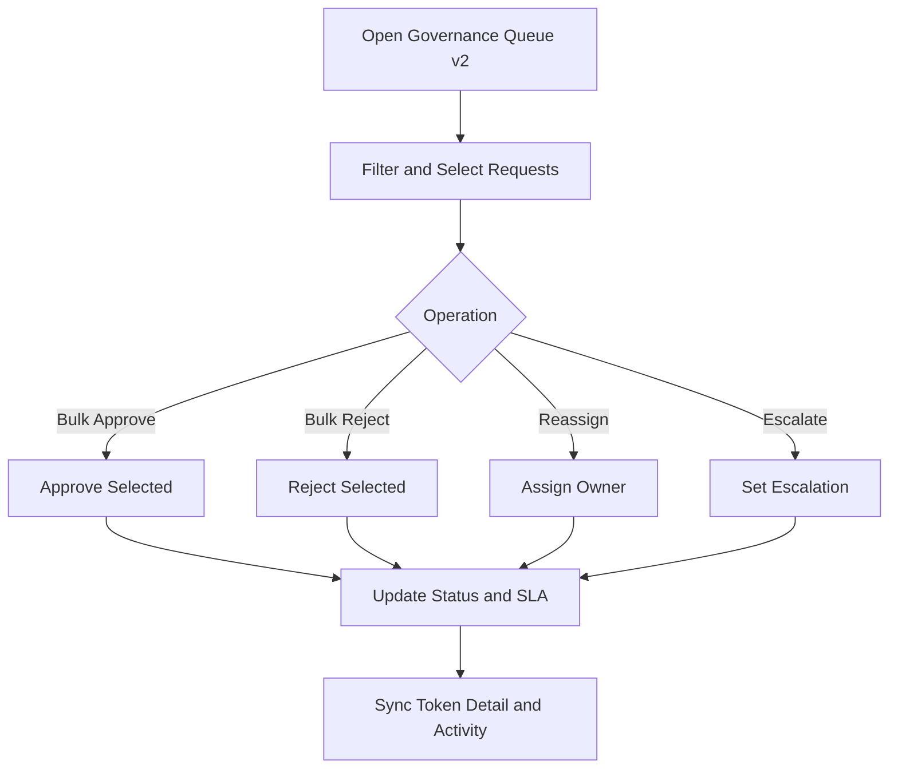
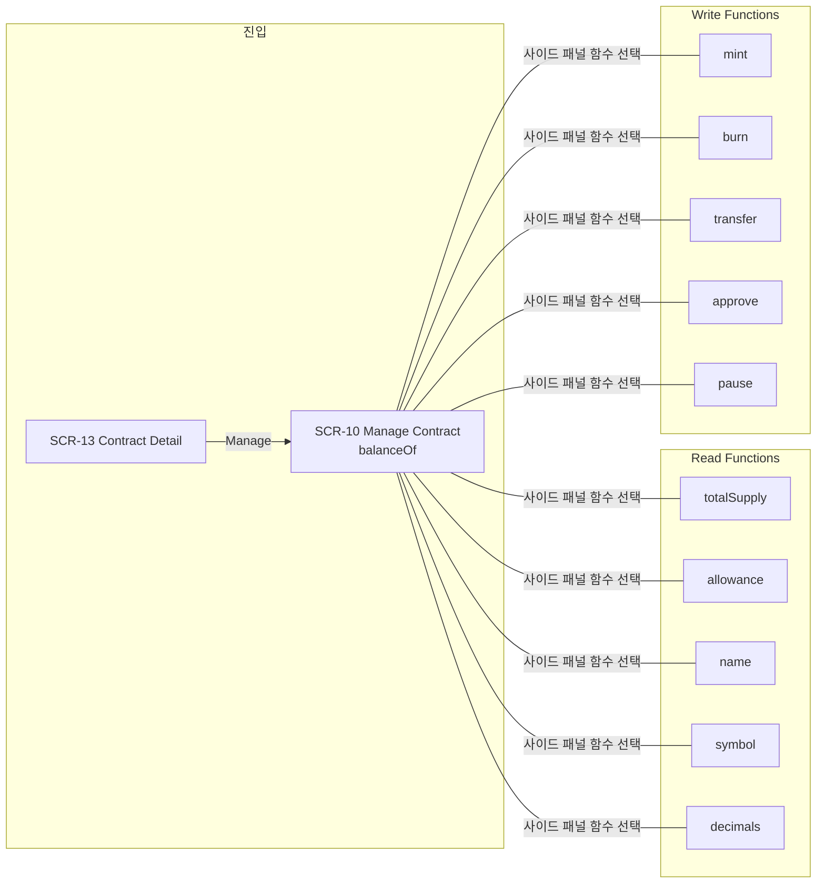

# Tokenization Demo User Flow

## 1) Flow overview

This document defines required UX flows:

1. Token issuance flow
2. Lifecycle management flow (mint/burn/transfer)
3. End-to-end operator journey
4. P0 enhancement flows (Add Token v2, Lifecycle Rail, Approval Queue v2)

## 2) Flow A: Issue New Token

## 3) Flow B: Token Lifecycle Action (Mint/Burn/Transfer)

## 4) Flow C: End-to-End Demo Journey

## 5) UX rules

- All high-impact actions must use confirmation modals.
- Operation result states must be visible in Token Detail activity log.
- Error states should preserve user input where possible.
- Governance state should be shown before final submit.

## 6) Screen mapping

| Flow step group | Screen(s) |
|---|---|
| Discovery and monitoring | Dashboard, Token List |
| Token onboarding | Add Token, Link Token |
| Token operations | Token Detail + Mint/Burn/Transfer modals |
| Contract and policy check | Smart Contracts, Governance |
| Program & collateral mint | Program Selector, Mint Builder, Redemption Queue, Collateral Profiles |

## 7) Screen-to-screen flow (전체 연결 흐름)

### Screen-to-screen flow 보충 설명

**끊어진 연결 보완 (v2 업데이트):**

| 추가된 연결 | 설명 |
|---|---|
| Dashboard → Contract List | 대시보드에서 Smart Contracts 직접 진입 |
| Dashboard → Wallets | 대시보드에서 Wallets 직접 진입 |
| Dashboard → Governance | Pending Approvals 위젯에서 Governance 진입 |
| Contract List → Contract Detail → Manage Contract | IA §8의 Detail(읽기)/Manage(실행) 분리 반영 |
| Wallets → Wallet Detail | 지갑 목록에서 상세 진입 |
| Governance → Token Detail | 승인/거절 후 해당 토큰 상세로 복귀 |
| Add Token → Token Detail | 생성 완료 후 Token Detail로 리다이렉트 |
| Link Token → Token Detail | 링크 완료 후 Token Detail로 리다이렉트 |
| Manage Contract ↔ Contract Detail | MC에서 Detail로 돌아가기 |

**화면 Depth 분류:**

| Depth | 역할 | 화면 |
|---|---|---|
| 0 | 진입점 | Dashboard |
| 1 | 섹션 랜딩 | Token List, Contract List, Wallets, Governance, Settings |
| 2a | 생성 플로우 | Add Token v2, Link Token |
| 2b | 상세/실행 | Token Detail, Contract Detail, Manage Contract, Wallet Detail |
| 3 | 액션 모달 | Mint Modal, Burn Modal, Transfer Modal |
| 3 | 서브플로우 | Program Selector → Mint Builder → Redemption Queue ↔ Collateral |
| 4 | MC 함수별 | Manage Contract 함수 실행 화면 (balanceOf, mint, burn 등) |

### Flow D: Program & Collateral Mint (FL-08)

## 8) MVP confirmation

- Issue flow: included
- Lifecycle flow: included
- End-to-end journey: included
- Program & collateral mint flow: included (SCR-15~18)

## 9) P0 Enhancement Flow: Add Token v2 (Type/Backing/Supply/Roles)

### P0 flow notes

- Backing asset class is mandatory in v2 issuance path.
- Role setup is preview-level for tokenization module; deep policy engine remains out of scope.
- Token type selection uses **inline accordion pattern**: selecting ERC-20F/721F/1155F card expands a function preview panel below, showing read/write functions and roles without navigating away from the wizard.
- This connects to Contract Detail (SCR-10) where the same functions appear as live read/write panels after deployment.

## 10) P0 Enhancement Flow: Lifecycle Rail Update

### Lifecycle rail required data

- state name
- entered_at timestamp
- actor
- tx_hash or request_id
- transition_reason

## 11) P0 Enhancement Flow: Approval Queue v2 Operations

### Queue v2 UX constraints

- Batch actions must support 1..N requests.
- SLA and assignee are first-class columns in queue table.
- Escalation flags must be visible in list and detail.

## 12) Manage Contract 함수별 화면 네비게이션

Manage Contract (SCR-10)에서 스마트 컨트랙트의 개별 함수를 실행하는 화면으로 전환하는 플로우.

### MC 함수별 화면 전환 규칙

- **진입**: Contract Detail → Manage Contract (기본 화면: balanceOf)
- **함수 전환**: 사이드 패널의 함수 리스트에서 선택하면 같은 레이아웃의 다른 함수 화면으로 전환 (SPA 내 상태 변경, 페이지 이동 아님)
- **Read 함수**: 파라미터 입력 → Call → 결과 표시 (트랜잭션 없음)
- **Write 함수**: 파라미터 입력 → Gas 추정 → Execute → 승인 플로우 연결 가능
- **복귀**: Manage Contract → Contract Detail → Contract List

### MC 함수 목록 (ERC-20F 기준)

| 구분 | 함수 | 파라미터 | 반환/동작 |
|---|---|---|---|
| Read | totalSupply() | 없음 | uint256 |
| Read | balanceOf(address) | account | uint256 |
| Read | allowance(owner,spender) | owner, spender | uint256 |
| Read | name() | 없음 | string |
| Read | symbol() | 없음 | string |
| Read | decimals() | 없음 | uint8 |
| Write | mint(address,uint256) | to, amount | 트랜잭션 → 승인 |
| Write | burn(uint256) | amount | 트랜잭션 |
| Write | transfer(address,uint256) | to, amount | 트랜잭션 |
| Write | approve(address,uint256) | spender, amount | 트랜잭션 |
| Write | pause() | 없음 | 트랜잭션 → 승인 |

## 13) 전체 화면 전환 매트릭스 (v2)

| From ＼ To | Dashboard | Token List | Token Detail | Add Token | Link Token | Contract List | Contract Detail | Manage Contract | Wallets | Wallet Detail | Governance | Settings |
|---|---|---|---|---|---|---|---|---|---|---|---|---|
| **Dashboard** | — | ✓ | ✓ | ✓ | — | ✓ | — | — | ✓ | — | ✓ | ✓ |
| **Token List** | — | — | ✓ | ✓ | ✓ | — | — | — | — | — | — | — |
| **Token Detail** | — | — | — | — | — | — | — | ✓ | — | — | — | — |
| **Add Token** | — | — | ✓* | — | — | — | — | — | — | — | — | — |
| **Link Token** | — | — | ✓* | — | — | — | — | — | — | — | — | — |
| **Contract List** | — | — | — | — | — | — | ✓ | — | — | — | — | — |
| **Contract Detail** | — | — | — | — | — | ✓ | — | ✓ | — | — | — | — |
| **Manage Contract** | — | — | ✓ | — | — | — | ✓ | — | — | — | — | — |
| **Wallets** | — | — | — | — | — | — | — | — | — | ✓ | — | — |
| **Wallet Detail** | — | — | — | — | — | — | — | — | ✓ | — | — | — |
| **Governance** | ✓ | — | ✓ | — | — | — | — | — | — | — | — | — |

✓* = 생성/링크 완료 후 리다이렉트

> Token Detail에서 Mint/Burn/Transfer 모달, Program Selector, Mint Builder, Redemption Queue, Collateral Profiles로의 전환은 §3, §7 Flow D 참고.
