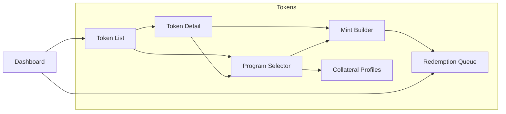

# Tokenization Demo Screen Inventory

## 1) Design execution context

- Agent: Design Agent (Agent 3) orchestrated by Agent 5
- Input: `docs/IA.md`, `docs/UserFlow.md`
- Figma MCP status: **Connected** (Talk to Figma, channel d5x5n0on)
- Figma implementation: **Completed** (2025-02-20)

All screens have been created in Figma with DSRV-like dark theme. Frame IDs below.

## 2) DSRV-like design direction (Group 30/31/32)

Target style for this demo (aligned with DSRV Portal/OrganizationSetting):

- Light enterprise console theme
- Left navigation (280px) + content area
- DSRV Portal color tokens

Proposed base tokens:

- Background: `#f9f9fa`
- Surface/Card: `#ffffff`
- Border: `#f3f6fb`, `#a9b2c7`
- Primary action: `#4281ff`
- Success: `#22C55E`
- Text primary: `#000000`, `#4c505a`
- Text secondary: `#656b77`, `#7f8695`

## 3) Screen inventory

| ID | Screen | IA mapping | Flow mapping | Priority | Status | Figma Frame ID |
|---|---|---|---|---|---|---|
| SCR-01 | Dashboard | Dashboard | Flow C (start/end) | P1 | **Figma done** | 10:2 |
| SCR-02 | Token List | Tokens > Token List | Flow A/C | P0 | **Figma done** | 10:3 |
| SCR-03 | Token Detail | Tokens > Token Detail | Flow B/C | P0 | **Figma done** | 10:4 |
| SCR-04 | Add Token v2 | Tokens > Add Token v2 | Flow A, P0 Enhancement | P0 | **Figma done** | 10:5 |
| SCR-05 | Link Token | Tokens > Link Token | Flow C | P0 | **Figma done** | 10:6 |
| SCR-06 | Mint Modal | Token Detail action | Flow B | P0 | **Figma done** | 10:7 |
| SCR-07 | Burn Modal | Token Detail action | Flow B | P0 | **Figma done** | 10:8 |
| SCR-08 | Transfer Modal | Token Detail action | Flow B | P0 | **Figma done** | 10:9 |
| SCR-09 | Smart Contract List | Smart Contracts | Flow C | P1 | **Figma done** | 10:36 |
| SCR-10 | Manage Contract | Smart Contracts > Manage | Flow C | P1 | **Figma done** | 10:37 |
| SCR-15 | Program Selector | Tokens > Program Selector | FL-08 | P1 | **Figma done** | 12:4587 |
| SCR-16 | Mint Request Builder | Tokens > Mint Builder | FL-08 | P1 | **Figma done** | 12:4588 |
| SCR-17 | Redemption Queue | Tokens > Redemption Queue | FL-08 | P1 | **Figma done** | 12:4589 |
| SCR-18 | Collateral Profiles | Tokens > Collateral Profiles | FL-08 | P1 | **Figma done** | 12:4590 |
| SCR-11 | Wallets | Wallets > Wallet List | - | P1 | **Figma done** | 12:4727 |
| SCR-12 | Governance (Approval Queue v2) | Governance > Approval Queue v2 | P0 Enhancement | P0 | **Figma done** | 12:4728 |
| SCR-13 | Contract Detail | Smart Contracts > Contract Detail | IA alignment | P1 | **Figma done** | 13:6376 |
| SCR-14 | Wallet Detail | Wallets > Wallet Detail | IA alignment | P1 | **Figma done** | 13:6355 |
| SCR-23 | Settings Configuration | Settings > Configuration | IA alignment | P2 | **Figma done** | 13:6377 |

## 3-1) P0 sync frame mapping (IA/UserFlow/Figma)

| P0 capability | IA reference | UserFlow reference | Figma frame |
|---|---|---|---|
| Add Token v2 (Type/Backing/Supply/Roles) | `IA.md` > Add Token v2 | `UserFlow.md` > Section 9 | SCR-04 (`10:5`) |
| Lifecycle Rail | `IA.md` > Token Detail lifecycle rail | `UserFlow.md` > Section 10 | SCR-03 (`10:4`) + components (`12:6217–13:6282`) |
| Approval Queue v2 operations | `IA.md` > Approval Queue v2 | `UserFlow.md` > Section 11 | SCR-12 (`12:4728`) |

## 4) Key layout specs per core screen

### SCR-01 Dashboard

- KPI row: total tokens, pending approvals, 24h action count
- Recent activity table: type, token, amount, operator, status, timestamp
- Quick actions: Add Token, Mint, Transfer
- Pending Approvals widget/list card added (13:6415)

### SCR-02 Token List

- Header controls: search, network filter, status filter
- Table columns: token, network, standard, total supply, holders, status, updated_at
- Row action: Open Token Detail

### SCR-03 Token Detail

- Summary card: symbol/name/network/status/current supply
- **Lifecycle Rail** (12:6217–13:6282, 120px): Defined → Deployed/Linked → Issued/Minted → Distributed/Transferred → Burned/Redeemed
  - 각 상태별 State | Timestamp | Actor | Tx_hash 테이블
- Action group: Mint, Burn, Transfer
- Tabs: Activity, Holders (optional), Contract info

### SCR-12 Governance

- Approval Queue v2 table (8 columns) + batch actions
- Policy Summary section card added (13:6422)

## 5) Modal interaction specs

| Modal | Required fields | Validation |
|---|---|---|
| Mint | Amount, destination wallet, memo(optional) | amount > 0, wallet required |
| Burn | Amount, source wallet, reason(optional) | amount <= wallet balance |
| Transfer | Amount, source wallet, destination wallet | source != destination |

All modals include:

- Risk acknowledgement line
- Governance state indicator (auto-approve/pending-approval)
- Primary and secondary actions

## 6) Component system checklist

- [x] Button variants: primary/secondary/danger/ghost
- [x] Input variants: default/error/disabled
- [x] Status chips: active/pending/failed/completed
- [x] Data table with pagination and empty state
- [x] Modal shell with shared footer actions

## 7) Figma implementation (completed)

<<<<<<< Updated upstream
1. Create pages: `01_Layout`, `02_Screens`, `03_Components`, `04_Flows`
2. Build component set from section 6
3. Assemble screens in section 3 order
4. Link prototype hotspots for Flow A/B/C
5. Export screen links to `docs/INDEX.md`
6. Import fallback table package from `docs/design/figma-table-data.md` and `docs/design/figma-table-data/*.csv`
=======
All core screens created on Page 1 with:
- **Design tokens**: Background #0B1220, Surface #121A2B, Primary #3B82F6, Danger #EF4444
- **Layout**: Left nav (240px) + content area on all main screens
- **Screens**: Dashboard, Token List, Token Detail, Add Token, Link Token, Mint/Burn/Transfer modals, Smart Contract List, Manage Contract, Program Selector, Mint Request Builder, Redemption Queue, Collateral Profiles
  - Added for IA completeness: Contract Detail (SCR-13), Wallet Detail (SCR-14), Settings Configuration (SCR-23)

### CTA & Flow (production-ready)
- **Dashboard**: "View Tokens →" CTA → Token List | "Add Token →" → Add Token | "Mint →", "Transfer →" → Token Detail
- **Token List**: "+ Add Token →" → Add Token | "Link Token →" → Link Token | "Open Detail →" CTA → Token Detail
- **Token Detail**: "Mint → Modal", "Burn → Modal", "Transfer → Modal" → 각 모달
- **Status chips**: Active (green #22C55E), Completed (gray)
- **DSRV 로고**: 사이드바 상단 (모든 메인 화면)

### IA & Flow diagrams (Figma) – Group 25/26/27 style
- **IA Diagram** (10:121): Tokenization Demo sitemap - Root → 6 nav items → Token sub-nodes (Token List, Detail, Add, Link) → Mint/Burn/Transfer
- **Flow A** (10:122): Token List → Add Token → Select Network → Input Metadata → Review → Valid? (diamond) → Y: Deploy, N: Show Error
- **Flow B** (10:123): Token Detail → Mint/Burn/Transfer → Input & Confirm → Approval? (diamond) → Y: Pending, N: Execute
- **Flow C** (10:124): End-to-End - Dashboard → Token List → Add/Link → Token Detail → Mint → Transfer → Burn → Smart Contract
- **Screen-to-Screen Flow** (12:4729): 다크 테마, Entry/Tokens/Modals/Smart Contracts 서브그래프, Group 25 스타일 (entry #c2e5ff, 화면 #ffffff, 연결선 라벨)
- **Style**: White bg, entry #c2e5ff/#3dadff, decision diamond #b3b3b3, error/end #ffc7c2/#f24822, Y/N on arrows

### Table & IA updates
- **Recent Activity**: 표 형태 (헤더 + 5행, 컬럼별 정렬, 구분선)
- **Token List**: 표 형태 (4개 토큰, 7컬럼)
- **Token Detail Activity**: 표 형태 (Type, Amount, Operator, Timestamp, Status)
- **Smart Contract List**: 표 형태 (3개 컨트랙트, 4컬럼)
- **IA Table**: Depth | Path | Node (0~3 depth, 12행)

### Sidebar nav & ex) placeholders (2025-02-20)
- **Sidebar nav**: SCR-02~05, SCR-09~10에 Dashboard, Tokens, Smart Contracts, Wallets, Governance, Settings 메뉴 추가
- **메뉴 색상**: 활성 #4281ff (Tokens: SCR-02~05, Smart Contracts: SCR-09~10), 비활성 #4d505a
- **ex) 예시 데이터** (회색 플레이스홀더 #7f8695, 입력 박스 안에 표시):
  - Add Token: Name `ex) USDC Staking`, Symbol `ex) USDC`, Decimals `ex) 6`
  - Link Token: Blockchain `ex) Ethereum`, Contract `ex) 0x7a3f2b1c...4f2e`
  - Token Detail Token Meta: `ex) Ethereum | ERC-20 | Active`
  - Mint Modal: Amount `ex) 5,000`, Destination `ex) 0x1234...5678`
  - Burn Modal: Amount `ex) 500`, Source `ex) 0xabcd...ef01`
  - Transfer Modal: Amount `ex) 1,500`, Source `ex) 0xabcd...ef01`, Destination `ex) 0x1234...5678`

### SCR-15~18 (2026-02, 담보 기반 민팅)
- **SCR-15 Program Selector** (12:4587): 프로그램 목록 테이블, 자산군/토큰타입/담보비율, Select CTA
- **SCR-16 Mint Request Builder** (12:4588): Step 1~3 (Program, Collateral, Amount & Proof URL), Submit Mint Request
- **SCR-17 Redemption Queue** (12:4589): 리딤 대기 목록, Request ID/Token/Amount/Requester/Status, Process CTA
- **SCR-18 Collateral Profiles** (12:4590): 담보 프로필 테이블, Reserve Transparency

### Fireblocks gap hand-off candidate screens (정책엔진 상세 제외)

#### P0 (우선 보강) – Agent A 적용 완료 (2026-02)
- **SCR-04 Add Token v2** (10:5):
  - Step 1a: Network 선택 (Ethereum/Polygon/Solana) – 카드 버튼 (10:64~10:66)
  - Step 1b: Token Type 선택 카드 (ERC-20F/ERC-721F/ERC-1155F) – 3개 카드 (13:6537~13:6539)
    - 선택 시 **인라인 아코디언 Function Preview** 패널 확장 (13:6549)
    - Read Functions, Write Functions, Roles 목록 표시
    - 파란 액센트 바 (13:6550) + 연한 배경
  - Step 2: Backing Asset — 카테고리별 Pill Chip 그리드 (단일 선택)
    - Fiat: USD, EUR, KRW, JPY, GBP, CHF, SGD (13:6576~13:6582)
    - Commodity: Gold(XAU), Silver(XAG), Platinum, Crude Oil (13:6591~13:6594)
    - Bond: US Treasury, Corporate, Municipal, Sovereign (13:6601~13:6604)
    - Alternative: Real Estate, Carbon Credit, Art, IP Rights (13:6610~13:6613)
    - 선택 상태: 파란 pill(#4281FF + 흰 텍스트), 비선택: 연회색(#F3F5FB + 진회색 텍스트)
  - Step 3: Name/Symbol/Decimals/Initial Supply
  - Step 4: Issuance Roles (Admin/Minter/Pauser) preview
  - Step 5: Review & Submit
- **SCR-03 Token Detail** (10:4): Lifecycle Rail 섹션 추가 – Defined→Deployed/Linked→Issued/Minted→Distributed/Transferred→Burned/Redeemed, 각 상태별 timestamp/actor/tx_hash 영역
- **SCR-12 Governance** (12:4728): Governance 내 Approval Queue v2 – 8컬럼(Request ID/Type/Token/Amount/Assignee/SLA/Escalation/Status), 액션 Bulk Approve, Bulk Reject, Reassign, Escalate (프레임 내부 배치)

#### P1 (운영 심화)
- **SCR-19 Wallet Policy Manager** (new): 지갑 생성 규칙, 주소 정책, 외부 화이트리스트 관리
- **SCR-20 Risk Control Settings** (new): 한도(일/건), 시간대 제한, 이상징후 차단 플래그
- **SCR-04 Add Token v2.1**: Deploy 전 role assignment 검증/프리뷰

#### P2 (가시성/관제)
- **SCR-21 Ops Monitoring & Alerts** (new): 실패 유형 대시보드, 알림 라우팅, 온콜 담당 정보
- **SCR-22 Collection Metadata Helper** (new): NFT/Collection metadata 입력 헬퍼(ERC721F/ERC1155F 선택 시 노출)

### Screen transition matrix

> 전체 화면 연결 흐름은 `docs/UserFlow.md` §7 Screen-to-screen flow 참고

| From \ To | Token List | Token Detail | Program Selector | Mint Builder | Redemption Queue | Collateral Profiles |
|---|---|---|---|---|---|---|
| Dashboard | ✓ | ✓ | - | - | ✓ | - |
| Token List | - | ✓ | ✓ | - | ✓ | ✓ |
| Token Detail | ✓ | - | ✓ | ✓ | ✓ | ✓ |
| Program Selector | - | - | - | ✓ | - | ✓ |
| Mint Builder | ✓ | ✓ | ✓ | - | ✓ | ✓ |
| Redemption Queue | ✓ | ✓ | - | - | - | ✓ |
| Collateral Profiles | ✓ | ✓ | ✓ | ✓ | - | - |

### Table style (Group 1321316973)
- **Header row**: bg #0f1d39, stroke #ced3de, white text
- **Body rows**: alternating #ffffff / #eaf1ff
- **Row height**: 40–57px, column alignment

### SCR-11, SCR-12 (Group 30/31)
- **Sidebar**: 280px, white
- **Background**: #f9f9fa
- **Content area**: x:312 (after 280px sidebar)

### Agent B (Flow/Interaction) 적용 (2025-02-20)
- **Token List (10:3)**: "Add Token v2" CTA 추가 (12:6215) → SCR-04 Add Token 연결
- **Token Detail (10:4)**: Lifecycle Rail 섹션 추가 (12:6216~13:6219) – Defined→Deployed→Issued→Distributed→Burned 상태 전이 표기
- **Governance (12:4728)**: Approval Queue v2 액션 버튼 추가 – Bulk Approve, Bulk Reject, Reassign, Escalate (13:6220~13:6227)
- **Flow E - P0 Enhancement (13:6228)**: Add Token v2 플로우, Lifecycle Rail, Queue v2 Operation 다이어그램 신규 생성 (Group 25 스타일)

### Next steps (optional)
1. Set prototype interactions in Figma (click hotspots)
2. Export Figma file URL to `docs/INDEX.md`
>>>>>>> Stashed changes
