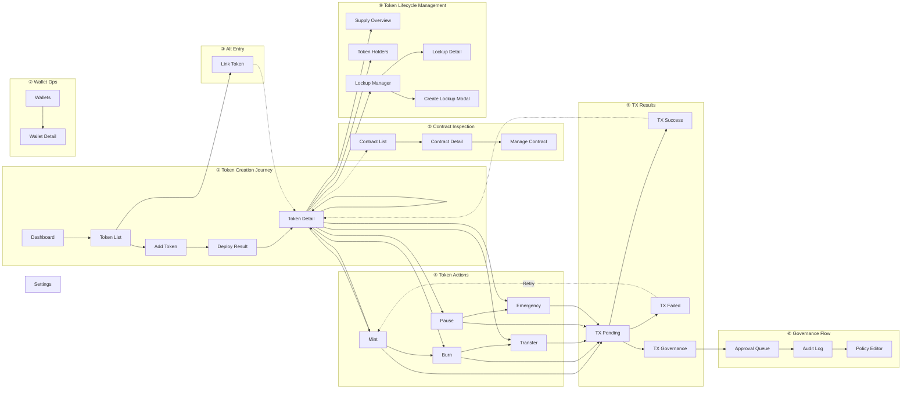

# Tokenization Platform Screen Inventory

> Part A: Layer 1 (Tokenization API Console) | Part B: Layer 2 (Point Token Admin)

---

# Part A — Layer 1: Tokenization API Console

## 1) Design execution context

- Agent: Design Agent (Agent 3) orchestrated by Agent 5
- Input: `docs/IA.md`, `docs/UserFlow.md`
- Figma MCP status: **Connected** (Talk to Figma, channel d5x5n0on)
- Figma implementation: **Completed** (2025-02-20)

All screens have been created in Figma with DSRV-like dark theme. Frame IDs below.

## 2) DSRV-like design direction (Group 30/31/32)

Target style for this demo (aligned with DSRV Portal/OrganizationSetting):

- Light enterprise console theme
- Left navigation (280px) + content area
- DSRV Portal color tokens

Proposed base tokens:

- Background: `#f9f9fa`
- Surface/Card: `#ffffff`
- Border: `#f3f6fb`, `#a9b2c7`
- Primary action: `#4281ff`
- Success: `#22C55E`
- Text primary: `#000000`, `#4c505a`
- Text secondary: `#656b77`, `#7f8695`

## 3) Screen inventory

| ID | Screen | IA mapping | Flow mapping | Priority | Status | Figma Frame ID |
|---|---|---|---|---|---|---|
| SCR-01 | Dashboard | Dashboard | Flow C (start/end) | P1 | **Figma done** | 10:2 |
| SCR-02 | Token List | Tokens > Token List | Flow A/C | P0 | **Figma done** | 10:3 |
| SCR-03 | Token Detail | Tokens > Token Detail | Flow B/C | P0 | **Figma done** | 10:4 |
| SCR-04 | Add Token v2 | Tokens > Add Token v2 | Flow A, P0 Enhancement | P0 | **Figma done** | 10:5 |
| SCR-05 | Link Token | Tokens > Link Token | Flow C | P0 | **Figma done** | 10:6 |
| SCR-06 | Mint Modal | Token Detail action | Flow B | P0 | **Figma done** | 10:7 |
| SCR-07 | Burn Modal | Token Detail action | Flow B | P0 | **Figma done** | 10:8 |
| SCR-08 | Transfer Modal | Token Detail action | Flow B | P0 | **Figma done** | 10:9 |
| SCR-09 | Smart Contract List | Smart Contracts | Flow C | P1 | **Figma done** | 10:36 |
| SCR-10 | Manage Contract | Smart Contracts > Manage | Flow C | P1 | **Figma done** | 10:37 |
| SCR-15 | Program Selector | Tokens > Program Selector | FL-08 | P1 | **Figma done** | 12:4587 |
| SCR-16 | Mint Request Builder | Tokens > Mint Builder | FL-08 | P1 | **Figma done** | 12:4588 |
| SCR-17 | Redemption Queue | Tokens > Redemption Queue | FL-08 | P1 | **Figma done** | 12:4589 |
| SCR-18 | Collateral Profiles | Tokens > Collateral Profiles | FL-08 | P1 | **Figma done** | 12:4590 |
| SCR-11 | Wallets | Wallets > Wallet List | - | P1 | **Figma done** | 12:4727 |
| SCR-12 | Governance (Approval Queue v2) | Governance > Approval Queue v2 | P0 Enhancement | P0 | **Figma done** | 12:4728 |
| SCR-13 | Contract Detail | Smart Contracts > Contract Detail | IA alignment | P1 | **Figma done** | 13:6376 |
| SCR-14 | Wallet Detail | Wallets > Wallet Detail | IA alignment | P1 | **Figma done** | 13:6355 |
| SCR-23 | Settings Configuration | Settings > Configuration + API Keys | IA alignment | P2 | **Figma done** | 13:6377 |
| SCR-24 | Deploy Result | Tokens > Deploy Result | Flow A (post-submit) | P0 | **Figma done** | 34:7640 |
| SCR-25 | Pause/Unpause | Token Detail > Btn Pause | Flow B | P0 | **Figma done** (버튼: 34:7632) | 10:4 내 |
| SCR-26 | Lock/Unlock | Token Detail > Btn Lock | Flow B | P1 | **Figma done** (버튼: 34:7634) | 10:4 내 |
| SCR-27 | Emergency Action | Token Detail > Btn Emergency | Flow B | P1 | **Figma done** (버튼: 34:7636) | 10:4 내 |
| SCR-28 | Audit Log | Governance > Audit Log | Audit | P1 | **Figma done** | 34:7685 |
| SCR-29 | Policy Editor | Governance > Policy Editor | Governance | P2 | **Figma done** | 34:7710 |
| SCR-30 | Supply Overview | Tokens > Supply Overview | Token Lifecycle | P0 | **Figma done** | 41:8870 |
| SCR-31 | Token Holders | Tokens > Token Holders | Token Lifecycle | P0 | **Figma done** | 41:8871 |
| SCR-32 | Lockup Manager | Tokens > Lockup Schedules | Token Lifecycle | P0 | **Figma done** | 41:8872 |
| SCR-33 | Lockup Detail | Tokens > Lockup Detail | Token Lifecycle | P0 | **Figma done** | 41:8873 |
| SCR-34 | Create Lockup Modal | Lockup Manager > Create | Token Lifecycle | P0 | **Figma done** | 41:8874 |

## 3-1) P0 sync frame mapping (IA/UserFlow/Figma)

| P0 capability | IA reference | UserFlow reference | Figma frame |
|---|---|---|---|
| Add Token v2 (Type/Backing/Supply/Roles) | `IA.md` > Add Token v2 | `UserFlow.md` > Section 9 | SCR-04 (`10:5`) |
| Lifecycle Rail | `IA.md` > Token Detail lifecycle rail | `UserFlow.md` > Section 10 | SCR-03 (`10:4`) + components (`12:6217–13:6282`) |
| Approval Queue v2 operations | `IA.md` > Approval Queue v2 | `UserFlow.md` > Section 11 | SCR-12 (`12:4728`) |

## 4) Key layout specs per core screen

### SCR-01 Dashboard

- KPI row: total tokens, pending approvals, 24h action count
- Recent activity table: type, token, amount, operator, status, timestamp
- Quick actions: Add Token, Mint, Transfer
- Pending Approvals widget/list card added (13:6415)

### SCR-02 Token List

- Header controls: search, network filter, status filter
- Table columns: token, network, standard, total supply, holders, status, updated_at
- Row action: Open Token Detail

### SCR-03 Token Detail

- Summary card: symbol/name/network/status/current supply
- **Lifecycle Rail** (12:6217–13:6282, 120px): Defined → Deployed/Linked → Issued/Minted → Distributed/Transferred → Burned/Redeemed
  - 각 상태별 State | Timestamp | Actor | Tx_hash 테이블
- Action group: Mint, Burn, Transfer
- Tabs: Activity, Holders (optional), Contract info

### SCR-12 Governance

- Approval Queue v2 table (8 columns) + batch actions
- Policy Summary section card added (13:6422)

## 5) Modal interaction specs

| Modal | Required fields | Validation | Figma Frame |
|---|---|---|---|
| Mint | Amount, destination wallet, memo(optional) | amount > 0, wallet required | 10:7 |
| Burn | Amount, source wallet, reason(optional) | amount <= wallet balance | 10:8 |
| Transfer | Amount, source wallet, destination wallet | source != destination | 10:9 |
| Pause | Checkbox acknowledgement, token info | checkbox required | 35:7789 |
| Emergency | Reason (required), type "EMERGENCY" to confirm | both fields required | 35:7804 |

All modals include:

- Risk acknowledgement line
- Governance state indicator (auto-approve/pending-approval)
- Primary and secondary actions
- Close (✕) button

## 5-1) Transaction Status Overlays (post-confirm)

| State | Description | Figma Frame | Key elements |
|---|---|---|---|
| TX-01 Sending | ⏳ Tx pending, progress bar, block confirmations | 35:7748 | Spinner, progress bar, tx hash |
| TX-02 Confirmed | ✅ Tx success, block info, explorer link | 35:7758 | Green check, tx hash, "View on Etherscan" |
| TX-03 Failed | ❌ Tx error, error message, retry | 35:7768 | Red X, error detail, Retry + Dismiss |
| TX-04 Governance | 🔒 Pending approval, request ID, approvers | 35:7779 | Lock icon, SLA, "Go to Queue" CTA |

## 5-2) Empty States

| State | Message | CTA | Figma Frame |
|---|---|---|---|
| ES-01 Token List | No tokens found. | + Add Token | 35:7818 |
| ES-02 Contract List | No contracts found. | — | 35:7819 |
| ES-03 Wallet List | No wallets found. | — | 35:7820 |
| ES-04 Activity | No activity yet. | — | 35:7821 |
| ES-05 Approval Queue | No pending approvals. | — | 35:7822 |
| ES-06 Audit Log | No audit records found. | — | 35:7823 |

## 6) Component system checklist

- [x] Button variants: primary/secondary/danger/ghost/warning(orange)
- [x] Input variants: default/error/disabled
- [x] Status chips: active/pending/failed/completed
- [x] Data table with pagination and empty state
- [x] Modal shell with shared footer actions
- [x] Transaction status overlays (pending/confirmed/failed/governance)
- [x] Empty state components (icon + message + optional CTA)
- [x] Warning/danger confirmation boxes (orange/red backgrounds)
- [x] 2-step confirmation pattern (Emergency modal)

## 7) Figma implementation (completed)

All core screens created on Page 1 with:
- **Design tokens**: Background #0B1220, Surface #121A2B, Primary #3B82F6, Danger #EF4444
- **Layout**: Left nav (240px) + content area on all main screens
- **Screens**: Dashboard, Token List, Token Detail, Add Token, Link Token, Mint/Burn/Transfer modals, Smart Contract List, Manage Contract, Program Selector, Mint Request Builder, Redemption Queue, Collateral Profiles
  - Added for IA completeness: Contract Detail (SCR-13), Wallet Detail (SCR-14), Settings Configuration (SCR-23)

### CTA & Flow (production-ready)
- **Dashboard**: "View Tokens →" CTA → Token List | "Add Token →" → Add Token | "Mint →", "Transfer →" → Token Detail
- **Token List**: "+ Add Token →" → Add Token | "Link Token →" → Link Token | "Open Detail →" CTA → Token Detail
- **Token Detail**: "Mint → Modal", "Burn → Modal", "Transfer → Modal" → 각 모달
- **Status chips**: Active (green #22C55E), Completed (gray)
- **DSRV 로고**: 사이드바 상단 (모든 메인 화면)

### IA & Flow diagrams (Figma) – Group 25/26/27 style
- **IA Diagram** (10:121): Tokenization Demo sitemap - Root → 6 nav items → Token sub-nodes (Token List, Detail, Add, Link) → Mint/Burn/Transfer
- **Flow A** (10:122): Token List → Add Token → Select Network → Input Metadata → Review → Valid? (diamond) → Y: Deploy, N: Show Error
- **Flow B** (10:123): Token Detail → Mint/Burn/Transfer → Input & Confirm → Approval? (diamond) → Y: Pending, N: Execute
- **Flow C** (10:124): End-to-End - Dashboard → Token List → Add/Link → Token Detail → Mint → Transfer → Burn → Smart Contract
- **Screen-to-Screen Flow** (12:4729): 다크 테마, Entry/Tokens/Modals/Smart Contracts 서브그래프, Group 25 스타일 (entry #c2e5ff, 화면 #ffffff, 연결선 라벨)
- **Style**: White bg, entry #c2e5ff/#3dadff, decision diamond #b3b3b3, error/end #ffc7c2/#f24822, Y/N on arrows

### Table & IA updates
- **Recent Activity**: 표 형태 (헤더 + 5행, 컬럼별 정렬, 구분선)
- **Token List**: 표 형태 (4개 토큰, 7컬럼)
- **Token Detail Activity**: 표 형태 (Type, Amount, Operator, Timestamp, Status)
- **Smart Contract List**: 표 형태 (3개 컨트랙트, 4컬럼)
- **IA Table**: Depth | Path | Node (0~3 depth, 12행)

### Sidebar nav & ex) placeholders (2025-02-20)
- **Sidebar nav**: SCR-02~05, SCR-09~10에 Dashboard, Tokens, Smart Contracts, Wallets, Governance, Settings 메뉴 추가
- **메뉴 색상**: 활성 #4281ff (Tokens: SCR-02~05, Smart Contracts: SCR-09~10), 비활성 #4d505a
- **ex) 예시 데이터** (회색 플레이스홀더 #7f8695, 입력 박스 안에 표시):
  - Add Token: Name `ex) USDC Staking`, Symbol `ex) USDC`, Decimals `ex) 6`
  - Link Token: Blockchain `ex) Ethereum`, Contract `ex) 0x7a3f2b1c...4f2e`
  - Token Detail Token Meta: `ex) Ethereum | ERC-20 | Active`
  - Mint Modal: Amount `ex) 5,000`, Destination `ex) 0x1234...5678`
  - Burn Modal: Amount `ex) 500`, Source `ex) 0xabcd...ef01`
  - Transfer Modal: Amount `ex) 1,500`, Source `ex) 0xabcd...ef01`, Destination `ex) 0x1234...5678`

### SCR-15~18 (2026-02, 담보 기반 민팅)
- **SCR-15 Program Selector** (12:4587): 프로그램 목록 테이블, 자산군/토큰타입/담보비율, Select CTA
- **SCR-16 Mint Request Builder** (12:4588): Step 1~3 (Program, Collateral, Amount & Proof URL), Submit Mint Request
- **SCR-17 Redemption Queue** (12:4589): 리딤 대기 목록, Request ID/Token/Amount/Requester/Status, Process CTA
- **SCR-18 Collateral Profiles** (12:4590): 담보 프로필 테이블, Reserve Transparency

### Fireblocks gap hand-off candidate screens (정책엔진 상세 제외)

#### P0 (우선 보강) – Agent A 적용 완료 (2026-02)
- **SCR-04 Add Token v2** (10:5):
  - Step 1a: Network 선택 (Ethereum/Polygon/Solana) – 카드 버튼 (10:64~10:66)
  - Step 1b: Token Type 선택 카드 (ERC-20F/ERC-721F/ERC-1155F) – 3개 카드 (13:6537~13:6539)
    - 선택 시 **인라인 아코디언 Function Preview** 패널 확장 (13:6549)
    - Read Functions, Write Functions, Roles 목록 표시
    - 파란 액센트 바 (13:6550) + 연한 배경
  - Step 2: Backing Asset — 카테고리별 Pill Chip 그리드 (단일 선택)
    - Fiat: USD, EUR, KRW, JPY, GBP, CHF, SGD (13:6576~13:6582)
    - Commodity: Gold(XAU), Silver(XAG), Platinum, Crude Oil (13:6591~13:6594)
    - Bond: US Treasury, Corporate, Municipal, Sovereign (13:6601~13:6604)
    - Alternative: Real Estate, Carbon Credit, Art, IP Rights (13:6610~13:6613)
    - 선택 상태: 파란 pill(#4281FF + 흰 텍스트), 비선택: 연회색(#F3F5FB + 진회색 텍스트)
  - Step 3: Name/Symbol/Decimals/Initial Supply
  - Step 4: Issuance Roles (Admin/Minter/Pauser) preview
  - Step 5: Review & Submit
- **SCR-03 Token Detail** (10:4): Lifecycle Rail 섹션 추가 – Defined→Deployed/Linked→Issued/Minted→Distributed/Transferred→Burned/Redeemed, 각 상태별 timestamp/actor/tx_hash 영역
- **SCR-12 Governance** (12:4728): Governance 내 Approval Queue v2 – 8컬럼(Request ID/Type/Token/Amount/Assignee/SLA/Escalation/Status), 액션 Bulk Approve, Bulk Reject, Reassign, Escalate (프레임 내부 배치)

#### P1 (운영 심화)
- **SCR-19 Wallet Policy Manager** (new): 지갑 생성 규칙, 주소 정책, 외부 화이트리스트 관리
- **SCR-20 Risk Control Settings** (new): 한도(일/건), 시간대 제한, 이상징후 차단 플래그
- **SCR-04 Add Token v2.1**: Deploy 전 role assignment 검증/프리뷰

#### P2 (가시성/관제)
- **SCR-21 Ops Monitoring & Alerts** (new): 실패 유형 대시보드, 알림 라우팅, 온콜 담당 정보
- **SCR-22 Collection Metadata Helper** (new): NFT/Collection metadata 입력 헬퍼(ERC721F/ERC1155F 선택 시 노출)

### Figma Layout — Prototype Flow Map (2026-02-20)

> 배치 원칙: **1:1 유저 시나리오 기반** — 좌→우로 happy path, 위→아래로 분기/서브플로우
> 전체 화면 연결 흐름은 `docs/UserFlow.md` §7 Screen-to-screen flow 참고

#### Figma Prototype Flow Layout

```
TOKENIZATION PLATFORM — PROTOTYPE FLOW MAP
┌ Read left→right for happy path │ Read top→bottom for branches & sub-flows └

──────────────────────────────────────────────────────────────────────────────────
① SCENARIO 1: Token Creation Journey (Row 0, y=0)
──────────────────────────────────────────────────────────────────────────────────

  [Dashboard] → [Token List] → [Add Token] → [Deploy Result] → [Token Detail]
  (0,0)         (1600,0)       (3200,0)      (4800,0)          (6400,0)
                    │                              ↳ back to Token Detail
                    ↓
              ③ ALT ENTRY                ② SCENARIO 2: Contract Inspection (continues right)
              [Link Token]
              (1600,1200)                [Contract List] → [Contract Detail] → [Manage Contract] → [Settings]
              ↳ → Token Detail           (8100,0)          (9700,0)           (11300,0)           (12900,0)

──────────────────────────────────────────────────────────────────────────────────
④ TOKEN ACTIONS — Modals triggered from Token Detail (Row 1, y=1200)
──────────────────────────────────────────────────────────────────────────────────

                                          [Mint]  [Burn]  [Transfer]  [Pause]  [Emergency]
                                          (6400)  (6940)  (7480)      (8020)   (8560)
                                            ↓       ↓       ↓          ↓        ↓

⑦ WALLET OPS (Row 1, y=1200)
[Wallets] → [Wallet Detail]
(11300)      (12900)

──────────────────────────────────────────────────────────────────────────────────
⑤ TX RESULTS — Post-confirm transaction states (Row 2, y=1800)
──────────────────────────────────────────────────────────────────────────────────

                                          [TX Pending]  [TX Success]  [TX Failed]  [TX Governance]
                                          (6400,1800)   (6880,1800)   (7360,1800)  (7840,1800)
                                                        ↳ back to TD  ↳ Retry      ↓ to Governance

──────────────────────────────────────────────────────────────────────────────────
⑥ GOVERNANCE FLOW — From TX-04 or sidebar (Row 3, y=2600, x=6400+)
──────────────────────────────────────────────────────────────────────────────────

                                          [Governance/Queue] → [Audit Log] → [Policy Editor]
                                          (6400,2600)          (8040,2600)    (9680,2600)

──────────────────────────────────────────────────────────────────────────────────
⑧ TOKEN LIFECYCLE MANAGEMENT — From Token Detail (Row 3, y=2600, x=0~4800)
──────────────────────────────────────────────────────────────────────────────────

  [Supply Overview] → [Token Holders] → [Lockup Manager] → [Lockup Detail]
  (0,2600)             (1600,2600)       (3200,2600)         (4800,2600)
                                               ↓
                                         [Create Lockup Modal]
                                         (3200,3700)

══════════════════════════════════════════════════════════════════════════════════
P1 EXTENDED FLOW (y=4000)
──────────────────────────────────────────────────────────────────────────────────

  [Program Selector] → [Mint Builder] → [Redemption Queue] → [Collateral Profiles]
  (0,4000)              (1600,4000)      (3200,4000)          (4800,4000)

══════════════════════════════════════════════════════════════════════════════════
EMPTY STATE COMPONENTS (y=5200)
──────────────────────────────────────────────────────────────────────────────────

  [ES-01] [ES-02] [ES-03] [ES-04] [ES-05] [ES-06]
  (0)     (560)   (1120)  (1680)  (2240)  (2800)
```



| From \ To | Token List | Token Detail | Program Selector | Mint Builder | Redemption Queue | Collateral Profiles |
|---|---|---|---|---|---|---|
| Dashboard | ✓ | ✓ | - | - | ✓ | - |
| Token List | - | ✓ | ✓ | - | ✓ | ✓ |
| Token Detail | ✓ | - | ✓ | ✓ | ✓ | ✓ |
| Program Selector | - | - | - | ✓ | - | ✓ |
| Mint Builder | ✓ | ✓ | ✓ | - | ✓ | ✓ |
| Redemption Queue | ✓ | ✓ | - | - | - | ✓ |
| Collateral Profiles | ✓ | ✓ | ✓ | ✓ | - | - |

### Table style (Group 1321316973)
- **Header row**: bg #0f1d39, stroke #ced3de, white text
- **Body rows**: alternating #ffffff / #eaf1ff
- **Row height**: 40–57px, column alignment

### SCR-11, SCR-12 (Group 30/31)
- **Sidebar**: 280px, white
- **Background**: #f9f9fa
- **Content area**: x:312 (after 280px sidebar)

### Agent B (Flow/Interaction) 적용 (2025-02-20)
- **Token List (10:3)**: "Add Token v2" CTA 추가 (12:6215) → SCR-04 Add Token 연결
- **Token Detail (10:4)**: Lifecycle Rail 섹션 추가 (12:6216~13:6219) – Defined→Deployed→Issued→Distributed→Burned 상태 전이 표기
- **Governance (12:4728)**: Approval Queue v2 액션 버튼 추가 – Bulk Approve, Bulk Reject, Reassign, Escalate (13:6220~13:6227)
- **Flow E - P0 Enhancement (13:6228)**: Add Token v2 플로우, Lifecycle Rail, Queue v2 Operation 다이어그램 신규 생성 (Group 25 스타일)

### Next steps (optional)
1. Set prototype interactions in Figma (click hotspots)
2. Export Figma file URL to `docs/INDEX.md`
3. Import fallback table package from `docs/design/figma-table-data.md` and `docs/design/figma-table-data/*.csv`

---

# Part B — Layer 2: Point Token Admin (Culture Token)

## L2-1) Design context

- Product: BKC&C Culture Token Admin (Point Token Admin)
- Architecture layer: Layer 2 — wraps Layer 1 Tokenization APIs with business logic
- Navigation: 7-module sidebar (Dashboard / Token Mgmt / Wallet Mgmt / Financial Mgmt / Blockchain / Explorer / Settings & Commons)
- Design system: Layer 1과 동일 (Light enterprise, DSRV color tokens)
- Figma location: Layer 1 화면 하단 y=7000+ 또는 별도 Page

## L2-2) Screen inventory

| ID | Screen | Layer 1 원본 | 유형 | IA mapping | Priority | Status | Figma Frame ID |
|---|---|---|---|---|---|---|---|
| L2-01 | Dashboard | SCR-01 복사+개조 | 복사 | Dashboard | P0 | **Figma done** | 1:7905 |
| L2-02 | Token List | SCR-02 복사 | 복사 | Token Mgmt > Token List | P0 | **Figma done** | 1:8013 |
| L2-03 | Token Detail | SCR-03 복사 | 복사 | Token Mgmt > Token Detail | P0 | **Figma done** | 1:8228 |
| L2-04 | Create Token | SCR-04 복사+간소화 | 복사 | Token Mgmt > Create Token | P0 | **Figma done** | 1:8089 |
| L2-05 | Mint Modal | SCR-06 복사 | 복사 | Token Mgmt > Mint | P0 | **Figma done** | 1:8335 |
| L2-06 | Burn Modal | SCR-07 복사 | 복사 | Token Mgmt > Burn | P0 | **Figma done** | 1:8350 |
| L2-07 | Transfer Modal | SCR-08 복사 | 복사 | Token Mgmt > Transfer | P0 | **Figma done** | 1:8365 |
| L2-08 | Deploy Result | SCR-24 복사 | 복사 | Token Mgmt > Deploy | P0 | **Figma done** | 1:8201 |
| L2-09 | Supply Overview | SCR-30 복사 | 복사 | Token Mgmt > Supply | P0 | **Figma done** | 1:8478 |
| L2-10 | Token Holders | SCR-31 복사 | 복사 | Token Mgmt > Holders | P0 | **Figma done** | 1:8547 |
| L2-11 | Lockup Manager | SCR-32 복사 | 복사 | Token Mgmt > Lockup | P0 | **Figma done** | 1:8582 |
| L2-12 | Wallet List | SCR-11 복사 | 복사 | Wallet Mgmt > List | P0 | **Figma done** | 1:8383 |
| L2-13 | Wallet Balance Detail | SCR-14 복사+강화 | 복사 | Wallet Mgmt > Detail | P1 | **Figma done** | 1:8427 |
| L2-14 | **Retirement** | NEW | 신규 | Financial Mgmt > Retirement | P0 | **Figma done** | 3:2312 |
| L2-15 | **Record Editor** | NEW | 신규 | Financial Mgmt > Record Editor | P0 | **Figma done** | 3:2405 |
| L2-16 | **Refund / Buy** | NEW | 신규 | Financial Mgmt > Refund/Buy | P0 | **Figma done** | 3:2446 |
| L2-17 | **TX History** | NEW | 신규 | Blockchain > TX History | P0 | **Figma done** | 3:2378 |
| L2-18 | **Address Whitelist** | NEW | 신규 | Blockchain > Whitelist | P1 | **Figma done** | 4:1654 |
| L2-19 | **Gas Wallet** | NEW | 신규 | Blockchain > Gas Wallet | P1 | **Figma done** | 4:1702 |
| L2-20 | **Tx Safe** | NEW | 신규 | Blockchain > Tx Safe | P1 | **Figma done** | 4:1760 |
| L2-21 | **TX Detail** | NEW | 신규 | Explorer > TX Detail | P0 | **Figma done** | 3:2502 |
| L2-22 | **Account History** | NEW | 신규 | Explorer > Account History | P1 | **Figma done** | 6:1809 |
| L2-23 | **System Admin** | NEW | 신규 | Settings > System Admin | P1 | **Figma done** | 6:1825 |
| L2-24 | Policy Engine | SCR-29 복사+강화 | 복사 | Settings > Policy Engine | P1 | **Figma done** | 1:8666 |
| L2-25 | Audit Log | SCR-28 복사 | 복사 | Settings > Audit Log | P1 | **Figma done** | 3:2323 |
| L2-26 | **Alert / Notifications** | NEW | 신규 | Settings > Alerts | P2 | **Figma done** | 6:1840 |
| L2-27 | API & Integration Settings | SCR-23 복사+축소 | 복사 | Settings > API | P2 | **Figma done** | 1:8615 |
| L2-28 | **Transaction Stats** | NEW | 신규 | Dashboard > TX Stats | P0 | **Figma done** | 3:2565 |

**Summary**: 복사 15개 + 신규 13개 = 총 28개

## L2-3) Key layout specs (Layer 2 specific screens)

### L2-14 Retirement (환매/소각)

- Header: "Retirement Requests" + period filter + status filter
- KPI row: Total Retired / Pending / Processed Today / Avg Processing Time
- Table columns: Request ID, Token, Amount, Requester, Status, Submitted At, Processed At, Processor
- Row actions: Approve, Reject, View Detail
- Empty state: "No retirement requests."

### L2-15 Record Editor (이력 수정)

- Header: "Record Editor" + search by address/token
- Warning banner: "All edits require approval and are recorded in the audit log."
- Table columns: Edit ID, Token, Target Address, Old Value, New Value, Reason, Editor, Approver, Status
- Action: + New Edit → modal with target address, old/new value, reason
- Empty state: "No record edits."

### L2-16 Refund / Buy (환불/매입)

- Header: "Refund & Buy Orders" + type filter (Refund/Buy) + status filter
- KPI row: Total Refunded / Total Bought / Pending / Today's Volume
- Table columns: Order ID, Type, Token, Amount, Counterparty, Status, TX Hash, Created At
- Row actions: Process, Cancel, View TX
- Empty state: "No refund or buy orders."

### L2-17 TX History

- Header: "Transaction History" + date range picker + status filter + type filter
- Table columns: TX Hash, Block, From, To, Value, Token, Gas Used, Status, Timestamp
- Row action: View TX Detail (→ L2-21)
- Pagination + CSV export button
- Empty state: "No transactions found."

### L2-18 Address Whitelist

- Header: "Address Whitelist" + search + bulk import button
- Table columns: Address, Label, Added By, Added At, Status
- Row actions: Revoke, Edit Label
- Action: + Add Address → inline form or modal
- Empty state: "No whitelisted addresses."

### L2-19 Gas Wallet

- Header: "Gas Wallet Management"
- Balance card: Current Balance, Chain, Threshold, Auto-recharge status
- Recharge history table: Date, Amount, TX Hash, Source
- Action: Recharge Now → modal with amount
- Alert: "Balance below threshold" warning when applicable

### L2-20 Tx Safe

- Header: "Transaction Safety Rules"
- Rule list: Daily Limit, Per-TX Limit, Blacklist, Time Restriction
- Each rule card: Rule name, Parameters, Status (Active/Disabled), Last Modified
- Action: + Add Rule → wizard or modal
- Anomaly log: Recent blocked/flagged transactions

### L2-21 TX Detail (Explorer)

- Header: TX Hash (copyable), Status badge
- Info sections: Block Number, Timestamp, From, To, Value, Gas Used, Gas Price
- Event Log: Decoded contract events
- Internal TX: Sub-calls if applicable
- Navigation: Back to TX History

### L2-22 Account History

- Header: "Account History" + address search
- Account info card: Address, Label, Type, Current Balances
- Activity table: Date, Type, Token, Amount, TX Hash, Counterparty
- Balance chart: Token balance over time
- Empty state: "Enter an address to view history."

### L2-23 System Admin

- Tabs: Users | Roles | System Config
- Users tab: User table (Name, Email, Role, Status, Last Login), + Add User
- Roles tab: Role definitions, permission matrix
- System Config tab: Chain settings, feature flags, maintenance mode

### L2-28 Transaction Stats

- Header: "Transaction Statistics" + period selector
- KPI row: Total TX, Success Rate, Avg Gas, Total Volume
- Charts: TX count by day (bar), TX volume by token (pie), Success/Fail ratio (donut)
- Table: Top tokens by TX count

## L2-4) Layer 2 Figma layout

```
POINT TOKEN ADMIN — PROTOTYPE FLOW MAP
┌ Read left→right for happy path │ Read top→down for branches └

────────────────────────────────────────────────────────────────
① TOKEN CREATION (Row 0, y=7000)
────────────────────────────────────────────────────────────────

  [L2-Dashboard] → [L2-Token List] → [L2-Create Token] → [L2-Deploy] → [L2-Token Detail]
  (0,7000)         (1600,7000)       (3200,7000)          (4800,7000)   (6400,7000)

────────────────────────────────────────────────────────────────
② TOKEN ACTIONS (Row 1, y=8200)
────────────────────────────────────────────────────────────────

  [L2-Mint]  [L2-Burn]  [L2-Transfer]     [L2-Wallet List] → [L2-Wallet Detail]
  (6400)     (6940)     (7480)             (9700,8200)        (11300,8200)

────────────────────────────────────────────────────────────────
③ FINANCIAL MANAGEMENT (Row 2, y=9400)
────────────────────────────────────────────────────────────────

  [L2-Retirement] → [L2-Record Editor] → [L2-Refund/Buy]
  (0,9400)           (1600,9400)          (3200,9400)

────────────────────────────────────────────────────────────────
④ BLOCKCHAIN (Row 3, y=10600)
────────────────────────────────────────────────────────────────

  [L2-TX History] → [L2-Whitelist] → [L2-Gas Wallet] → [L2-Tx Safe]
  (0,10600)          (1600,10600)     (3200,10600)       (4800,10600)

────────────────────────────────────────────────────────────────
⑤ EXPLORER + STATS (Row 4, y=11800)
────────────────────────────────────────────────────────────────

  [L2-TX Detail] → [L2-Account History]     [L2-TX Stats]
  (0,11800)         (1600,11800)              (3200,11800)

────────────────────────────────────────────────────────────────
⑥ SETTINGS & COMMONS (Row 5, y=13000)
────────────────────────────────────────────────────────────────

  [L2-System Admin] → [L2-Policy] → [L2-Audit Log] → [L2-Alerts] → [L2-API Settings]
  (0,13000)            (1600,13000)  (3200,13000)      (4800,13000)  (6400,13000)

────────────────────────────────────────────────────────────────
⑦ TOKEN LIFECYCLE (Row 6, y=14200)
────────────────────────────────────────────────────────────────

  [L2-Supply] → [L2-Holders] → [L2-Lockup Manager]
  (0,14200)     (1600,14200)    (3200,14200)
```
