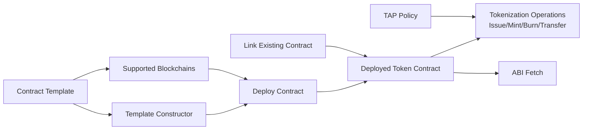
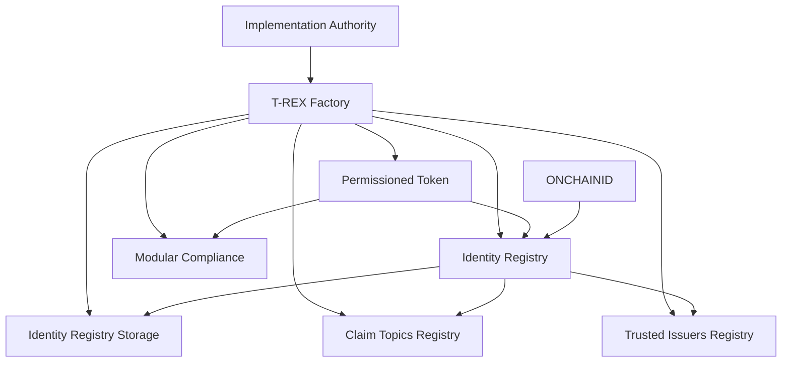
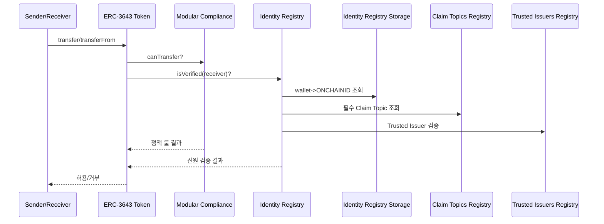
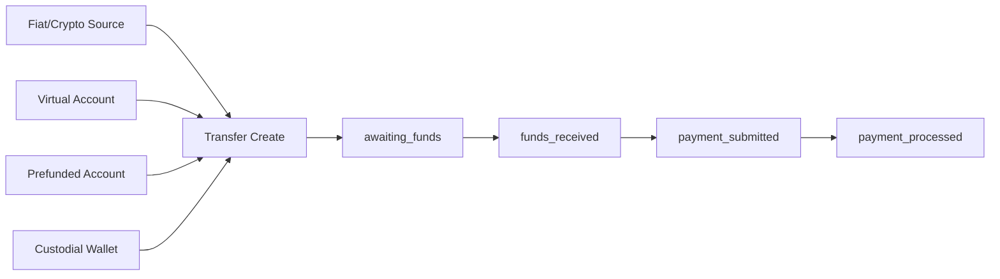

# Tokenization 프로덕트 통합 분석 리포트 (PM/개발 관점, 기능 전수조사)

## 0) 리포트 목적 (요청사항 반영)

본 문서는 Fireblocks, Tokeny, Securitize, Bridge를 대상으로 아래를 **기능 단위로 최대한 상세히** 정리한다.

1. 경쟁사별 지원 기능 매트릭스
2. 기능별 지원/미지원/부분지원 구분
3. 각 셀에 `지원 여부 + 지원 방식 + 차별점`
4. 경쟁사별 컨트랙트(또는 계약 레이어) 연결 구조

대상 문서 통합:

- `docs/research/requirements-summary.md`
- `docs/research/market-comparison.md`
- `docs/research/fireblocks-tokenization-notes.md`
- `docs/research/tokenization-product-api-comparison-ko.md`

> 참고: 이 4개 제품은 완전 대체 관계가 아니라 **레이어가 다름**. 실제 구축에서는 `발행/컴플라이언스 레이어 + 결제/정산 레이어`로 조합하는 경우가 많다.

---

## 1) 판정 기준 (지원 여부 표기)

- **O (지원)**: 공개 문서/API 레퍼런스에서 기능이 명시적으로 확인됨
- **△ (부분지원/제한지원)**: 일부 범위만 공개되거나 파트너/계약 조건으로 제한됨
- **X (비지원/주력 아님)**: 공개 범위상 해당 기능이 핵심 제품 범위가 아님

주의:
- `X`는 "기술적으로 절대 불가능"이 아니라 "공개 제품 범위상 주력 아님" 의미를 포함한다.
- 최종 계약 전에는 세일즈 엔지니어링/법무 검증이 필수다.

### 조사 범위

- 공식 개발자 문서 / API 레퍼런스 / 공식 프로토콜 문서 우선
- 마케팅 카피보다 API 문서와 엔드포인트 가시성을 우선 평가

### 해석 원칙

- 공개 API 문서에 없는 기능은 "없다"가 아니라 **"공개 범위 미확인"**으로 분리
- 엔터프라이즈 계약/규제 심사/지역 제한에 의해 실제 가용성은 달라질 수 있음

---

## 2) 경쟁사별 컨트랙트 연결 구조 조사

## 2.1 Fireblocks (Tokenization + Contract Template 중심)

### 확인된 핵심 구성요소

| 구성요소 | 역할 | 연결 대상 |
|---|---|---|
| Contract Template | 컨트랙트 템플릿 정의/업로드 | 템플릿별 지원체인, 생성자 스키마 |
| Template Constructor Metadata | 배포 파라미터 스키마 | 배포 API |
| Supported Blockchains by Template | 템플릿별 배포 가능 체인 매핑 | 배포 시 체인 검증 |
| Deployed Contract | 실제 온체인 컨트랙트 인스턴스 | Tokenization 운영 API/트랜잭션 API |
| ABI Fetch | 컨트랙트 ABI 조회 | 호출 인코딩/디코딩 |
| Tokenization Token Record | 신규 발행 토큰 메타 관리 | Mint/Burn/Transfer/Link |
| Link Existing Contract | 기존 컨트랙트 워크스페이스 연결 | 운영/모니터링 흐름 |
| TAP(정책엔진) | 승인/차단 정책 | 트랜잭션 승인 요청/배포 |

### 연결 구조 (공개 문서 기준)



### 해석 포인트
- Fireblocks의 "컨트랙트"는 Tokeny처럼 표준 프로토콜 컨트랙트 스택을 직접 노출하기보다, **운영 API + 템플릿/배포 파이프라인** 중심으로 노출된다.
- EVM 외 Stellar/Ripple까지 운영 흐름이 이어지는 점이 차별적이다.

### 컨트랙트/표준 관점

- Tokenization API + Contract Template API 기반으로 컨트랙트 배포/연결/운영 흐름 제공
- EVM 계열은 민트/번/전송/임의 컨트랙트 함수 호출(`CONTRACT_CALL`) 지원
- Fireblocks 문서에 ERC721F/ERC1155F 레퍼런스 구현 및 관련 발행 API가 명시됨
- 템플릿 목록/템플릿별 지원 체인 조회/생성자 조회/ABI 조회 API가 존재

### 체인 관점

- 공개 문서 기준: EVM 계열 + Stellar + Ripple 토큰화 지원
- Stellar/Ripple은 trustline 관련 운영 흐름이 문서에 명시됨

### 중요한 제약

- Tokenization 기능은 프리미엄 기능으로 별도 활성화가 필요하다고 명시됨

---

## 2.2 Tokeny (ERC-3643 / T-REX 컨트랙트 스택 중심)

### 확인된 핵심 컨트랙트 스택

| 컨트랙트/컴포넌트 | 역할 | 주요 연결 |
|---|---|---|
| T-REX Factory | 토큰 스위트 일괄 배포 | Token, Identity Registry, Compliance 등 생성 |
| Implementation Authority | 구현체 주소 관리(업그레이드 제어) | Factory/Proxy 계열 |
| Permissioned Token (ERC-3643) | 전송 가능 토큰 본체 | Identity Registry + Compliance 참조 |
| Identity Registry | 투자자 신원 검증 게이트 | Identity Registry Storage, Trusted Issuers, Claim Topics |
| Identity Registry Storage | 지갑↔ONCHAINID 저장소 | 다수 Registry가 공유 가능 |
| Claim Topics Registry | 요구 클레임 유형 정의 | Identity 검증 시 참조 |
| Trusted Issuers Registry | 신뢰 발급자 정의 | 클레임 유효성 판단 |
| Modular Compliance | 전송/보유/국가/한도 룰 실행 | Token transfer 시 canTransfer 계열 검증 |
| ONCHAINID | 투자자 신원/클레임 보유 | Registry가 검증 |

### 연결 구조 (공개 ERC-3643/Tokeny 문서 기준)



### 전송 검증 체인(핵심)



### 컨트랙트/표준 관점 (강점)

- 핵심 표준: **ERC-3643 Permissioned Token**
- ERC-3643의 핵심 온체인 구성요소:
  - Identity Registry
  - Claim Topics Registry
  - Trusted Issuers Registry
  - Compliance(모듈형)
- 전송 시 `신원 + 클레임 + 발급자 신뢰성 + 컴플라이언스 룰`을 결합 검증하는 구조

### 컴플라이언스 모듈 관점

- 국가 Allow/Restrict
- 최대 보유량/공급량 제한
- 조건부 전송(Conditional Transfer)
- 화이트리스트 기반 전송 제한
- 시간 기반 전송/거래소 전송 제한

### 해석 포인트
- 4개 중 **컨트랙트 연결 구조가 가장 명시적이고 정교하게 공개**되어 있다.
- 규제형 토큰화에서 "정책을 운영 프로세스가 아니라 컨트랙트 계층에서 강제"하는 모델이다.

---

## 2.3 Securitize (Connect API + DS Protocol 공개자료 기준)

### 공개 범위에서 확인 가능한 구성

| 구성요소 | 역할 | 연결 |
|---|---|---|
| Securitize Connect API | 투자자 인증/검증/문서/지갑 API | OAuth2, verification, wallets |
| Wallets API | 투자자 지갑 등록/조회(tokenId 연계) | 투자자 검증 상태와 연동 |
| Verification API | KYC/KYB 상태 조회 | 온보딩/접근제어 |
| DS Protocol (레거시 공개자료) | 디지털 증권 라이프사이클 구조 | Trust/Registry/Compliance/Communications |
| DSTokenInterfaces (공개 repo) | DS 토큰 인터페이스 레퍼런스 | preTransferCheck, issueTokens 등 함수 레퍼런스 |

### 연결 구조 (공개자료 종합)

```mermaid
flowchart LR
    U[Investor] --> OAUTH[OAuth2 / Securitize iD]
    OAUTH --> V[Verification API]
    V --> W[Wallets API tokenId mapping]
    DS[DS Token Interfaces\n(legacy public refs)] --> CS[Compliance Service]
    DS --> RS[Registry Service]
    TS[Trust Service] --> DS
    COM[Communications Service] --> DS
```

### 공개 API에서 확인되는 축

- Securitize Connect API 중심:
  - OAuth2 인증
  - 투자자 검증 상태
  - 문서 관리
  - 지갑 등록/조회 (tokenId와 연계)

### 컨트랙트 관점 (주의)

- 최신 공개 Connect API 문서만 보면, 발행/민트/번을 직접 다루는 상세 API는 전면적으로 노출되지 않음
- 다만 공개 레퍼런스로 DS Protocol(과거 공개 인터페이스) 및 ERC20 호환형 디지털 증권 인터페이스 자료가 존재
- 따라서 실제 구축 시에는:
  - "Connect API로 가능한 범위(온보딩/검증/지갑)"와
  - "토큰 컨트랙트 운용(파트너/엔터프라이즈 범위)"를 분리 확인해야 함

### 해석 포인트
- 공개 최신 API는 Connect(온보딩/검증)에 집중되어 있고,
- 토큰 컨트랙트 라이프사이클 전체 API는 문서 공개 범위가 상대적으로 제한적이다.
- 따라서 Securitize는 단독 발행엔진 판단보다는 **온보딩/규제 검증 레이어** 강점으로 보는 것이 안전하다.

---

## 2.4 Bridge (계약/컨트랙트보다 오케스트레이션 중심)

### 공개 범위에서 확인되는 구조

| 구성요소 | 역할 | 연결 |
|---|---|---|
| Transfers API | fiat/crypto/crypto 라우팅 | 상태머신 + 웹훅 |
| Virtual Accounts | 법정화폐 입금 계좌 | Transfers/Wallets 목적지로 연동 |
| Prefunded Accounts | 선충전 정산 계정 | instant off-ramp/on-ramp |
| Custodial Wallets | 지갑 보관/이동 | Orchestration API 통해서만 자금 이동 |
| Issuance(USDB 관련) | Bridge 발행 스테이블코인 라인 | 상세 컨트랙트 제어 API 공개 범위 제한 |

### 상태 중심 연결 구조



### 컨트랙트 관점 (핵심 구분)

- Bridge는 "신규 보안형 토큰 컨트랙트 발행 플랫폼"이라기보다
  - 스테이블코인 이동
  - 법정화폐 레일 연계
  - 정산 오케스트레이션
  레이어에 최적화

### 지원 자산/체인 관점

- Wallet/Orchestration 문서 기준으로 스테이블코인 및 체인 지원을 제공
- Virtual Accounts / Prefunded Accounts / Transfers 상태머신이 핵심

### 해석 포인트
- Bridge는 "컨트랙트 배포/표준설계"보다 "정산 상태머신/레일 라우팅"이 핵심이다.
- 토큰화 프로젝트에서는 발행엔진 대체재가 아니라 결제/정산 레이어 보완재로 적합하다.

---

## 2.5 컨트랙트/표준 지원 비교표 (실무용)

| 항목                    | Fireblocks           | Tokeny          | Securitize                 | Bridge           |
| --------------------- | -------------------- | --------------- | -------------------------- | ---------------- |
| 신규 토큰 발행 API 공개       | 높음                   | 높음              | 공개 범위 제한적(Connect API 중심)  | 낮음(핵심 영역 아님)     |
| 기존 컨트랙트 링크            | 지원(문서 명시)            | 토큰/컴플라이언스 관리 중심 | 지갑-토큰 연계 중심                | 해당 없음(발행 플랫폼 아님) |
| 표준/컨트랙트 철학            | 템플릿+운영 중심            | ERC-3643 네이티브   | 온보딩/신원 중심 + DS 레거시 공개자료    | 결제/정산 오케스트레이션    |
| 전송 전 신원/컴플라이언스 온체인 강제 | 정책/승인 중심(오프체인 정책 비중) | 매우 강함(온체인 모듈)   | 검증 API 강점(온체인 강제 구조 공개 제한) | 규제/레일 제약 중심      |
| 민트/번/전송               | 강함                   | 강함(권한형 전송 제어)   | 공개 API 기준 제한적              | 전송/환전/정산 강함      |
| 멀티체인/레일 확장성           | 강함                   | EVM 중심 권한형 토큰   | 파트너 구조 확인 필요               | 법정화폐 레일 강함       |

---

## 3) 지원 기능 매트릭스 (요청 포맷)

셀 표기 형식:
- `지원: O/△/X`
- `방식: 어떻게 지원하는지`
- `차별점: 경쟁 대비 포인트`

## 3.1 토큰 발행/컨트랙트/라이프사이클 기능

| 지원 기능 | Fireblocks | Tokeny | Securitize | Bridge |
|---|---|---|---|---|
| 신규 토큰 발행 API | 지원: **O**<br>방식: Tokenization API로 신규 토큰 발행(issuance).<br>차별점: 운영/승인정책과 결합 용이. | 지원: **O**<br>방식: Assets API + T-REX 배포 플로우.<br>차별점: ERC-3643 규제형 설계 내장. | 지원: **△**<br>방식: 공개 최신 API는 Connect 중심, 발행 API 공개 범위 제한.<br>차별점: 온보딩/규제 검증 강점. | 지원: **X**<br>방식: 발행엔진보다 오케스트레이션/정산 중심.<br>차별점: 결제/정산 레일 강점. |
| 기존 컨트랙트 링크/등록 | 지원: **O**<br>방식: link/register 계열 API로 기존 자산/컨트랙트 연결.<br>차별점: 멀티체인 운영 파이프라인에 흡수 가능. | 지원: **△**<br>방식: 기존 토큰 관리 가능하나 핵심은 ERC-3643 스위트 운용.<br>차별점: 규제 룰 일관성 유지. | 지원: **△**<br>방식: tokenId 기반 지갑 연계 중심.<br>차별점: 투자자/지갑 측 통제에 집중. | 지원: **X**<br>방식: 컨트랙트 링크 주력 아님.<br>차별점: 결제 라우팅에 초점. |
| 컨트랙트 템플릿 기반 배포 | 지원: **O**<br>방식: template 업로드/조회/배포 API.<br>차별점: 템플릿별 지원체인 조회 가능. | 지원: **O**<br>방식: T-REX Factory로 표준 스위트 배포.<br>차별점: 규제형 컨트랙트 일괄 구성. | 지원: **△**<br>방식: DS 레거시 공개자료는 있으나 최신 공개 API 배포 흐름 제한.<br>차별점: 온보딩 API 생태계. | 지원: **X**<br>방식: 해당 범위 아님.<br>차별점: 배포 대신 결제 파이프라인. |
| 컨트랙트 ABI/생성자 메타 조회 | 지원: **O**<br>방식: constructor/ABI 조회 API 제공.<br>차별점: 운영 자동화에 유리. | 지원: **△**<br>방식: ERC-3643 표준 구조 문서화, SDK/문서 중심.<br>차별점: 컴포넌트 역할이 명시적. | 지원: **△**<br>방식: 인터페이스 repo 공개(레거시).<br>차별점: 규제형 함수 시맨틱 참고 가능. | 지원: **X**<br>방식: 핵심 범위 아님.<br>차별점: 상태/정산 중심 API. |
| Mint | 지원: **O**<br>방식: 토큰화/트랜잭션 오퍼레이션.<br>차별점: 승인정책(TAP)와 결합. | 지원: **O**<br>방식: Permissioned Token + 컴플라이언스 하 실행.<br>차별점: 신원/정책 연동 강제. | 지원: **△**<br>방식: 공개 최신 API 기준 직접 운용 노출 제한.<br>차별점: 온보딩 레이어 강점. | 지원: **X**<br>방식: 직접 토큰 mint 엔진 주력 아님.<br>차별점: 정산/송금 중심. |
| Burn | 지원: **O**<br>방식: 토큰화/트랜잭션 오퍼레이션.<br>차별점: 운영 감사 추적과 연결 쉬움. | 지원: **O**<br>방식: ERC-3643 권한형 흐름 내 처리.<br>차별점: 규제 룰 기반 통제 가능. | 지원: **△**<br>방식: 공개 최신 API에서 직접 노출 제한.<br>차별점: 검증/지갑 통제 중심. | 지원: **X**<br>방식: 주력 범위 아님.<br>차별점: 결제 플로우 집중. |
| Transfer | 지원: **O**<br>방식: 트랜잭션 API + 정책 검증.<br>차별점: 다중체인 운영 일관성. | 지원: **O**<br>방식: canTransfer + 신원/컴플라이언스 모듈.<br>차별점: 전송 전 규정 준수 강제. | 지원: **△**<br>방식: wallet/tokenId 온보딩과 연결된 전송 통제 맥락.<br>차별점: 투자자 검증 데이터 강함. | 지원: **O**<br>방식: Transfers API의 핵심 기능.<br>차별점: fiat↔crypto 레일까지 포괄. |
| 임의 컨트랙트 함수 호출 | 지원: **O**<br>방식: EVM에서 contract call 오퍼레이션.<br>차별점: 커스텀 로직 확장 용이. | 지원: **△**<br>방식: 표준/모듈 조합 중심, 임의 호출은 구현/권한 설계 필요.<br>차별점: 표준 준수 안정성. | 지원: **△**<br>방식: 공개 최신 API 기준 가시성 제한.<br>차별점: 규제형 온보딩에 특화. | 지원: **X**<br>방식: 주력 범위 아님.<br>차별점: 오케스트레이션 특화. |

## 3.2 컴플라이언스/신원/거버넌스 기능

| 지원 기능 | Fireblocks | Tokeny | Securitize | Bridge |
|---|---|---|---|---|
| 정책 엔진/승인 워크플로우 | 지원: **O**<br>방식: TAP draft/publish/approval 요청 흐름.<br>차별점: 거래 실행 게이트 통제 강함. | 지원: **O**<br>방식: Modular Compliance 모듈형 룰.<br>차별점: 온체인 규칙 집행 강함. | 지원: **△**<br>방식: 온보딩 검증 중심, 트랜잭션 정책엔진 공개범위 제한.<br>차별점: 규제 검증 데이터 품질. | 지원: **△**<br>방식: 레일/지역/한도 등 운영 제약 중심.<br>차별점: 결제 규정 대응. |
| 온체인 신원 모델(ONCHAINID 등) | 지원: **△**<br>방식: 직접 표준 신원모델보다 운영/정책 중심.<br>차별점: 체인 운용 편의성. | 지원: **O**<br>방식: ONCHAINID + Registry 스택.<br>차별점: 신원-전송검증 결합이 핵심. | 지원: **△**<br>방식: Securitize iD(오프체인 검증) 강함.<br>차별점: 투자자 온보딩 실무 강점. | 지원: **X**<br>방식: 오케스트레이션 범위.<br>차별점: KYC/KYB 전제 조건 기반 운영. |
| 국가/관할 제한 룰 | 지원: **△**<br>방식: 정책 규칙으로 구성 가능.<br>차별점: 승인 정책 연계. | 지원: **O**<br>방식: Country Allow/Restrict 모듈.<br>차별점: ERC-3643 규제 시나리오 강함. | 지원: **△**<br>방식: 검증 결과/규제 상태 기반 접근 제어.<br>차별점: 투자자 데이터 중심. | 지원: **O**<br>방식: 국가/지역 가용성 제약 문서화.<br>차별점: 레일 단위 운영 현실 반영. |
| 보유량/공급량/기간 한도 | 지원: **△**<br>방식: 정책/컨트랙트 로직 조합 필요.<br>차별점: 유연성. | 지원: **O**<br>방식: Max Balance, Supply Limit, Time-based limits.<br>차별점: 모듈 조합형 세밀 제어. | 지원: **△**<br>방식: 공개 API는 검증/지갑 중심.<br>차별점: 온보딩 게이트 명확. | 지원: **△**<br>방식: 결제/레일/수수료/최소금액 제약 중심.<br>차별점: 금융결제 실무 적합. |
| 투자자 KYC/KYB/AML API | 지원: **△**<br>방식: 정책/운영 통합은 가능하나 전용 KYC 플랫폼 성격은 아님.<br>차별점: 자산 운영 통합. | 지원: **△**<br>방식: ONCHAINID/클레임 중심, 외부 KYC와 결합 필요.<br>차별점: 온체인 검증 강제. | 지원: **O**<br>방식: Securitize iD/Verification API.<br>차별점: 온보딩 특화 강점. | 지원: **△**<br>방식: 계정/지갑/레일 사용 전 심사 프로세스 존재.<br>차별점: 결제 운영 적합성. |
| 투자자 문서 수집/조회 | 지원: **X**<br>방식: 전용 문서 KYC API 주력 아님.<br>차별점: 트랜잭션 운영 쪽 강점. | 지원: **△**<br>방식: 클레임 중심, 문서는 외부시스템 결합이 일반적.<br>차별점: 온체인 자격 증명. | 지원: **O**<br>방식: Investor Documents API.<br>차별점: 투자자 라이프사이클 추적. | 지원: **X**<br>방식: 핵심 범위 아님.<br>차별점: 지급/정산 중심. |
| 지갑 화이트리스트/토큰별 허용 | 지원: **△**<br>방식: 정책+자산관리로 구현 가능.<br>차별점: 운영 정책 통합. | 지원: **O**<br>방식: 신원/클레임/규칙 기반 전송 허용.<br>차별점: 컨트랙트 수준 강제. | 지원: **O**<br>방식: tokenId 기준 wallet 등록/상태 관리.<br>차별점: 실무 온보딩 친화적. | 지원: **△**<br>방식: 지갑 정책/운영 제약 중심.<br>차별점: 결제 경로와 연결. |

## 3.3 결제/정산/운영 기능

| 지원 기능 | Fireblocks | Tokeny | Securitize | Bridge |
|---|---|---|---|---|
| 법정화폐 레일(ACH/SEPA/SPEI/Pix 등) | 지원: **△**<br>방식: 핵심 제품 축은 아님.<br>차별점: 디지털자산 운영 강점. | 지원: **X**<br>방식: 규제형 토큰 엔진 중심.<br>차별점: 온체인 컴플라이언스. | 지원: **△**<br>방식: 온보딩 중심, 레일 오케스트레이션 주력 아님.<br>차별점: 규제형 투자자 관리. | 지원: **O**<br>방식: 다중 fiat rails 명시 지원.<br>차별점: 이 영역의 핵심 강자. |
| Virtual Account (입금계좌) | 지원: **X**<br>방식: 공개 범위 주력 아님.<br>차별점: 토큰 운영 중심. | 지원: **X**<br>방식: 해당 없음.<br>차별점: 규제 토큰 스택. | 지원: **X**<br>방식: 해당 없음.<br>차별점: 투자자 검증 API. | 지원: **O**<br>방식: Virtual Accounts API.<br>차별점: 수취/정산 자동화 용이. |
| Prefunded Account | 지원: **X**<br>방식: 해당 없음.<br>차별점: 토큰 운영 강점. | 지원: **X**<br>방식: 해당 없음.<br>차별점: 컴플라이언스 강점. | 지원: **X**<br>방식: 해당 없음.<br>차별점: 온보딩 강점. | 지원: **O**<br>방식: Prefunded Accounts API.<br>차별점: 즉시 오프램프에 유리. |
| 상태머신 기반 결제 추적 | 지원: **△**<br>방식: 트랜잭션 상태 추적은 강함, 결제 레일 상태머신은 주력 아님.<br>차별점: 자산운영 로그 강점. | 지원: **△**<br>방식: 토큰 전송/규정 상태 중심.<br>차별점: 규제 추적 강함. | 지원: **△**<br>방식: 검증 상태 추적 중심.<br>차별점: KYC 상태 모델 명확. | 지원: **O**<br>방식: awaiting_funds 등 명시적 상태머신.<br>차별점: 결제 오퍼레이션 관측성 우수. |
| 웹훅/이벤트 중심 운영 | 지원: **O**<br>방식: 트랜잭션 이벤트 기반 운영 가능.<br>차별점: 운영 자동화 친화적. | 지원: **△**<br>방식: SDK/API 기반 이벤트 처리 설계 필요.<br>차별점: 온체인 규정 이벤트 해석 중요. | 지원: **△**<br>방식: 온보딩/검증 이벤트 중심.<br>차별점: 컴플라이언스 프로세스 추적. | 지원: **O**<br>방식: 상태 전이 웹훅 구조 제공.<br>차별점: 정산 운영 자동화 강함. |
| 운영 콘솔 친화성(토큰 Ops) | 지원: **O**<br>방식: 발행/민트/번/전송 운영 플로우 일체화.<br>차별점: 기관 운영형 UX. | 지원: **O**<br>방식: 규제형 토큰 운영 화면/설정 중심.<br>차별점: 컴플라이언스 설정 깊이. | 지원: **△**<br>방식: 투자자/검증 콘솔 강점.<br>차별점: 투자자 온보딩 효율. | 지원: **O**<br>방식: 결제/정산 운영 콘솔 지향.<br>차별점: 레일 운영 명확. |

---

## 4) 미지원/제한지원 요약 (요청 반영)

| 제품 | 명확한 비지원/주력 아님(X) | 부분지원/확인제한(△) |
|---|---|---|
| Fireblocks | Virtual/Prefunded 계정형 결제레일 기능은 주력 아님 | 전용 투자자 문서/KYC API는 플랫폼 핵심이 아님 |
| Tokeny | fiat rails 오케스트레이션 주력 아님 | 외부 KYC 시스템 결합 필요 (ONCHAINID/클레임 중심) |
| Securitize | 공개 최신 문서 기준 "발행/민트/번 전체 API"는 가시성 제한 | DS Protocol 레거시 공개자료와 최신 Connect API 사이 범위 분리 필요 |
| Bridge | 신규 보안형 토큰 컨트랙트 발행엔진 주력 아님 | 일부 자산/지역/지갑 기능은 규제/승인 조건 의존 |

---

## 5) PM 20년차 관점: 제품 전략 결론

1. **레이어 분리 없이 단일 벤더 만능 기대**는 실패 확률이 높다.
2. RWA/증권형 발행이 핵심이면 Fireblocks 또는 Tokeny를 코어로 두고,
3. 투자자 온보딩/검증은 Securitize Connect를 별도 레이어로 평가,
4. 법정화폐 정산/입출금은 Bridge를 결제 레이어로 별도 설계하는 방식이 가장 현실적이다.

권장 제품 레이어:

- Core Tokenization: Fireblocks 또는 Tokeny
- Identity/KYC: Securitize Connect (또는 내부/타 KYC)
- Fiat Settlement: Bridge
- Internal Control Plane: 자체 정책/원장/감사 서비스

---

## 6) 개발 20년차 관점: 구현 시 핵심 이슈

## 6.1 반드시 구현해야 할 공통 기술요건

1. Idempotency 키 표준화 (create/approve/settle 전 구간)
2. 웹훅 서명검증 + 순서역전 방지 + 중복 이벤트 제거
3. 상태머신 단일화 (외부 상태를 내부 표준 상태로 정규화)
4. 정책검증 결과(허용/거부 사유) 감사로그 구조화 저장
5. 재시도/보류/수동승인 runbook API화

## 6.2 컨트랙트 계층 상세 점검 포인트

### Fireblocks
- 템플릿별 체인 지원 조회를 배포 파이프라인 선행검증 단계로 강제
- ABI/생성자 스키마 버전 잠금(변경 시 릴리즈 게이트)
- link/register 자산 정책(중복등록, 심볼 충돌) 정의
- 장점: 운영 일관성, 승인정책, 멀티체인 실행
- 리스크: 토큰화 기능의 플랜/활성화 의존성

### Tokeny (ERC-3643)
- Registry/Compliance 모듈 조합 버전 테이블 관리
- Claim Topic 및 Trusted Issuer 갱신 워크플로우 분리
- transfer 검증 실패코드 표준화(UX 메시지 매핑)
- 장점: ERC-3643 중심 규제형 토큰 설계가 매우 명확
- 리스크: 규제 설계 난이도가 높아 초기 온보딩이 무거울 수 있음

### Securitize
- OAuth scope 및 consent 만료 시 재인증 플로우 설계
- verification 상태(None/Processing/Verified 등)별 기능 가드
- wallet-tokenId 바인딩 무결성 체크
- 장점: 투자자 온보딩/검증/지갑 연계 강함
- 리스크: 공개 API만으로 발행 전체 라이프사이클 판단이 어려움

### Bridge
- 상태 전이(awaiting_funds -> payment_processed) 기반 재무원장 동기화
- undeliverable/returned/refunded/error 예외 분기 설계
- 지역/자산 제한 정책을 API 호출 전 사전검증
- 장점: 입출금/정산/환전/레일 연동 강함
- 리스크: 발행/권한형 증권 토큰 엔진 대체재로 오해하면 아키텍처 불일치

## 6.3 구현 난이도 비교표

| 항목            | Fireblocks | Tokeny      | Securitize      | Bridge           |
| ------------- | ---------- | ----------- | --------------- | ---------------- |
| 인증/권한         | 중          | 중           | 중(OAuth 플로우 중요) | 중                |
| 온체인 모델 복잡도    | 중~상        | 상           | 중(공개 범위 기준)     | 하~중              |
| 컴플라이언스 구현 난이도 | 중          | 상(모듈 설계 필수) | 중(검증 연동)        | 중(레일/규제)         |
| 이벤트/상태 처리     | 중          | 중           | 중               | 상(상태머신/레일 예외 많음) |
| 샌드박스-프로덕션 갭   | 중          | 중           | 중               | 상(법무/레일 승인 영향)   |

---

## 7) 최종 권고 (현재 Tokenization 빌딩 전제)

## 7.1 의사결정 우선순위

1. 우리가 "발행 플랫폼"을 만들지 "정산 플랫폼"을 만들지 먼저 확정
2. 토큰 표준(ERC-20 vs ERC-3643)과 규제강도 확정
3. 투자자 온보딩 책임범위(내부 vs 외부) 확정
4. 법정화폐 레일 필요 국가/통화 스코프 확정

## 7.2 현실적인 조합 전략

- **규제형 증권/RWA 중심**: Tokeny + (Securitize Connect) + 내부 정책/감사
- **기관 토큰 운영 중심**: Fireblocks + 내부 규정엔진 + 필요 시 Bridge
- **결제/정산 중심**: Bridge + 발행엔진 별도(Fireblocks/Tokeny 중 선택)

---

## 8) 기능 명세 A to Z (PM/개발 공통 점검)

아래 A~Z는 "토큰화 프로덕트 빌딩 시 빠짐없이 확인해야 할 체크포인트"다.

| 글자  | 체크포인트               | 실무 해석                              |
| --- | ------------------- | ---------------------------------- |
| A   | Asset Universe      | 어떤 자산(증권/RWA/스테이블코인/포인트)을 토큰화할지    |
| B   | Blockchain Coverage | 체인별 지원 범위(EVM/비EVM/레일)             |
| C   | Contract Standard   | ERC-20/721/1155/3643 등 표준 선택       |
| D   | Deployment Model    | 신규 배포 vs 기존 컨트랙트 링크                |
| E   | Eligibility         | 투자자/지갑 자격 검증 모델(KYC/KYB/AML/클레임)   |
| F   | Fiat Rails          | ACH/SEPA/SPEI/Pix 등 법정화폐 레일 필요성    |
| G   | Governance          | 승인정책(TAP), 다단계 승인, 예외승인 플로우        |
| H   | Holder/Wallet       | 주소/지갑 등록, 화이트리스트, 상태관리             |
| I   | Issuance            | 발행 파라미터, 초기 공급량, 발행 권한 주체          |
| J   | Jurisdiction        | 국가/권역 규제 제한(allow/restrict)        |
| K   | Key/Custody         | 키 관리/HSM/MPC/승인정책 연계               |
| L   | Lifecycle           | Mint/Burn/Transfer/Freeze 등 라이프사이클 |
| M   | Monitoring          | 상태머신/웹훅/리트라이/관측성                   |
| N   | Network Fees        | 가스비/수수료/정산 수수료 구조                  |
| O   | Operational UX      | 운영자 콘솔 UX(대시보드/테이블/모달)             |
| P   | Policy Engine       | 룰엔진(정적/동적, 온체인/오프체인)               |
| Q   | Quality & Audit     | 감사추적(누가/언제/무엇을) + 리포팅              |
| R   | Reconciliation      | 온체인/원장/정산 데이터 정합성                  |
| S   | Settlement          | 결제완료/반송/에러/취소 상태 정의                |
| T   | Transfer Controls   | 조건부 전송/화이트리스트/한도 제한                |
| U   | Upgradeability      | 컨트랙트 업그레이드/버전 정책                   |
| V   | Vendor Risk         | 벤더 락인/API 가시성/계약 의존성               |
| W   | Workflow Automation | 발행-검증-정산 자동화 가능 범위                 |
| X   | eXception Handling  | 실패/지연/체인혼잡/검증실패 처리                 |
| Y   | Yield/Treasury      | 스테이블코인 운용/보상/재무 정책                 |
| Z   | Zero-downtime       | 장애복구/다중리전/운영 SLO                   |

---

## 9) 기존 요구사항(FR)과 제품 적합도 통합

기준: `requirements-summary.md`의 FR-01~FR-12.

| FR          | 요구사항               | Fireblocks   | Tokeny     | Securitize | Bridge   |
| ----------- | ------------------ | ------------ | ---------- | ---------- | -------- |
| FR-01       | 컨트랙트 생성/링크         | 강함           | 강함         | 공개범위 제한    | 약함       |
| FR-02       | 초기 발행              | 강함           | 강함         | 공개범위 제한    | 약함       |
| FR-03/04/05 | Mint/Burn/Transfer | 강함           | 강함(제어 강함)  | 제한적        | 전송/정산 중심 |
| FR-06/07    | 토큰 리스트/상세 운영       | 강함           | 강함         | 중(도메인별 상이) | 중        |
| FR-08       | 대시보드 KPI           | 구현 가능        | 구현 가능      | 구현 가능      | 구현 가능    |
| FR-09       | 지갑 매핑              | 강함           | 중~강        | 강함         | 강함       |
| FR-10       | 거버넌스 요약            | 강함(TAP)      | 강함(컴플라이언스) | 중          | 중        |
| FR-11       | 컨트랙트 관리            | 강함           | 강함         | 파트너 확인 필요  | 약함       |
| FR-12       | 산출물 export         | 제품 무관(내부 구현) | 제품 무관      | 제품 무관      | 제품 무관    |

---

## 10) 구축 시나리오별 추천 조합

## 시나리오 A: 규제형 증권 토큰 발행이 핵심

- 우선 후보: Tokeny + (필요 시) Securitize Connect + 내부 콘솔
- 이유: ERC-3643 기반 규제 통제 강제력이 높음

## 시나리오 B: 기관 운영 중심 토큰 라이프사이클

- 우선 후보: Fireblocks + 내부 정책/감사 레이어
- 이유: 발행/민트/번/전송 + 승인정책 + 멀티체인 운영 균형

## 시나리오 C: 스테이블코인 결제/정산이 핵심

- 우선 후보: Bridge + (필요 시) 발행 플랫폼 별도
- 이유: 법정화폐 레일/정산 오케스트레이션이 핵심 역량

---

## 11) 최종 결론 (A to Z 관점)

1. **컨트랙트 중심 토큰화 엔진**이 목적이면 Fireblocks/Tokeny를 1차 후보로 두는 것이 합리적
2. **투자자 신원/검증 파이프라인**은 Securitize Connect가 강력한 보완축
3. **법정화폐-스테이블코인 정산**은 Bridge가 별도 최적해
4. 실전에서는 단일 벤더 만능주의보다, 도메인별 강점을 조합한 레이어 아키텍처가 실패확률이 낮다

---

## 12) 참고 문서/링크 (공식 우선)

### Fireblocks

- Tokenization overview: [https://developers.fireblocks.com/docs/tokenization](https://developers.fireblocks.com/docs/tokenization)
- Tokenize assets: [https://developers.fireblocks.com/docs/issue-new-tokens](https://developers.fireblocks.com/docs/issue-new-tokens)
- Issue token API: [https://developers.fireblocks.com/reference/issuenewtoken](https://developers.fireblocks.com/reference/issuenewtoken)
- Link contract API: [https://developers.fireblocks.com/reference/link](https://developers.fireblocks.com/reference/link)
- Register asset: [https://developers.fireblocks.com/reference/registernewasset](https://developers.fireblocks.com/reference/registernewasset)
- Contract templates: [https://developers.fireblocks.com/reference/getcontracttemplates](https://developers.fireblocks.com/reference/getcontracttemplates)
- Template supported chains: [https://developers.fireblocks.com/reference/getsupportedblockchainsbytemplateid](https://developers.fireblocks.com/reference/getsupportedblockchainsbytemplateid)
- Template constructor: [https://developers.fireblocks.com/reference/getconstructorbycontracttemplateid](https://developers.fireblocks.com/reference/getconstructorbycontracttemplateid)
- Deploy contract: [https://developers.fireblocks.com/reference/deploycontract](https://developers.fireblocks.com/reference/deploycontract)
- Fetch contract ABI: [https://developers.fireblocks.com/reference/fetchcontractabi](https://developers.fireblocks.com/reference/fetchcontractabi)
- ERC721F/ERC1155F issuance: [https://developers.fireblocks.com/reference/issue-new-erc721ferc1155f-tokens](https://developers.fireblocks.com/reference/issue-new-erc721ferc1155f-tokens)
- TAP docs: [https://developers.fireblocks.com/docs/set-transaction-authorization-policy](https://developers.fireblocks.com/docs/set-transaction-authorization-policy)

### Tokeny / ERC-3643

- Tokeny docs hub: [https://docs.tokeny.com/](https://docs.tokeny.com/)
- Assets APIs: [https://docs.tokeny.com/docs/assets-apis-copy](https://docs.tokeny.com/docs/assets-apis-copy)
- ERC-3643 standard: [https://docs.tokeny.com/docs/the-erc-3643-token-standard](https://docs.tokeny.com/docs/the-erc-3643-token-standard)
- Compliance modules: [https://docs.tokeny.com/docs/compliance-modules](https://docs.tokeny.com/docs/compliance-modules)
- Owner compliance config: [https://docs.tokeny.com/docs/owner-configure-token-compliance](https://docs.tokeny.com/docs/owner-configure-token-compliance)
- Identities APIs: [https://docs.tokeny.com/docs/identities-apis-copy](https://docs.tokeny.com/docs/identities-apis-copy)
- ERC-3643 docs (registry/compliance): [https://docs.erc3643.org/](https://docs.erc3643.org/)

### Securitize

- Securitize Connect API: [https://sec-connect-api-docs.securitize.io/](https://sec-connect-api-docs.securitize.io/)
- Authentication (OAuth): [https://sec-connect-api-docs.securitize.io/authentication-1/authentication](https://sec-connect-api-docs.securitize.io/authentication-1/authentication)
- Scope of Access: [https://sec-connect-api-docs.securitize.io/scope-of-access](https://sec-connect-api-docs.securitize.io/scope-of-access)
- Wallets API: [https://sec-connect-api-docs.securitize.io/wallets](https://sec-connect-api-docs.securitize.io/wallets)
- Verification details: [https://sec-connect-api-docs.securitize.io/verification-details](https://sec-connect-api-docs.securitize.io/verification-details)
- Investor documents: [https://sec-connect-api-docs.securitize.io/investor-documents](https://sec-connect-api-docs.securitize.io/investor-documents)
- DS protocol interfaces reference: [https://github.com/securitize-io/DSTokenInterfaces](https://github.com/securitize-io/DSTokenInterfaces)

### Bridge

- Orchestration overview: [https://apidocs.bridge.xyz/platform/orchestration/overview](https://apidocs.bridge.xyz/platform/orchestration/overview)
- Transfers: [https://apidocs.bridge.xyz/platform/orchestration/transfers/transfer](https://apidocs.bridge.xyz/platform/orchestration/transfers/transfer)
- Transfer states: [https://apidocs.bridge.xyz/platform/orchestration/transfers/transfer-states](https://apidocs.bridge.xyz/platform/orchestration/transfers/transfer-states)
- Virtual accounts: [https://apidocs.bridge.xyz/platform/orchestration/virtual_accounts/virtual-account](https://apidocs.bridge.xyz/platform/orchestration/virtual_accounts/virtual-account)
- Prefunded accounts: [https://apidocs.bridge.xyz/platform/orchestration/prefunded_accounts/prefunded_accounts](https://apidocs.bridge.xyz/platform/orchestration/prefunded_accounts/prefunded_accounts)
- Wallets overview: [https://apidocs.bridge.xyz/platform/wallets/overview](https://apidocs.bridge.xyz/platform/wallets/overview)
- Supported rails/routes: [https://apidocs.bridge.xyz/get-started/introduction/what-we-support/payment-routes](https://apidocs.bridge.xyz/get-started/introduction/what-we-support/payment-routes)
